# Vulkan 全流程串讲：从 Shader、内存、Pipeline 到同步、WebGPU、Dawn 与 VMA

> 适用对象：已经会 C/C++、了解基本图形学，但 Vulkan 的对象、内存、命令和同步还没有串成一条线的开发者。  
> 技术基线：以 Vulkan 1.3 常用实践为主，优先采用 Dynamic Rendering、`VK_KHR_synchronization2`/核心 1.3 接口；传统 `VkRenderPass` 与旧版同步接口会说明对应关系。  
> 核对日期：2026-09-14。

---

## 目录

1. [先建立一张总图](#1-先建立一张总图)
2. [Shader 的数据流转流程](#2-shader-的数据流转流程)
3. [CPU 内存、GPU 内存与 Vulkan 内存认知模型](#3-cpu-内存gpu-内存与-vulkan-内存认知模型)
4. [按真实顺序创建 Vulkan 对象](#4-按真实顺序创建-vulkan-对象)
5. [Vertex Buffer 与 Texture 的完整上传过程](#5-vertex-buffer-与-texture-的完整上传过程)
6. [Descriptor、Pipeline Layout 与 Pipeline](#6-descriptorpipeline-layout-与-pipeline)
7. [Command Pool、Command Buffer 与命令录制](#7-command-poolcommand-buffer-与命令录制)
8. [Submit 后 GPU 如何理解并执行](#8-submit-后-gpu-如何理解并执行)
9. [Fence、Semaphore、Barrier：把同步彻底分清](#9-fencesemaphorebarrier把同步彻底分清)
10. [Swapchain、显示设备与多帧 Command Buffer](#10-swapchain显示设备与多帧-command-buffer)
11. [一帧渲染的完整伪代码](#11-一帧渲染的完整伪代码)
12. [容易遗漏但必须补齐的知识块](#12-容易遗漏但必须补齐的知识块)
13. [WebGPU 与 Vulkan 的逐层对比](#13-webgpu-与-vulkan-的逐层对比)
14. [哪些由 WebGPU 实现补，哪些由引擎补](#14-哪些由-webgpu-实现补哪些由引擎补)
15. [Dawn 是如何实现 WebGPU 的](#15-dawn-是如何实现-webgpu-的)
16. [VMA：Vulkan Memory Allocator](#16-vmavulkan-memory-allocator)
17. [最终心智模型、串讲提纲与检查清单](#17-最终心智模型串讲提纲与检查清单)
18. [官方资料](#18-官方资料)

---

## 0. 先给出结论

Vulkan 可以压缩成三条同时前进的主线：

| 主线 | 应用负责描述什么 | 代表对象 |
|---|---|---|
| 数据线 | 数据放在哪里、怎样从 CPU 到 GPU、Shader 怎样找到它 | `VkBuffer`、`VkImage`、`VkDeviceMemory`、Descriptor |
| 命令线 | GPU 要执行哪些 copy、draw、dispatch、render 操作 | Pipeline、`VkCommandBuffer`、`VkQueue` |
| 同步线 | 前一个访问何时完成，后一个访问何时可见，资源何时可复用 | Barrier、Semaphore、Fence |

一句话总览：

> CPU 创建资源和状态，准备数据，录制命令；Queue 接收提交；GPU 按 Pipeline 解释 draw/dispatch，按 Descriptor 和 Buffer/Image 找到数据；Barrier、Semaphore、Fence 保证先后顺序和内存可见性；Swapchain 把最终图像交给显示系统。

三个最重要的纠偏：

1. `VkBuffer`/`VkImage` 是资源对象，不等于实际内存；通常还要分配并绑定 `VkDeviceMemory`，或让 VMA 代办。
2. Pipeline 不是一段执行中的任务，而是一份“Shader + 固定功能状态 + 资源接口”的不可变或半不可变配置。
3. Barrier、Semaphore、Fence 都不是“让 GPU 停一下”的同义词；它们解决的边界完全不同。

---

## 1. 先建立一张总图

### 1.1 从应用到屏幕

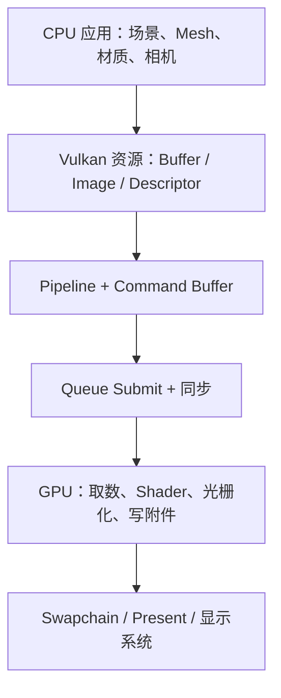

这里有四层，不要混在一起：

| 层 | 决定的问题 | 示例 |
|---|---|---|
| Renderer / Engine | 这一帧画什么、分几个 Pass、如何排序 | Shadow、GBuffer、Lighting、PostProcess、UI |
| Vulkan API | 怎样把资源、状态和工作显式描述给驱动 | Buffer、Descriptor、Pipeline、Command Buffer、Submit |
| Driver / ICD | 怎样编译 Shader、生成原生命令、调度硬件 | 厂商实现，细节不由 Vulkan 规定 |
| GPU Hardware | 真正执行命令、访存和并行计算 | Command Processor、Shader Core、Raster、ROP/Blend |

### 1.2 一帧里同时发生的三条线

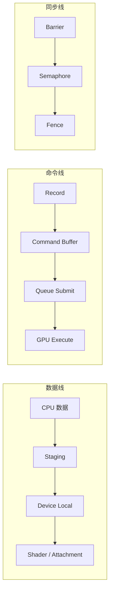

图中的同步线不是严格的调用顺序，而是三个不同同步范围：

- Barrier：主要约束同一 Queue 上命令之间的执行与内存依赖。
- Semaphore：连接 Queue submission，既可同 Queue，也可跨 Queue。
- Fence：让 Host/CPU 知道一次提交已经完成。

---

## 2. Shader 的数据流转流程

### 2.1 Shader 不直接读取普通 CPU 指针

CPU 里的 `std::vector<Vertex>`、图片解码结果或相机矩阵，只是进程虚拟地址空间中的普通数据。Shader 通常不能直接解引用这个地址。

它们要经历以下过程：

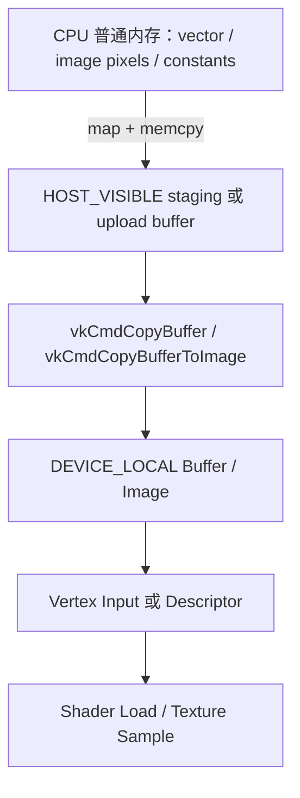

所谓 staging，不是特殊关键字，也不是 GPU 自动搬运机制。它通常就是一个满足以下条件的普通 `VkBuffer`：

- `usage` 包含 `VK_BUFFER_USAGE_TRANSFER_SRC_BIT`；
- 后面绑定的内存是 `HOST_VISIBLE`；
- CPU 映射后写入；
- Command Buffer 再录制 copy，把它复制到更适合 GPU 访问的资源中。

### 2.2 CPU 送给 GPU 的常见数据

| 数据 | 更新频率 | 常见最终资源 | Shader/固定阶段怎样使用 |
|---|---:|---|---|
| 顶点属性 | 静态或低频 | Device-local Vertex Buffer | Vertex Input 读取，再形成 Vertex Shader 输入 |
| 索引 | 静态或低频 | Device-local Index Buffer | Index Fetch 读取；Shader 本身通常不直接读索引 |
| 相机/对象常量 | 每帧或每对象 | Uniform Buffer、Push Constant | 各 Shader Stage 读取 |
| 大型结构化数据 | 动态 | Storage Buffer | Vertex/Fragment/Compute Shader 读写 |
| 纹理像素 | 静态、流式 | Optimal-tiled `VkImage` | 经 Image View + Sampler 被 Shader 采样 |
| 渲染目标 | GPU 产生 | Color/Depth `VkImage` | Attachment 写入，后续 Pass 可采样 |
| 间接绘制参数 | CPU 或 GPU 产生 | Indirect Buffer | Draw/Dispatch 命令处理阶段读取 |
| 回读结果 | GPU 产生 | Readback Buffer | GPU copy 后，CPU 等完成再 map/read |

### 2.3 经典图形 Pipeline 的 Shader 数据流

下面描述的是经典 Vertex Pipeline。Mesh/Task Shader、Ray Tracing Pipeline 属于扩展路径，后面单独补充。

| 顺序 | 类型 | 主要输入 | 主要输出/作用 |
|---:|---|---|---|
| 1 | Index/Vertex Fetch，固定功能 | Index Buffer、Vertex Buffer、绑定偏移、Vertex Input Description | 组装一次 Vertex Shader invocation 的属性输入 |
| 2 | Vertex Shader | 顶点属性、Uniform/Storage Buffer、纹理、Push Constant | `gl_Position` 和用户 varying |
| 3 | Tessellation Control，可选 | patch 顶点、Descriptor | 细分等级、patch 数据 |
| 4 | Tessellator，固定功能 | 细分等级 | 产生参数化顶点 |
| 5 | Tessellation Evaluation，可选 | 参数化坐标、patch 数据 | 顶点位置与 varying |
| 6 | Geometry Shader，可选 | 一个 primitive | 0 到多个 primitive |
| 7 | Primitive Assembly / Clipping / Rasterization，固定功能 | 顶点位置、primitive 状态 | 产生 fragment，并插值 varying |
| 8 | Fragment Shader | 插值数据、纹理、Uniform/Storage、Push Constant | 一个或多个颜色、可选深度 |
| 9 | Early/Late Depth-Stencil + Blend，固定功能 | Fragment 输出、深度模板、Blend 状态 | 写入颜色/深度附件 |

必须注意：

- Index Buffer 一般由固定功能 Index Fetch 使用，不是自动作为 Vertex Shader 的一个 Descriptor。
- Vertex Buffer 可以通过 Vertex Input 读取；同一块底层 Buffer 如果声明了合适的 usage，也可以另以 Storage Buffer Descriptor 读取，但这是另一条接口。
- Vertex Shader 到 Fragment Shader 的普通 varying，由 Pipeline 接口匹配和光栅器插值，不需要应用在单次 draw 内插入 Barrier。
- Texture 的 Shader 入口不是 `VkImage` 句柄本身，而通常是 Descriptor 中的 `VkImageView` + `VkSampler`，或 combined image sampler。

### 2.4 Compute Shader 是另一条 Pipeline

Compute 不经过 Vertex Fetch、Rasterizer、Depth/Blend：

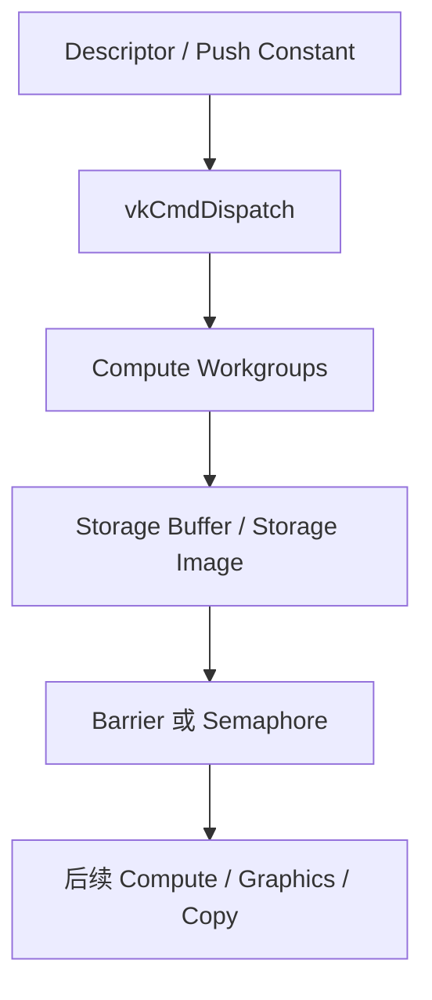

工作组内部可以使用 Shader 语言的 workgroup barrier；不同 dispatch、draw 或 Queue 之间的资源依赖，则由 Vulkan Pipeline Barrier/Semaphore 描述。不要把两种 barrier 混为一谈。

### 2.5 两种 CPU → GPU 上传路线

#### 路线 A：Staging copy，离散显卡最常见

```text
CPU 数据
→ HOST_VISIBLE staging buffer
→ transfer copy
→ DEVICE_LOCAL vertex/index/uniform/storage buffer 或 image
→ Barrier
→ Shader/固定功能读取
```

优点：最终资源通常位于 GPU 访问更快的内存。  
代价：多一次 copy、需要上传队列/命令与同步管理。

#### 路线 B：直接写 Host-visible 的最终 Buffer

```text
CPU 数据
→ map 最终 buffer 的 backing memory
→ memcpy
→ 必要时 flush
→ submit 后 GPU 读取
```

适合：

- UMA 集成 GPU；
- 每帧更新的较小 Uniform/Upload Ring；
- 设备暴露了合适的 `DEVICE_LOCAL | HOST_VISIBLE` memory type；
- 测量后确认直接访问没有造成 GPU 端带宽/延迟问题。

它不是对所有离散显卡都更快。Vulkan 只暴露 memory type 和属性，应用必须查询，不能假设“显存一定不可映射”或“Host-visible 一定不在显存”。

### 2.6 Shader 看见资源所需的三件事

以 Fragment Shader 采样纹理为例，需要同时满足：

1. **资源存在且数据已上传**：`VkImage` 已创建、绑定内存、像素 copy 完成。
2. **资源接口可达**：Descriptor Set 写入了 `VkImageView`/`VkSampler`，并绑定到与 Pipeline Layout 兼容的 set/binding。
3. **同步和状态正确**：Transfer write 对 Fragment shader sampled read 可见，Image Layout 与用途匹配。

只完成其中一两项仍然不够。

---

## 3. CPU 内存、GPU 内存与 Vulkan 内存认知模型

### 3.1 先区分三类“内存”

Vulkan 文档中的“Host Memory”和“Device Memory”很容易被混淆。

| 名称 | 例子 | 谁管理 | 是否保存 Buffer/Image 内容 |
|---|---|---|---|
| 应用自己的 CPU 内存 | `new`、`malloc`、`std::vector` | 应用/JVM/系统分配器 | 只保存你自己的源数据 |
| Vulkan 实现的 Host Memory | Pipeline/Descriptor/Command Buffer 等对象的驱动元数据 | 驱动；可选 `VkAllocationCallbacks` | 通常不是资源内容 |
| Vulkan Device Memory | `vkAllocateMemory` 返回的 `VkDeviceMemory` | 应用显式管理或 VMA 管理 | 是 Buffer/Image 的 backing storage |

关键纠偏：

> `VkAllocationCallbacks` 主要让应用接管驱动创建 Vulkan 对象时所需的 Host Memory 回调；它不是“向显卡申请显存”的接口，也不是 VMA 的替代物。

### 3.2 资源对象与 backing memory 是两层

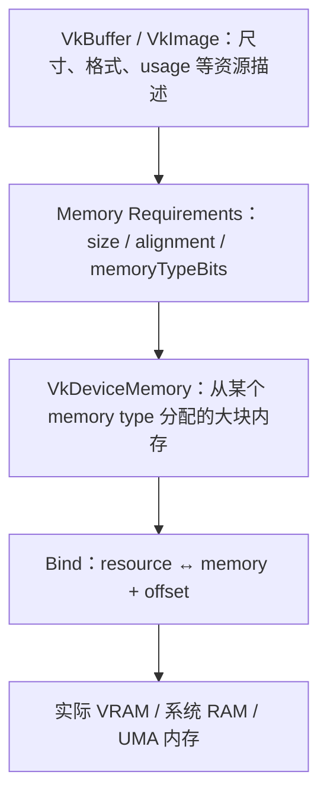

裸 Vulkan 创建 Buffer 的标准顺序：

1. `vkCreateBuffer`：创建资源对象。
2. `vkGetBufferMemoryRequirements2`：查询大小、对齐、可用 memory type 位图及 dedicated 建议。
3. 从允许的类型中选择 `memoryTypeIndex`。
4. `vkAllocateMemory`：申请 `VkDeviceMemory` 大块。
5. `vkBindBufferMemory2`：把 Buffer 绑定到该内存的某个 offset。

Image 同理：`vkCreateImage` → requirements → allocate → `vkBindImageMemory2`。

### 3.3 Memory Heap 与 Memory Type

`VkPhysicalDeviceMemoryProperties` 暴露：

- **Memory Heap**：物理容量来源，例如 24 GiB 本地显存、系统内存；回答“容量从哪里扣”。
- **Memory Type**：访问属性组合并指向一个 heap；回答“用什么属性访问这块容量”。

常见属性：

| Flag | 意义 | 常见用途 |
|---|---|---|
| `DEVICE_LOCAL` | 对设备本地，通常 GPU 访问更理想 | Vertex、Index、Texture、Render Target |
| `HOST_VISIBLE` | CPU 能 `vkMapMemory` | Staging、动态 Uniform、Readback |
| `HOST_COHERENT` | Host 写入/读取无需显式 flush/invalidate 来维护 Host cache 一致性 | 简化上传/回读；仍需执行顺序同步 |
| `HOST_CACHED` | CPU cache 访问友好，尤其适合随机读取 | Readback；写合并上传内存未必有该 flag |
| `LAZILY_ALLOCATED` | 可按需为瞬时附件提供物理 backing，常见于 tile GPU | Transient Attachment，不能按普通 Host Memory 使用 |

一个 Heap 可以对应多个 Memory Type。选择 type 时必须同时满足：

```text
(requirements.memoryTypeBits & (1 << typeIndex)) != 0
并且
(memoryTypes[typeIndex].propertyFlags & requiredFlags) == requiredFlags
```

### 3.4 三种典型硬件拓扑

| 拓扑 | 可能看到的特征 | 建议心态 |
|---|---|---|
| 离散 GPU | 独立 device-local VRAM；另有 host-visible 系统内存 | 静态大资源常用 staging → device-local |
| UMA / 集成 GPU | 一个 heap 可能同时对 CPU/GPU 本地 | 直接 map 可能合理，但仍有 cache/sync 语义 |
| Resizable BAR / 可映射显存窗口 | 某些 type 同时 `DEVICE_LOCAL | HOST_VISIBLE` | 可用于特定上传路线；要看 heap budget 与实测 |

不要通过显卡品牌写死 memory type index，也不要把 memory type 0 永远视作“显存”。

### 3.5 `vkMapMemory` 到底做了什么

`vkMapMemory` 返回一个 Host 虚拟地址窗口，使 CPU 能访问某段 `HOST_VISIBLE` device memory。

它不代表：

- 数据已经传给 GPU；
- GPU 已停止使用该区域；
- CPU/GPU cache 自动一致；
- 返回的 CPU 指针等于 GPU device address。

#### Host 写入 GPU 读取

正确概念顺序是：

1. CPU 等待该内存区域不再被上一帧 GPU 使用。
2. CPU `memcpy` 到 mapped pointer。
3. 非 coherent memory 调用 `vkFlushMappedMemoryRanges`；range 要遵守 `nonCoherentAtomSize` 对齐规则。
4. 通过 Queue submission 和正确依赖，让后续 device access 看到 Host write。

#### GPU 写入 CPU 读取

1. GPU 写入/复制到 Host-visible readback allocation。
2. CPU 用 Fence 或 Timeline Semaphore 等待相关 GPU 工作完成。
3. 非 coherent memory 调用 `vkInvalidateMappedMemoryRanges`。
4. CPU 才读取 mapped pointer。

`HOST_COHERENT` 省去的是显式 cache flush/invalidate，不是 Fence/Semaphore/Barrier 所表达的执行顺序和占用保护。

### 3.6 为什么不能一个资源一次 `vkAllocateMemory`

`vkAllocateMemory` 更接近昂贵的系统/驱动级大块分配，而不是普通 `malloc`。实际引擎通常：

```text
少量大的 VkDeviceMemory block
→ 按 alignment 划出多个 offset
→ 分别绑定 Buffer/Image
```

这叫 suballocation。它需要处理：

- `requirements.alignment`；
- `memoryTypeBits`；
- `bufferImageGranularity`；
- dedicated allocation 要求/建议；
- 内存碎片；
- heap budget；
- 延迟释放，避免 GPU 尚未结束就复用同一 offset。

VMA 正是把这层工程化，见第 16 节。

### 3.7 CPU 地址、Buffer Offset、Device Address 不是一回事

| 概念 | 谁使用 | 示例 |
|---|---|---|
| CPU mapped pointer | CPU | `void* mapped` |
| `VkDeviceMemory` offset | Vulkan 绑定/映射接口 | Buffer 在大内存块中的 suballocation offset |
| Buffer 内 offset | Draw/Descriptor/Copy 命令 | `vkCmdBindVertexBuffers(..., offsets)` |
| Descriptor 地址信息 | 驱动/GPU | 由 `vkUpdateDescriptorSets` 等编码 |
| Buffer Device Address | Shader/设备侧指针能力，可选 | `vkGetBufferDeviceAddress` |

普通 Shader Descriptor 访问不要求应用拿到裸 GPU 地址。只有启用 Buffer Device Address 等能力时，应用才显式处理设备地址，并承担额外生命周期与同步约束。

### 3.8 生命周期规则

资源删除的真正条件不是“CPU 不用了”，而是：

> 所有可能访问它的 GPU submission 都已经完成。

所以通常需要：

- 等关联 Fence/Timeline value；或
- 把销毁任务放入按 submission serial 管理的 deferred deletion queue。

`vkDeviceWaitIdle` 能保证安全，但频繁使用会让流水线停顿，只适合初始化收尾、Swapchain 重建的简单实现或错误恢复等低频路径。

---

## 4. 按真实顺序创建 Vulkan 对象

用户常会记成“创建 Instance 后就创建 Vertex Buffer”。准确说，中间必须先得到 Physical Device、Logical Device 和可用 Queue；Surface/Swapchain 是否先建取决于是否需要显示。

### 4.1 推荐的初始化顺序

| 阶段 | 创建/获取对象 | 内存与数据关系 |
|---:|---|---|
| 1 | Loader、API version | 找到 Vulkan 实现入口 |
| 2 | `VkInstance` | Instance 是 API/扩展/层的根，不是 GPU 内存管理器 |
| 3 | Debug Messenger，可选 | 验证层与调试信息 |
| 4 | `VkSurfaceKHR`，窗口程序 | 描述窗口系统表面，本身不是可渲染图像 |
| 5 | 枚举 `VkPhysicalDevice` | 查询特性、限制、格式、memory heaps/types、queue families、present support |
| 6 | 选择 Queue Families | Graphics/Compute/Transfer/Present 能力与数量 |
| 7 | `VkDevice` + 获取 `VkQueue` | 之后才能创建大多数 device objects 和申请 device memory |
| 8 | VMA Allocator，可选 | 在 Instance + PhysicalDevice + Device 之后创建 |
| 9 | Swapchain | Swapchain images 由实现拥有；应用获取 Image，通常不自行分配其内存 |
| 10 | Swapchain Image Views | 定义每个 swapchain image 的可见子资源/格式视图 |
| 11 | Depth/MSAA/中间 Images | 创建 Image、分配/绑定内存、创建 Image View |
| 12 | Vertex/Index/Uniform/Storage Buffers | 创建 Buffer、分配/绑定内存；静态数据通常经 staging 上传 |
| 13 | Texture + View + Sampler | 上传像素、layout transition、创建 View/Sampler |
| 14 | Descriptor Set Layout | 声明 set 中每个 binding 的资源类型、数量和 shader stage visibility |
| 15 | Pipeline Layout | 组合多个 Descriptor Set Layout + Push Constant Range |
| 16 | Shader Module + Pipeline | SPIR-V 与固定功能状态；Pipeline 与 resource interface 对齐 |
| 17 | Descriptor Pool + Set | Pool 提供 descriptor 存储；Set 写入 Buffer/Image/View/Sampler 引用 |
| 18 | Command Pool + Command Buffers | Command Pool 绑定 queue family；Buffer 用于录制 |
| 19 | Fence/Semaphore | Frames-in-flight、Acquire、Render、Present、跨 Queue 同步 |

顺序不是唯一的。例如 Descriptor Pool 可以早于 Pipeline 创建，静态 Mesh 也可以晚加载。真正依赖关系才是重点：

```text
VkInstance
→ VkPhysicalDevice
→ VkDevice
→ Buffer/Image/Pipeline/Descriptor/Command 等 device objects
```

以及：

```text
DescriptorSetLayout
→ PipelineLayout
→ Pipeline
```

### 4.2 初始化时必须一起选定的能力

在 `vkCreateDevice` 前应完成：

- API 版本与扩展选择；
- features chain，例如 dynamic rendering、synchronization2、timeline semaphore、descriptor indexing 等；
- Queue Family 与 queue count；
- Surface format、present mode、image count 支持；
- 目标格式是否支持 sampled/storage/attachment/transfer usage；
- limits：对齐、descriptor 数量、push constant 大小、workgroup 限制等。

“先创对象，失败后再看能力”会让初始化和跨设备兼容变得混乱。

---

## 5. Vertex Buffer 与 Texture 的完整上传过程

### 5.1 裸 Vulkan 创建资源的通用模板

下面代码省略错误处理，仅用于表现认知顺序：

```cpp
VkBufferCreateInfo info{
    .sType = VK_STRUCTURE_TYPE_BUFFER_CREATE_INFO,
    .size = size,
    .usage = usage,
    .sharingMode = VK_SHARING_MODE_EXCLUSIVE,
};

VkBuffer buffer = VK_NULL_HANDLE;
vkCreateBuffer(device, &info, nullptr, &buffer);

VkMemoryRequirements req{};
vkGetBufferMemoryRequirements(device, buffer, &req);

uint32_t typeIndex = findMemoryType(
    req.memoryTypeBits,
    requiredMemoryProperties);

VkMemoryAllocateInfo allocInfo{
    .sType = VK_STRUCTURE_TYPE_MEMORY_ALLOCATE_INFO,
    .allocationSize = req.size,
    .memoryTypeIndex = typeIndex,
};

VkDeviceMemory memory = VK_NULL_HANDLE;
vkAllocateMemory(device, &allocInfo, nullptr, &memory);
vkBindBufferMemory(device, buffer, memory, 0);
```

生产代码不应默认“一 Buffer 一 `VkDeviceMemory`”；此处只是展示原始 API 顺序。

### 5.2 Vertex Buffer 上传

#### 第一步：CPU 生成顶点数据

```cpp
std::vector<Vertex> vertices = loadMesh();
VkDeviceSize bytes = vertices.size() * sizeof(Vertex);
```

#### 第二步：创建 Staging Buffer

- Buffer usage：`TRANSFER_SRC`。
- Memory：`HOST_VISIBLE`，通常优先 `HOST_COHERENT`。
- map → memcpy → 必要时 flush。

```cpp
void* mapped = nullptr;
vkMapMemory(device, stagingMemory, 0, bytes, 0, &mapped);
std::memcpy(mapped, vertices.data(), static_cast<size_t>(bytes));

if (!isHostCoherent) {
    // 实际 range 要按 nonCoherentAtomSize 对齐。
    vkFlushMappedMemoryRanges(device, 1, &flushRange);
}
vkUnmapMemory(device, stagingMemory);
```

#### 第三步：创建最终 Vertex Buffer

- Buffer usage：`TRANSFER_DST | VERTEX_BUFFER`。
- Memory：通常优先 `DEVICE_LOCAL`。

#### 第四步：录制 copy 与依赖

```cpp
VkBufferCopy copy{
    .srcOffset = 0,
    .dstOffset = 0,
    .size = bytes,
};
vkCmdCopyBuffer(cmd, stagingBuffer, vertexBuffer, 1, &copy);

VkBufferMemoryBarrier2 ready{
    .sType = VK_STRUCTURE_TYPE_BUFFER_MEMORY_BARRIER_2,
    .srcStageMask = VK_PIPELINE_STAGE_2_TRANSFER_BIT,
    .srcAccessMask = VK_ACCESS_2_TRANSFER_WRITE_BIT,
    .dstStageMask = VK_PIPELINE_STAGE_2_VERTEX_INPUT_BIT,
    .dstAccessMask = VK_ACCESS_2_VERTEX_ATTRIBUTE_READ_BIT,
    .srcQueueFamilyIndex = VK_QUEUE_FAMILY_IGNORED,
    .dstQueueFamilyIndex = VK_QUEUE_FAMILY_IGNORED,
    .buffer = vertexBuffer,
    .offset = 0,
    .size = VK_WHOLE_SIZE,
};

VkDependencyInfo dependency{
    .sType = VK_STRUCTURE_TYPE_DEPENDENCY_INFO,
    .bufferMemoryBarrierCount = 1,
    .pBufferMemoryBarriers = &ready,
};
vkCmdPipelineBarrier2(cmd, &dependency);
```

如果 copy 在专用 Transfer Queue，draw 在 Graphics Queue，还要处理：

- Transfer submission signal Semaphore；
- Graphics submission wait Semaphore；
- 若资源为 exclusive sharing 且 queue family 不同，做 release/acquire ownership transfer；或创建资源时使用 concurrent sharing（通常有潜在性能/实现权衡）。

#### 第五步：提交与释放 Staging

Staging Buffer 不能在 `vkQueueSubmit2` 返回后立刻销毁。Submit 是异步的，必须等上传 Fence/Timeline value 表明 copy 已完成，再回收或复用其内存。

### 5.3 每帧 Uniform 数据

小型动态数据通常不值得每次单独 staging copy。常见做法是：

- 创建 persistently mapped upload/uniform ring buffer；
- 每个 frame-in-flight 或每个 draw 分配一个对齐 slice；
- CPU 等待对应 frame Fence 后写入；
- 使用 Descriptor offset 或 dynamic offset 指向 slice；
- 遵守 `minUniformBufferOffsetAlignment`；
- 非 coherent 内存按 atom size flush。

例如双/三帧：

```text
Uniform Ring
├─ Frame 0 region：GPU 可能正在读
├─ Frame 1 region：GPU 可能正在读
└─ Frame 2 region：Fence 完成后由 CPU 重写
```

### 5.4 Texture 上传比 Buffer 多两层状态

Texture 一般经历：

1. CPU 解码成像素。
2. 像素写入 Staging Buffer。
3. 创建 optimal-tiled `VkImage`，usage 至少包含 `TRANSFER_DST | SAMPLED`。
4. `UNDEFINED → TRANSFER_DST_OPTIMAL`。
5. `vkCmdCopyBufferToImage`。
6. 如需 mipmap，执行 blit/compute 或离线 mip 上传，并逐 subresource 同步。
7. `TRANSFER_DST_OPTIMAL → SHADER_READ_ONLY_OPTIMAL`（或使用更合适的现代 layout）。
8. 创建 `VkImageView` 和 `VkSampler`。
9. 更新 Descriptor Set。

典型同步 2 Image Barrier：

```cpp
VkImageMemoryBarrier2 toSample{
    .sType = VK_STRUCTURE_TYPE_IMAGE_MEMORY_BARRIER_2,
    .srcStageMask = VK_PIPELINE_STAGE_2_TRANSFER_BIT,
    .srcAccessMask = VK_ACCESS_2_TRANSFER_WRITE_BIT,
    .dstStageMask = VK_PIPELINE_STAGE_2_FRAGMENT_SHADER_BIT,
    .dstAccessMask = VK_ACCESS_2_SHADER_SAMPLED_READ_BIT,
    .oldLayout = VK_IMAGE_LAYOUT_TRANSFER_DST_OPTIMAL,
    .newLayout = VK_IMAGE_LAYOUT_SHADER_READ_ONLY_OPTIMAL,
    .srcQueueFamilyIndex = VK_QUEUE_FAMILY_IGNORED,
    .dstQueueFamilyIndex = VK_QUEUE_FAMILY_IGNORED,
    .image = textureImage,
    .subresourceRange = fullColorRange,
};
```

Image Barrier 同时可能承担三件事：

- execution dependency；
- memory availability/visibility；
- layout transition。

Image Layout 不是简单的枚举标签。它描述资源为某种访问准备的设备侧组织/状态；转换可能只改变跟踪状态，也可能触发真实硬件工作，具体由实现决定。

### 5.5 回读路径正好反过来

```text
GPU 结果 Image/Buffer
→ Barrier 到 TRANSFER_SRC
→ copy 到 HOST_VISIBLE | TRANSFER_DST readback buffer
→ Fence/Timeline 等 GPU 完成
→ 非 coherent 时 invalidate
→ CPU 读取
```

不能只调用 `vkMapMemory` 就期待 GPU 已把数据写完。

---

## 6. Descriptor、Pipeline Layout 与 Pipeline

### 6.1 先看对象关系

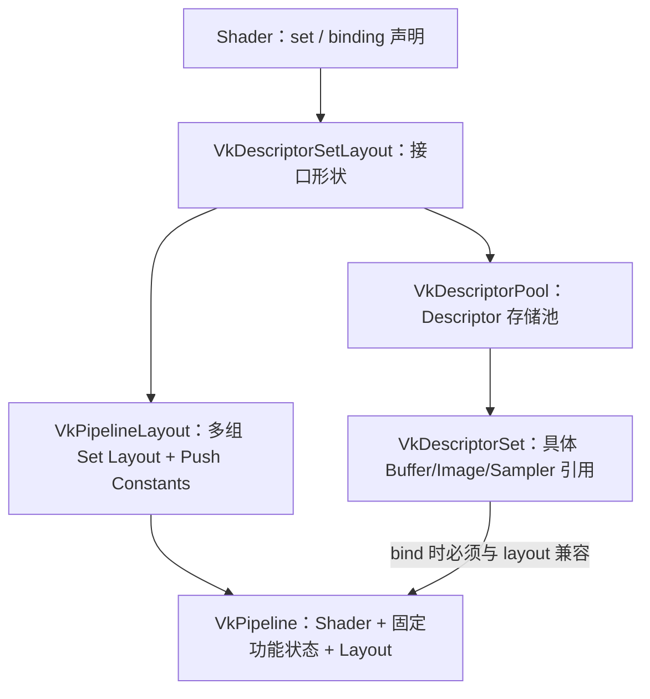

### 6.2 Descriptor Set Layout：资源接口的“类型声明”

假设 Shader：

```glsl
layout(set = 0, binding = 0) uniform CameraUBO { mat4 viewProj; } camera;
layout(set = 1, binding = 0) uniform sampler2D baseColor;
layout(set = 1, binding = 1) readonly buffer MaterialData { vec4 values[]; } material;
```

应用必须创建匹配的布局：

```text
Set 0 Layout
└─ binding 0：UNIFORM_BUFFER，Vertex/Fragment 可见

Set 1 Layout
├─ binding 0：COMBINED_IMAGE_SAMPLER，Fragment 可见
└─ binding 1：STORAGE_BUFFER，Fragment 可见
```

Layout 只定义类型、数量、stage visibility、部分 binding flags；它不包含具体 Camera Buffer 或 Texture。

### 6.3 Descriptor Pool 与 Descriptor Set

- `VkDescriptorPool`：为 Descriptor Set 的实现存储做批量分配；它不是 Buffer/Image 的显存池。
- `vkAllocateDescriptorSets`：从 Pool 中按某个 Layout 分配 Set。
- `vkUpdateDescriptorSets`：把具体 `VkDescriptorBufferInfo`、`VkDescriptorImageInfo` 等写入 Set。
- `vkCmdBindDescriptorSets`：录制“在后续 draw/dispatch 使用哪些 Set”。

Descriptor 中放的是资源引用及范围/视图/采样信息，不会复制整个 Texture 或 Buffer 内容。

一个常见分组策略：

| Set | 生命周期/频率 | 资源例子 |
|---:|---|---|
| 0 | 每帧/场景 | Camera、Lighting、Global textures |
| 1 | 每材质 | Base color、Normal、Material constants |
| 2 | 每对象 | Transform、Skinning、Object ID |

这不是 Vulkan 强制规范，只是减少重复绑定和更新的引擎设计。

### 6.4 Pipeline Layout：Shader 资源接口总目录

`VkPipelineLayout` 组合：

- 有顺序的 `VkDescriptorSetLayout[]`；
- `VkPushConstantRange[]`。

它不保存某个具体 Descriptor Set，也不保存实际 Push Constant 值。实际值在 Command Buffer 中通过 bind/push 命令提供。

Pipeline Layout 还决定不同 Pipeline 之间的 Descriptor Set 兼容性。引擎通常缓存/复用相同布局，避免无意义切换。

### 6.5 Graphics Pipeline 里有什么

经典 `VkPipeline` 可理解为：

| 类别 | 内容 |
|---|---|
| Program | Vertex/Fragment 等 Shader Stage、入口点、Specialization Constant |
| Resource interface | `VkPipelineLayout` |
| Vertex input | Binding stride、attribute format/offset |
| Input assembly | Primitive topology、primitive restart |
| Tessellation | Patch control points，可选 |
| Viewport/scissor | 固定或 dynamic |
| Rasterization | Polygon mode、cull、front face、depth bias |
| Multisample | Sample count、sample mask、alpha-to-coverage |
| Depth/stencil | Test/write/compare/stencil ops |
| Color blend | 每 attachment blend 和 write mask |
| Render target compatibility | 传统 Render Pass/Subpass，或 Dynamic Rendering 的 attachment formats |
| Dynamic state | 由命令在 draw 前提供、不固化进 Pipeline 的状态 |

Compute Pipeline 简化为：

```text
Compute Shader + Pipeline Layout + Specialization 信息
```

### 6.6 Shader Module、Pipeline 与机器码

通常流程：

```text
GLSL/HLSL/Slang
→ 离线编译 SPIR-V
→ vkCreateShaderModule
→ vkCreateGraphicsPipelines / vkCreateComputePipelines
→ 驱动校验、优化、编译或准备硬件程序
```

Pipeline 创建可能昂贵。应考虑：

- Pipeline Cache；
- 异步/后台创建；
- 减少无界 Shader permutation；
- Pipeline Library 等可选能力；
- 启动预热和运行时卡顿监控。

`VkPipelineCache` 是驱动可使用的 opaque 缓存，不等于引擎层“按完整 descriptor 哈希查找 Pipeline”的缓存；生产引擎通常两者都要。

### 6.7 Dynamic Rendering 与传统 Render Pass

传统方式：

```text
VkRenderPass + VkFramebuffer
→ vkCmdBeginRenderPass
```

Vulkan 1.3 常用方式：

```text
VkRenderingInfo + VkRenderingAttachmentInfo
→ vkCmdBeginRendering
```

Dynamic Rendering 减少 Render Pass/Framebuffer 对象，但没有取消以下概念：

- attachment format/sample count 兼容；
- load/store；
- layout；
- pass 前后同步；
- color/depth/stencil attachment 的资源生命周期。

---

## 7. Command Pool、Command Buffer 与命令录制

### 7.1 Command Pool

`VkCommandPool`：

- 创建时关联一个 Queue Family；
- 为 Command Buffer 的 Host-side/internal storage 摊销分配成本；
- 可以整体 reset；
- **externally synchronized**，同一个 Pool 不能被多个线程无保护地同时操作。

多线程录制的常见设计：

```text
每个 worker thread
× 每个 frame-in-flight
→ 一个独立 Command Pool
→ 若干 Primary/Secondary Command Buffer
```

### 7.2 Primary 与 Secondary Command Buffer

| 类型 | 能否直接提交 Queue | 常见用途 |
|---|---|---|
| Primary | 可以 | 一帧主流程、barrier、begin/end rendering、执行 secondary |
| Secondary | 不可以单独提交；由 Primary 执行 | 多线程录制 draw 列表、复用局部命令（需满足继承和生命周期规则） |

Secondary 并不天然更快。是否收益取决于 CPU 录制开销、驱动实现、粒度和并行度。

### 7.3 Command Buffer 状态

```text
Initial
→ Recording
→ Executable
→ Pending（提交后 GPU 可能执行）
→ Executable 或 Invalid
```

Pending 时不能随意 reset、修改或释放。CPU 通常等本帧 Fence 后再 reset 对应 Pool。

### 7.4 一段典型录制

```cpp
vkBeginCommandBuffer(cmd, &beginInfo);

// 1. 把 swapchain image 准备成颜色附件。
vkCmdPipelineBarrier2(cmd, &toColorAttachmentDependency);

// 2. 开始 Dynamic Rendering。
vkCmdBeginRendering(cmd, &renderingInfo);

vkCmdBindPipeline(cmd, VK_PIPELINE_BIND_POINT_GRAPHICS, pipeline);
vkCmdSetViewport(cmd, 0, 1, &viewport);
vkCmdSetScissor(cmd, 0, 1, &scissor);

vkCmdBindDescriptorSets(
    cmd,
    VK_PIPELINE_BIND_POINT_GRAPHICS,
    pipelineLayout,
    0, 1, &sceneSet,
    0, nullptr);

VkDeviceSize vertexOffset = 0;
vkCmdBindVertexBuffers(cmd, 0, 1, &vertexBuffer, &vertexOffset);
vkCmdBindIndexBuffer(cmd, indexBuffer, 0, VK_INDEX_TYPE_UINT32);

vkCmdPushConstants(
    cmd, pipelineLayout,
    VK_SHADER_STAGE_VERTEX_BIT,
    0, sizeof(DrawConstants), &drawConstants);

vkCmdDrawIndexed(cmd, indexCount, 1, 0, 0, 0);
vkCmdEndRendering(cmd);

// 3. 把最终 image 转为 PRESENT_SRC_KHR。
vkCmdPipelineBarrier2(cmd, &toPresentDependency);

vkEndCommandBuffer(cmd);
```

### 7.5 录制不等于执行

调用 `vkCmdDrawIndexed` 时：

- CPU 通常只是向 Command Buffer 记录命令/状态；
- GPU 不一定立即知道这条命令；
- 只有提交到 Queue 后，命令才进入设备执行时间线；
- 驱动可能在录制时生成部分原生命令，也可能在 submit 时进一步处理，Vulkan 不规定内部策略。

### 7.6 Command Buffer 记录的是状态机

`vkCmdBindPipeline`、`vkCmdBindDescriptorSets`、`vkCmdBindVertexBuffers` 会改变当前绑定状态；后续 draw 使用当时有效的状态。

可以把命令流理解为：

```text
Bind Pipeline A
Bind Scene Set
Bind Material Red
Bind Mesh 1
Draw
Bind Material Blue
Bind Mesh 2
Draw
```

它不是每次 draw 都复制一份完整 Pipeline 和全部资源数据，而是记录对象引用、参数和状态变化。被引用对象必须满足 Vulkan 规定的有效期，尤其不能在命令仍 Pending 时销毁。

---

## 8. Submit 后 GPU 如何理解并执行

### 8.1 `vkQueueSubmit2` 把三类信息交给 Queue

一次 submission 通常包含：

1. 等待哪些 Semaphore，以及在哪个 stage 才允许继续；
2. 执行哪些 Command Buffer；
3. 完成到指定范围后 signal 哪些 Semaphore；
4. 可选 Fence，用于 Host 观察整个 submit 完成。

```cpp
VkSemaphoreSubmitInfo waitInfo{
    .sType = VK_STRUCTURE_TYPE_SEMAPHORE_SUBMIT_INFO,
    .semaphore = imageAvailable,
    .value = 0, // Binary semaphore 在此填 0。
    .stageMask = VK_PIPELINE_STAGE_2_COLOR_ATTACHMENT_OUTPUT_BIT,
};

VkCommandBufferSubmitInfo cmdInfo{
    .sType = VK_STRUCTURE_TYPE_COMMAND_BUFFER_SUBMIT_INFO,
    .commandBuffer = cmd,
};

VkSemaphoreSubmitInfo signalInfo{
    .sType = VK_STRUCTURE_TYPE_SEMAPHORE_SUBMIT_INFO,
    .semaphore = renderFinished,
    .value = 0,
    .stageMask = VK_PIPELINE_STAGE_2_ALL_COMMANDS_BIT,
};

VkSubmitInfo2 submit{
    .sType = VK_STRUCTURE_TYPE_SUBMIT_INFO_2,
    .waitSemaphoreInfoCount = 1,
    .pWaitSemaphoreInfos = &waitInfo,
    .commandBufferInfoCount = 1,
    .pCommandBufferInfos = &cmdInfo,
    .signalSemaphoreInfoCount = 1,
    .pSignalSemaphoreInfos = &signalInfo,
};

vkQueueSubmit2(graphicsQueue, 1, &submit, frameFence);
```

示例中的 stage mask 需要根据真实第一位消费者/最后一位生产者选择，不能机械复制。

### 8.2 从 API 到硬件的大致过程

下面是可靠的认知模型，不是 Vulkan 对厂商实现的强制微架构：

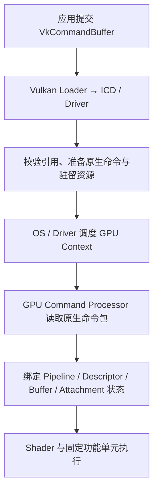

实际实现可以：

- 在 `vkCmd*` 时就构造原生命令；
- 在 `vkEndCommandBuffer` 或 submit 时补充处理；
- 把 Command Buffer 复制/引用到驱动管理的 ring；
- 在硬件队列中放置间接指针或命令包；
- 缓存 Pipeline 的机器码与硬件状态模板。

Vulkan 不保证某一种内部形式，所以不要把 `VkCommandBuffer` 简化成“GPU 直接解释的一段标准 Vulkan 字节码”。GPU 最终解释的是厂商原生命令。

### 8.3 遇到 `vkCmdDrawIndexed` 时发生什么

概念上，设备会使用当前命令状态：

1. 找到 Graphics Pipeline，激活已编译 Shader 和固定功能状态。
2. 找到 Pipeline Layout 对应的 Descriptor Sets/Push Constants。
3. 从 Index Buffer 读取索引。
4. 按 Vertex Input Description 从 Vertex Buffer 取属性。
5. 启动 Vertex Shader invocations。
6. 组装 primitive、裁剪、光栅化并插值。
7. 启动 Fragment Shader invocations，按 Descriptor 采样/访存。
8. 执行 depth/stencil、blend，并写入 Attachment Image。

现代 GPU 会并行、分批、乱序隐藏延迟。上述是逻辑顺序，不代表所有硬件单元串行完成后下一个才开始。

### 8.4 Pipeline、Descriptor、Buffer 分别回答什么

| 对象 | GPU 执行时回答的问题 |
|---|---|
| Pipeline | 执行哪套 Shader，光栅、深度、Blend 等状态是什么 |
| Pipeline Layout | Shader 的 set/binding 与 push constant 接口长什么样 |
| Descriptor Set | 这次绑定的具体 Buffer/Image/Sampler 是谁 |
| Vertex/Index Buffer binding | 几何数据从哪个 Buffer、哪个 offset、按何种格式取 |
| Rendering attachments | 颜色/深度最终写到哪些 Image View |
| Command Buffer | 这些状态和动作以什么逻辑序列发生 |

### 8.5 “同一 Queue 有顺序”不等于“自动解决数据竞争”

同一 Queue 接收的提交有规定的 Queue operation order，命令也有 API 定义的顺序关系；但 GPU Pipeline 可以让不同阶段重叠，单纯先录制 A 再录制 B 并不自动建立所有需要的 memory visibility。

例如：

```text
Compute A 写 Storage Buffer
Draw B 的 Vertex Shader 读同一 Buffer
```

如果没有合适的 Barrier，即使 A 在命令流中写在 B 前，也可能缺少明确的 write availability/read visibility 依赖。同步不是为了让代码“看起来有顺序”，而是精确声明资源 hazard。

---

## 9. Fence、Semaphore、Barrier：把同步彻底分清

### 9.1 同步要同时回答两个问题

Vulkan 同步包含两部分：

1. **Execution dependency**：消费者不能在生产者到达某个执行点之前越过指定点。
2. **Memory dependency**：生产者的写入先变为 available，再对消费者访问变为 visible。

只保证执行先后，不一定保证 cache 中的新数据对后续访问可见。

### 9.2 三种数据 Hazard

| Hazard | 含义 | 是否通常需要内存依赖 |
|---|---|---|
| RAW：Read After Write | 后面读前面刚写的数据 | 是，最常见 |
| WAW：Write After Write | 两次写同一范围，顺序有语义 | 是 |
| WAR：Write After Read | 后写不能破坏前读 | 通常需要 execution dependency；是否需要 memory dependency 取决于访问 |

同步范围应精确到：

- 哪个资源或 subresource；
- 生产者 stage/access；
- 消费者 stage/access；
- 是否涉及 image layout；
- 是否跨 Queue/Queue Family。

### 9.3 Fence：GPU → CPU 完成通知

典型模式：

```cpp
vkWaitForFences(device, 1, &frameFence, VK_TRUE, UINT64_MAX);
// 到这里，与该 Fence 关联的 submit 已完成，可安全复用本帧资源。

vkResetFences(device, 1, &frameFence);
vkQueueSubmit2(queue, 1, &submit, frameFence);
```

Fence 常用来保护：

- 本帧 Command Pool/Command Buffer reset；
- 本帧 Uniform/Upload 区域重写；
- Descriptor Set 更新；
- deferred deletion；
- CPU readback。

Fence 不是 GPU 命令之间最灵活的同步方式，也不能被 Shader 直接等待。

### 9.4 Binary Semaphore：Submission ↔ Submission

Binary Semaphore 有 signaled/unsignaled 两态：

```text
Submission A signal S
→ Submission B wait S
```

常见用途：

- acquire image → graphics submit；
- graphics submit → present；
- transfer submit → graphics submit；
- compute queue → graphics queue。

CPU 通常不使用 `vkWaitForFences` 那样直接等待 binary semaphore。

### 9.5 Timeline Semaphore：带递增值的时间线

Timeline Semaphore 是 64 位单调递增计数器：

```text
Upload batch 17 signal value 17
Graphics frame wait value >= 17
Upload batch 18 signal value 18
```

优势：

- 一个对象表达许多完成点；
- 更适合流式上传、多 Queue 依赖和 submission serial；
- Host 可查询/等待某个 value；
- 比“每任务一个 Binary Semaphore/Fence”更容易管理。

但窗口系统的 acquire/present 常规边界仍通常使用 Binary Semaphore；不要不加区分地把所有 WSI Semaphore 替换成 Timeline Semaphore。

### 9.6 Pipeline Barrier：同一 Queue 命令流中的资源依赖

典型 Compute 写、Fragment 读：

```cpp
VkBufferMemoryBarrier2 barrier{
    .sType = VK_STRUCTURE_TYPE_BUFFER_MEMORY_BARRIER_2,
    .srcStageMask = VK_PIPELINE_STAGE_2_COMPUTE_SHADER_BIT,
    .srcAccessMask = VK_ACCESS_2_SHADER_STORAGE_WRITE_BIT,
    .dstStageMask = VK_PIPELINE_STAGE_2_FRAGMENT_SHADER_BIT,
    .dstAccessMask = VK_ACCESS_2_SHADER_STORAGE_READ_BIT,
    .srcQueueFamilyIndex = VK_QUEUE_FAMILY_IGNORED,
    .dstQueueFamilyIndex = VK_QUEUE_FAMILY_IGNORED,
    .buffer = dataBuffer,
    .offset = 0,
    .size = VK_WHOLE_SIZE,
};

VkDependencyInfo dep{
    .sType = VK_STRUCTURE_TYPE_DEPENDENCY_INFO,
    .bufferMemoryBarrierCount = 1,
    .pBufferMemoryBarriers = &barrier,
};
vkCmdPipelineBarrier2(cmd, &dep);
```

读法：

> 在 Compute Shader 的 storage writes 进入目标同步范围后，使这些写对后续 Fragment Shader 的 storage reads 可见。

Barrier 不是 CPU wait；录制它时 CPU 不会等 GPU。它成为 GPU 命令流中的依赖。

### 9.7 Stage Mask 和 Access Mask 如何选

先问四句话：

1. 谁最后写？——`srcStageMask`。
2. 它怎样写？——`srcAccessMask`。
3. 谁最先读/写？——`dstStageMask`。
4. 它怎样访问？——`dstAccessMask`。

例子：

| 场景 | Source | Destination |
|---|---|---|
| Transfer 上传 Vertex Buffer | `TRANSFER` + `TRANSFER_WRITE` | `VERTEX_INPUT` + `VERTEX_ATTRIBUTE_READ` |
| Transfer 上传 Texture | `TRANSFER` + `TRANSFER_WRITE` | `FRAGMENT_SHADER` + `SHADER_SAMPLED_READ` |
| Compute 写 Storage，Compute 再读 | `COMPUTE_SHADER` + `SHADER_STORAGE_WRITE` | `COMPUTE_SHADER` + `SHADER_STORAGE_READ` |
| Color Attachment 后续采样 | `COLOR_ATTACHMENT_OUTPUT` + `COLOR_ATTACHMENT_WRITE` | 对应 Shader + `SHADER_SAMPLED_READ` |

`ALL_COMMANDS` 虽然有时正确，但过宽会损失并行；`TOP_OF_PIPE`/`BOTTOM_OF_PIPE` 也不是万能模板。先写出 producer/consumer，再选最窄但完整的范围。

### 9.8 API Barrier 与 Shader 内 Barrier

| 类型 | 使用位置 | 能同步谁 | 典型用途 |
|---|---|---|---|
| `vkCmdPipelineBarrier2` | Command Buffer | draw/dispatch/copy 等命令间，主要同 Queue | Pass 间资源 hazard、layout transition |
| Shader `barrier()`/`OpControlBarrier` | Shader 内 | 规定 scope 内的 invocations，常见为同 workgroup | Compute workgroup shared memory协作 |
| Atomics / memory barrier built-ins | Shader 内 | 按 Shader 内存模型和 scope | 无锁计数、可见性控制 |

一个 dispatch 内没有普适的“所有 workgroup 全局 rendezvous”。需要全局阶段边界时，通常拆成两个 dispatch，中间插 Pipeline Barrier；或采用专门算法/设备生成工作流。

普通 Vertex → Fragment varying 的流水传递由 Graphics Pipeline 定义，不需要人为在单个 draw 中插 API Barrier。

### 9.9 跨 Queue 的正确模型

假设 Transfer Queue 上传 Texture，Graphics Queue 采样：

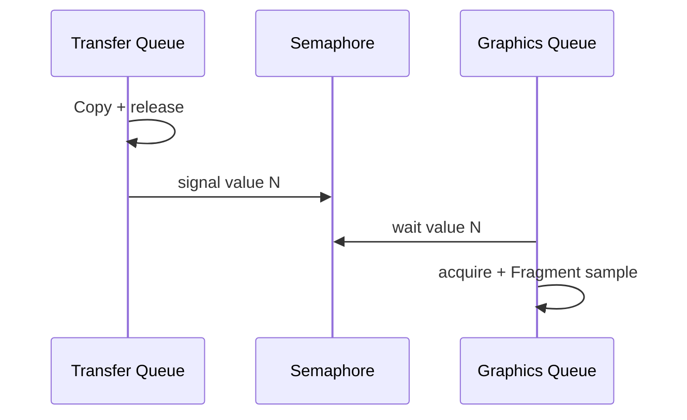

通常需要：

1. Transfer Queue 上产生写入并做 release half；
2. Semaphore 把两个 submissions 连接起来；
3. Graphics Queue 上做 acquire half 并声明 consumer stage/access；
4. 若两个 queue family 不同且资源是 exclusive sharing，填正确的 `srcQueueFamilyIndex`/`dstQueueFamilyIndex`。

Semaphore 连接提交，Queue Family ownership transfer 解决 exclusive resource 的所有权。两者不是互相替代。

### 9.10 同 Queue 与跨 Queue 的工具选择

| 边界 | 首选工具 | 说明 |
|---|---|---|
| 同 Command Buffer 内命令间 | Pipeline Barrier | 最精确 |
| 同 Queue 不同 Command Buffer/Submit | Barrier + 提交顺序；必要时 Semaphore | 可把 barrier 放生产/消费端，按实际设计处理 |
| 不同 Queue submissions | Semaphore | Timeline 尤其适合长期时间线 |
| 不同 Queue Family 的 exclusive resource | Semaphore + release/acquire ownership transfer | 两部分都要考虑 |
| GPU 完成后 CPU 继续 | Fence 或 Host wait Timeline value | 避免 Queue/Device idle |
| Shader workgroup 内 | Shader barrier/atomic | 不是 Vulkan API Pipeline Barrier |

### 9.11 Event

`VkEvent` 可以在设备命令流里拆分 set/wait 依赖，表达更细粒度的 device-side 同步。它比 Barrier/Semaphore 更少用于普通渲染主线；先掌握 Barrier、Semaphore、Fence，再根据 profile 和调度需求考虑 Event。

### 9.12 同步的完整公式

每遇到同步问题，写出：

```text
资源范围
+ Producer Stage
+ Producer Access
+ Consumer Stage
+ Consumer Access
+ 是否跨 Queue
+ 是否跨 Queue Family
+ Image old/new Layout
+ 谁需要观察完成：GPU 还是 CPU
```

只写“这里加个 Barrier”通常还没有真正解决问题。

---

## 10. Swapchain、显示设备与多帧 Command Buffer

### 10.1 Surface、Swapchain、Image 的关系

- `VkSurfaceKHR`：Vulkan 与窗口系统之间的呈现目标抽象。
- `VkSwapchainKHR`：一组可轮换呈现的 Image 及呈现参数。
- Swapchain Images：通过 `vkGetSwapchainImagesKHR` 获取；内存由实现管理，应用不要像普通 Image 那样自行 `vkAllocateMemory`/bind。
- Image View：应用为 swapchain image 创建，以便作为 attachment 使用。

### 10.2 Acquire → Render → Present

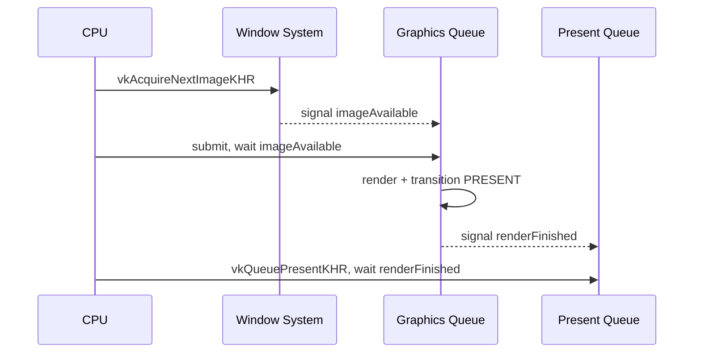

`vkAcquireNextImageKHR` 返回 image index，表示应用可以按协议使用该图像。渲染完成后，`vkQueuePresentKHR` 把它交回 presentation engine。

### 10.3 “Present” 后不一定直接扫描到显示器

窗口化系统可能还有：

- Desktop compositor；
- 色彩转换和合成；
- display engine/scan-out；
- present mode 导致的排队、丢帧或等待 vblank。

因此：

> Fragment Shader 写入 swapchain image，不等于那一瞬间像素就已经显示在屏幕上。

### 10.4 Frames in Flight

如果 CPU 每帧都等待 GPU 完整结束，CPU/GPU 几乎串行。常见方案允许 2～3 帧同时在途：

```text
CPU 正在构建 Frame N+1
GPU 正在执行 Frame N
显示系统可能正在呈现 Frame N-1
```

每个 `FrameContext` 通常有：

| 对象 | 为什么按 frame 分开 |
|---|---|
| Fence | 知道该 frame slot 何时可复用 |
| imageAvailable / renderFinished Semaphore | 避免不同帧 WSI 同步对象冲突 |
| Command Pool/Buffer | 上一帧 Pending 时不能 reset |
| Uniform/Upload ring slice | 避免 CPU 覆盖 GPU 正在读取的数据 |
| Descriptor arena/sets | 避免更新正在使用的 Set |
| Transient resources/deletion list | 在 Fence 完成后安全回收 |

### 10.5 Frame slot 不等于 Swapchain image index

例如：

- 2 个 frames-in-flight；
- 3 张 swapchain images。

`currentFrame = 0/1` 是 CPU 资源槽；`imageIndex = 0/1/2` 是本次 acquire 到的图像。二者不能用同一个变量代替。

如果同一 swapchain image 可能仍被更早 submission 使用，常见简单实现还维护：

```text
imageInFlightFence[imageIndex]
```

### 10.6 一帧循环的安全顺序

1. 等待 `frame[current].fence`。
2. 回收该 frame slot 的 deferred resources。
3. Acquire swapchain image。
4. 若返回 out-of-date，重建并跳过本帧。
5. 只有在确定会 submit 时再 reset Fence，避免 reset 后没有 submission 导致下一次永远等不到 signal。
6. Reset Command Pool，更新该帧 Uniform/Descriptor。
7. Record Command Buffer。
8. Submit：wait imageAvailable，signal renderFinished，并关联 Fence。
9. Present：wait renderFinished。
10. 处理 suboptimal/out-of-date，并推进 frame slot。

### 10.7 多 Command Buffer 的几种组织方式

| 组织方式 | 优点 | 风险/代价 |
|---|---|---|
| 每帧一个 Primary | 简单、容易调试 | CPU 录制难并行 |
| 一个 Primary + 每 Pass/线程 Secondary | 可并行录制大批 draw | secondary 开销、继承信息、粒度需要实测 |
| Upload/Compute/Graphics 分别 Command Buffer | 清晰表达不同工作与同步 | Queue/ownership/scheduling 更复杂 |
| 每 Pass 一个 Primary，批量 submit | 与 Render Graph 接近 | submit 太碎会增加 CPU/调度开销 |

Command Buffer 数量不是越多越好，重点是：

- 减少无意义 submit；
- 让 CPU 能并行；
- 让 GPU 有足够工作；
- 同步边界能与资源生命周期对应。

---

## 11. 一帧渲染的完整伪代码

### 11.1 初始化

```cpp
initLoader();
createInstanceAndDebugMessenger();
createSurface(window);

physicalDevice = choosePhysicalDevice(
    requiredFeatures,
    requiredExtensions,
    surfaceSupport);

createLogicalDeviceAndQueues();
createVmaAllocator();               // 可选，但实际项目强烈推荐。

createSwapchainAndViews();
createDepthAndIntermediateImages();

uploadStaticMeshesAndTextures();    // staging + transfer + sync。

createDescriptorSetLayouts();
createPipelineLayouts();
createShaderModulesAndPipelines();

createDescriptorPoolsAndSets();
writeDescriptors();

for (FrameContext& f : frames) {
    createCommandPoolAndBuffers(f);
    createFrameSyncObjects(f);
    createPerFrameUploadArena(f);
}
```

### 11.2 每帧

```cpp
void drawFrame() {
    FrameContext& f = frames[currentFrame];

    // CPU 等 GPU：只等待准备复用的 frame slot。
    vkWaitForFences(device, 1, &f.fence, VK_TRUE, UINT64_MAX);
    collectDeferredDeletes(f.completedSerial);

    uint32_t imageIndex = 0;
    VkResult acquire = vkAcquireNextImageKHR(
        device, swapchain, UINT64_MAX,
        f.imageAvailable, VK_NULL_HANDLE, &imageIndex);

    if (acquire == VK_ERROR_OUT_OF_DATE_KHR) {
        recreateSwapchain();
        return;
    }

    // 此后确保失败路径不会留下一个永远不 signal 的已 reset Fence。
    vkResetFences(device, 1, &f.fence);
    vkResetCommandPool(device, f.commandPool, 0);

    updateSceneOnCPU();
    writePerFrameUploadMemory(f);    // 必要时 flush。
    updateSafePerFrameDescriptors(f);

    recordFrameCommands(f.primary, imageIndex);

    submitGraphics(
        f.primary,
        /*wait=*/f.imageAvailable,
        /*signal=*/f.renderFinished,
        /*fence=*/f.fence);

    VkResult present = presentImage(
        presentQueue,
        swapchain,
        imageIndex,
        f.renderFinished);

    if (present == VK_ERROR_OUT_OF_DATE_KHR ||
        present == VK_SUBOPTIMAL_KHR ||
        framebufferResized) {
        recreateSwapchain();
    }

    currentFrame = (currentFrame + 1) % frames.size();
}
```

### 11.3 录制一帧

```cpp
void recordFrameCommands(VkCommandBuffer cmd, uint32_t imageIndex) {
    begin(cmd);

    transitionSwapchainImage(
        cmd, imageIndex,
        VK_IMAGE_LAYOUT_UNDEFINED, // 实际 old layout 应由你的状态跟踪决定。
        VK_IMAGE_LAYOUT_COLOR_ATTACHMENT_OPTIMAL);

    beginRendering(cmd, swapchainViews[imageIndex], depthView);

    for (const DrawItem& item : visibleDrawList) {
        bindPipelineIfChanged(cmd, item.pipeline);
        bindSceneMaterialObjectSets(cmd, item);
        bindMeshBuffers(cmd, item.mesh);
        vkCmdDrawIndexed(cmd, item.indexCount, 1, item.firstIndex,
                         item.vertexOffset, item.firstInstance);
    }

    endRendering(cmd);

    // 可在此进行 PostProcess/UI，实际应由 Render Graph 生成依赖。
    transitionSwapchainImage(
        cmd, imageIndex,
        VK_IMAGE_LAYOUT_COLOR_ATTACHMENT_OPTIMAL,
        VK_IMAGE_LAYOUT_PRESENT_SRC_KHR);

    end(cmd);
}
```

真实引擎不应每次硬编码 old layout；应由资源状态跟踪或 Render Graph 确定。Swapchain image 在 acquire 后的布局和是否保留旧内容，也必须按规范与实际渲染策略处理。

### 11.4 关闭顺序

简单安全版本：

```text
停止产生新任务
→ 等待必要的 GPU 工作完成
→ 销毁每帧资源/同步/Command Pool
→ 销毁 Pipeline/Layouts/Descriptors
→ 销毁应用自有 Buffer/Image/View/Sampler
→ 销毁 Swapchain
→ 销毁 VMA Allocator
→ 销毁 VkDevice
→ 销毁 Surface/Debug Messenger
→ 销毁 VkInstance
```

应严格遵守父子对象和 backing memory 生命周期；不要把这份逆序当作能覆盖所有扩展对象的唯一清单。

---

## 12. 容易遗漏但必须补齐的知识块

前面的内容覆盖了主干，但要做成稳定引擎，还缺以下工程层。

### 12.1 Validation Layer 与 Debug Utils

开发阶段建议：

- 启用 `VK_LAYER_KHRONOS_validation`；
- 开启 `VK_EXT_debug_utils`；
- 给 Buffer/Image/Pipeline/Pass 标可读名称；
- 使用 debug labels 包围 Render Pass/Draw 区域；
- 在 CI 上运行 validation 和 GPU-assisted validation 的合适组合。

同步错误很多时候不会立刻崩溃，而是表现为偶发闪烁、某显卡错误或数帧后 device lost。验证层是第一道防线，不是上线时的性能方案。

### 12.2 Render Graph / Frame Graph

Vulkan 只提供 Barrier、资源和命令，不替你决定整帧依赖。Render Graph 通常负责：

- 声明 Pass 读写哪些逻辑资源；
- 根据 RAW/WAR/WAW 建图与排序；
- 生成 Image Layout transition 和 Buffer/Image Barrier；
- 计算 transient resource 生命周期；
- 做资源别名/复用；
- 合并或重排 Pass；
- 安排 Graphics/Compute/Transfer Queue。

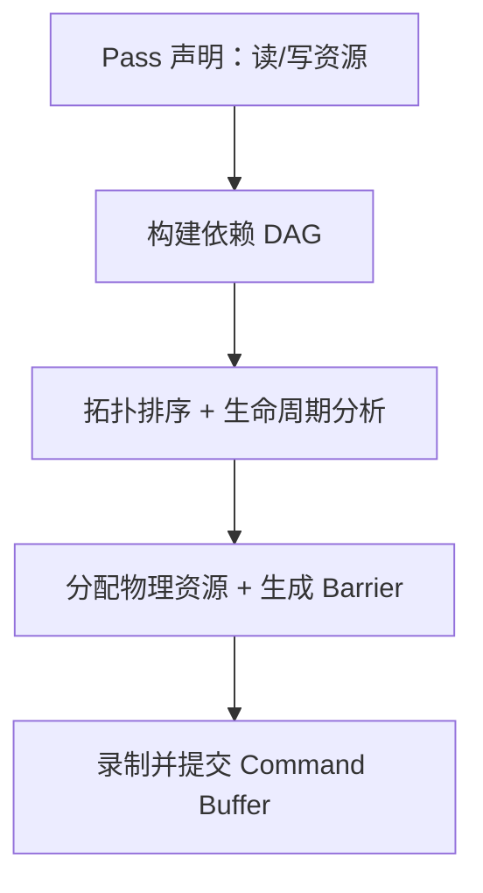

Render Graph 不是 Vulkan 对象，是引擎用 Vulkan 对象构建的高层系统。

### 12.3 资源状态跟踪

至少跟踪：

- Image 每个 mip/layer/aspect 的 layout、最后 stage/access、queue family；
- Buffer range 的使用状态（按需做粗粒度或细粒度）；
- 是否已初始化；
- 最后使用的 submission serial；
- 是否可以安全删除/复用。

没有这层，复杂多 Pass 项目会被手写 Barrier 淹没。

### 12.4 Descriptor 管理

除了创建一个 Pool，还要设计：

- persistent set 与 per-frame/transient set；
- Pool 扩容和 reset；
- Descriptor Set Layout/Pipeline Layout cache；
- Descriptor indexing/bindless 的设备能力和 fallback；
- update-after-bind、partially-bound 等 flags 的正确同步；
- 动态 Uniform/Storage offset；
- 材质变化时避免更新 GPU 正在读取的 Set。

### 12.5 Pipeline 与 Shader 系统

引擎还需要：

- Shader 编译、include、宏/variant；
- SPIR-V reflection 与 Layout 生成/校验；
- Pipeline key/hash；
- 异步创建与 fallback Pipeline；
- Pipeline cache 持久化及驱动/设备兼容校验；
- 热重载时的延迟销毁；
- Shader 调试信息与崩溃定位。

### 12.6 Memory Budget、Streaming 与 Eviction

成功分配不等于预算健康。还要：

- 查询 heap budget/usage；
- Texture mip streaming；
- LRU/优先级；
- 大资源 dedicated allocation；
- transient attachment 与 aliasing；
- 上传/回读 ring 的峰值控制；
- OOM 回退，而不是直接崩溃。

### 12.7 Device Lost、Swapchain 重建和错误恢复

需处理：

- 窗口 resize/minimize；
- `VK_ERROR_OUT_OF_DATE_KHR` / `VK_SUBOPTIMAL_KHR`；
- Surface 能力变化；
- device lost；
- 热插拔或驱动 reset；
- 重建对象时仍在途资源的回收。

### 12.8 查询与性能分析

常见工具：

- Timestamp Query：测 GPU Pass 时长；
- Occlusion Query；
- Pipeline Statistics（若支持）；
- RenderDoc、Nsight Graphics、Radeon GPU Profiler 等厂商/第三方工具；
- CPU 侧记录 Pipeline 创建、Descriptor 更新、Command 录制和 submit 开销。

CPU `std::chrono` 包住 `vkQueueSubmit` 只能测 Host 调用成本，不能代表 GPU 完成时间。

### 12.9 现代可选能力

主线之外还包括：

- Mesh/Task Shader；
- Ray Tracing Pipeline 与 Acceleration Structure；
- Descriptor Buffer；
- Buffer Device Address；
- Device-generated Commands；
- Sparse Resources；
- Video encode/decode queues；
- Fragment shading rate 等。

这些能力会扩展对象和同步模型，但不会推翻本章三条主线：资源、命令、同步。

---

## 13. WebGPU 与 Vulkan 的逐层对比

### 13.1 WebGPU 的定位

WebGPU 不是浏览器里的 Vulkan，也不是 WebGL 3。它借鉴 Vulkan、D3D12、Metal 的现代显式 API 结构，同时为了：

- 跨 Vulkan/D3D12/Metal 实现；
- 浏览器多进程与安全隔离；
- 跨厂商可移植；
- 降低同步和内存错误风险；

有意隐藏了大量硬件和驱动细节。

因此可以这样记：

```text
Vulkan：应用直接描述 native GPU 资源、状态、同步与队列
WebGPU：应用描述资源用途、Pass 和命令，WebGPU 实现翻译为 native API
```

### 13.2 对象映射

| Vulkan | WebGPU | 是否一一对应 |
|---|---|---|
| `VkInstance` | 无直接应用可见对象；由 User Agent/Native runtime 管理 | 否 |
| `VkPhysicalDevice` | `GPUAdapter` | 概念接近 |
| `VkDevice` | `GPUDevice` | 接近 |
| `VkQueue` | `GPUQueue` | 表面接近，但 WebGPU 不暴露 Queue Family/多硬件 Queue 拓扑 |
| `VkDeviceMemory` | 无 | 被实现隐藏 |
| `VkBuffer` | `GPUBuffer` | 接近，但创建与内存绑定合并/隐藏 |
| `VkImage` | `GPUTexture` | 接近 |
| `VkImageView` | `GPUTextureView` | 接近 |
| `VkSampler` | `GPUSampler` | 接近 |
| `VkDescriptorSetLayout` | `GPUBindGroupLayout` | 很接近 |
| `VkDescriptorSet` | `GPUBindGroup` | 很接近 |
| `VkDescriptorPool` | 无 | 由实现内部管理 |
| `VkPipelineLayout` | `GPUPipelineLayout` | 接近 |
| `VkShaderModule` | `GPUShaderModule` | 接近；标准 WebGPU 使用 WGSL |
| `VkPipeline` | `GPURenderPipeline` / `GPUComputePipeline` | 接近 |
| `VkRenderPass`/Dynamic Rendering scope | `GPURenderPassEncoder` | 是工作范围映射，不是同构对象 |
| `VkCommandPool` | 无 | 实现内部管理 |
| Command Buffer 录制 | `GPUCommandEncoder` | 接近 |
| `VkCommandBuffer` | `GPUCommandBuffer` | 接近，但生命周期/复用规则不同 |
| Secondary Command Buffer | `GPURenderBundle` 有部分相似用途 | 不是等价物 |
| `vkQueueSubmit` | `GPUQueue.submit()` | 接近 |
| `VkFence` | `queue.onSubmittedWorkDone()` 只提供较粗完成通知 | 非一一对应 |
| `VkSemaphore` | 无应用可见等价物 | 被实现隐藏 |
| `vkCmdPipelineBarrier2` | 无应用可见等价物 | 由实现根据 usage/pass 自动生成 native 同步 |
| Image Layout | 无应用可见状态 | 由实现跟踪 |
| `VkSurfaceKHR` + `VkSwapchainKHR` | `GPUCanvasContext` + `getCurrentTexture()` | 高层封装 |
| `VkQueryPool` | `GPUQuerySet` | 部分对应，能力更受限 |

### 13.3 WebGPU 的六层心智模型

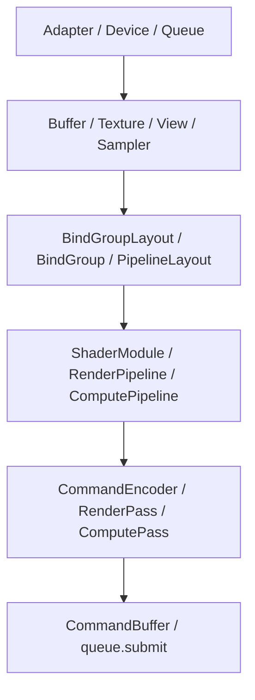

WebGPU 代码与 Vulkan 的直接迁移关系：

```js
const encoder = device.createCommandEncoder();

const pass = encoder.beginRenderPass(renderPassDescriptor);
pass.setPipeline(pipeline);
pass.setBindGroup(0, sceneBindGroup);
pass.setVertexBuffer(0, vertexBuffer);
pass.setIndexBuffer(indexBuffer, "uint32");
pass.drawIndexed(indexCount);
pass.end();

const commandBuffer = encoder.finish();
device.queue.submit([commandBuffer]);
```

对应 Vulkan 的：

```text
vkBeginCommandBuffer
vkCmdBeginRendering
vkCmdBindPipeline
vkCmdBindDescriptorSets
vkCmdBindVertexBuffers
vkCmdBindIndexBuffer
vkCmdDrawIndexed
vkCmdEndRendering
vkEndCommandBuffer
vkQueueSubmit2
```

### 13.4 WebGPU 隐藏或缺少的 Vulkan 控制

下面以标准、可移植 WebGPU 为基线。WebGPU 和实现扩展仍会演进，不能把某个浏览器实验特性当作所有平台的标准能力。

| Vulkan 能力 | WebGPU 状态 | 影响 |
|---|---|---|
| Memory Heap/Type、`VkDeviceMemory`、bind | 隐藏 | 不能选择具体 heap/type、offset 或直接使用 VMA |
| 显式 Barrier、stage/access、Image Layout | 隐藏 | 正确性更简单，但无法手工做最细同步优化 |
| 多 Queue/Queue Family/ownership transfer | 隐藏 | 无法像 Vulkan 一样显式安排 dedicated transfer/async compute queues |
| Fence/Semaphore/Timeline Semaphore | 不直接暴露 | 使用 API promise/callback 等较高层完成通知，无法复刻全部原生同步图 |
| Descriptor Pool | 隐藏 | Bind Group 的底层存储由实现管理 |
| Command Pool/Primary/Secondary | 隐藏/简化 | 不能直接管理原生命令内存；Render Bundle 只覆盖部分复用场景 |
| 显式 Swapchain acquire/present 同步 | 隐藏 | Canvas current texture 和浏览器/实现管理呈现 |
| Push Constant / 小型即时数据 | 2026-09 Editor’s Draft 已定义可选 `immediate_address_space`、Pipeline Layout 的 `immediateSize` 与 `setImmediates`；部署支持不能一概而论 | 必须查询 feature/limit；不可用时用小 Uniform Buffer + offset fallback |
| 任意 Pipeline Cache 控制 | 隐藏 | 应用仍可缓存 WebGPU Pipeline 对象，但无法直接管理原生 cache blob |
| Sparse residency/显式 memory aliasing | 标准核心缺少 | 真正的 tiled residency/aliasing 不能完整模拟 |
| Vulkan 风格 unrestricted bindless/device address | 标准可移植集合更受限 | 需按 feature/limit 设计 Bind Group、数组和索引方案 |
| Geometry/Tessellation/Mesh/Task Shader | 不属于 WebGPU 基线图形阶段 | 需算法 fallback，部分功能无法等价实现 |
| Ray Tracing Pipeline/Acceleration Structure | 不属于标准核心 | 不能假定可用；可用 Compute 软件路径但能力和性能不同 |
| Subpass/Input Attachment 模型 | 无直接等价物 | 多数场景拆成 Render Pass/Texture 读写，代价需评估 |
| 外部内存/外部 Semaphore/原生互操作 | Web 标准严格受限 | Native 实现可能有扩展，但不可作为 Web 可移植基础 |

特别说明：WebGPU 仍在演进。本文核对的 2026-09 Editor’s Draft 已出现与 Vulkan Push Constant 用途相近的 **Immediate Data**，WGSL 通过 `var<immediate>` 读取，由 command encoder 的 `setImmediates` 写入；它不能被当成所有浏览器和设备都已具备的固定基线。做生产引擎时应按 adapter/device 能力检测，并保留 Uniform Buffer fallback。

### 13.5 WebGPU 没有显式 Barrier，依赖并没有消失

WebGPU 应用写：

```js
const compute = encoder.beginComputePass();
compute.setPipeline(computePipeline);
compute.setBindGroup(0, simulationData);
compute.dispatchWorkgroups(x, y, z);
compute.end();

const render = encoder.beginRenderPass(renderDesc);
render.setPipeline(renderPipeline);
render.setBindGroup(0, simulationData);
render.draw(vertexCount);
render.end();
```

实现仍需在 Vulkan 后端解决：

```text
Compute storage write
→ VkBuffer/VkImage memory barrier + layout transition（如适用）
→ Graphics shader read
```

所以正确说法是：

> WebGPU 把 native resource state tracking 和 barrier 生成责任移交给实现，而不是 GPU 不再需要同步。

### 13.6 WebGPU 的上传与映射

常见方式：

- `device.queue.writeBuffer()` / `writeTexture()`：实现内部完成上传与必要的 staging/copy。
- `mappedAtCreation: true`：创建时拿到 mapped range，写完 `unmap()` 后交给 GPU。
- `mapAsync(GPUMapMode.READ/WRITE)`：异步取得 CPU 访问权；mapped 时应用与 GPU 使用存在严格互斥规则。
- 显式用 `COPY_SRC/COPY_DST` Buffer/Texture 加 CommandEncoder copy：构建自己的高层上传/回读流程。

即使 WebGPU 不让你选 memory type，引擎仍要减少小而碎的 `writeBuffer`、做 upload ring/pool，并控制资源创建峰值。

---

## 14. 哪些由 WebGPU 实现补，哪些由引擎补

“WebGPU 比 Vulkan 少的功能，都由引擎补”这句话只对一部分成立。准确分成三类。

### 14.1 第一类：由 WebGPU 实现自动补

应用看不见，但 Dawn/wgpu/浏览器实现必须处理：

| 隐藏工作 | 实现需要做什么 |
|---|---|
| 原生资源分配 | 选择 Vulkan memory type、分配/复用 backing memory、处理 OOM |
| 资源状态 | 跟踪 Buffer/Texture usage、subresource state |
| Barrier/Layout | 根据 Pass 和命令用法插入 Vulkan/D3D12 barrier 或 Metal 对应同步 |
| Descriptor 实现 | 把 Bind Group 翻译成 descriptor set/buffer/table/argument buffer 等 |
| Shader 翻译 | WGSL 校验并转为 SPIR-V/HLSL/MSL，再交给驱动编译 |
| Queue/WSI | 映射到 native queue，管理 acquire/present 和内部同步 |
| 安全初始化 | 防止读取到其他页面/进程留下的未初始化 GPU 数据 |
| 延迟销毁 | GPU 还在使用对象时，延迟释放 native handle/memory |
| 驱动兼容 | 做 feature gating、限制归一化和 driver workaround |

这些不能由普通 WebGPU 引擎直接替换，因为应用拿不到相应 native 控制。

### 14.2 第二类：仍必须由渲染引擎补

WebGPU 只保证 API 正确性，不替你构建高层 Renderer：

| 引擎系统 | 主要职责 |
|---|---|
| Scene/World | Entity、Transform、Camera、Light、可见性 |
| Render Graph | Pass 依赖、逻辑资源生命周期、排序和可选优化 |
| Resource Manager | Texture/Mesh cache、streaming、upload/readback pool、LRU |
| Material/Binding System | Bind Group 组织、dynamic offset、绑定缓存 |
| Shader System | WGSL 生成、variant、reflection、热重载 |
| Pipeline Cache | 按状态 key 复用 `GPURenderPipeline`，异步创建 |
| Draw List | Culling、sorting、batching、instancing、indirect draw |
| Frame Resource Ring | 防止 CPU 覆盖 GPU 在途资源；按逻辑 frame slot 分片 |
| Feature Fallback | 根据 adapter features/limits 选择算法和资源格式 |
| Profiler | Timestamp Query（可用时）、Pass 标记、CPU/GPU 指标 |
| Presentation Layer | Canvas configure、resize、DPI、色彩空间和设备丢失恢复 |

特别注意：WebGPU 自动插 Barrier 只保证正确，不知道你的业务意图。Render Graph 仍有价值，因为它能：

- 避免创建大量临时 Texture；
- 控制 Pass 顺序和生命周期；
- 找出可合并或可跳过的 Pass；
- 做逻辑层资源池化；
- 为 Vulkan/Metal/D3D12/WebGPU 多后端共用同一套 Frame 描述。

### 14.3 第三类：引擎无法完整补，只能降级或放弃

| 缺失控制 | 为什么不能完整模拟 | 可选策略 |
|---|---|---|
| 真正多 Queue async compute | WebGPU 不让应用选择/同步 native queues | 单 Queue 排序；让实现内部优化；Native Vulkan 后端保留高级路径 |
| Sparse residency | 无页级 commit/decommit API | mip streaming、texture atlas、软件虚拟纹理但代价更高 |
| 原生 Ray Tracing Pipeline | 没有标准 AS/RT pipeline 对象 | Compute-based BVH traversal；或按平台关闭 |
| Mesh Shader | 没有对应 stage | Compute culling + indirect draw/传统 vertex pipeline |
| 显式 memory aliasing | 无 `VkDeviceMemory + offset` 控制 | 复用整个 GPUTexture/GPUBuffer 对象，不能保证同等 aliasing |
| 精确 stage/access barrier 调优 | API 不暴露 | 优化 Pass/usage，依赖实现；Native 后端单独调优 |

所以跨 Vulkan + WebGPU 引擎的合理抽象不是“封装所有 Vulkan 功能”，而是：

```text
Portable Core
├─ Buffer / Texture / Sampler
├─ Bind Group / Pipeline
├─ Render / Compute / Copy Pass
└─ Logical resource dependencies

Backend Capabilities
├─ Vulkan advanced path
└─ WebGPU portable fallback
```

### 14.4 建议的 WebGPU 引擎模块

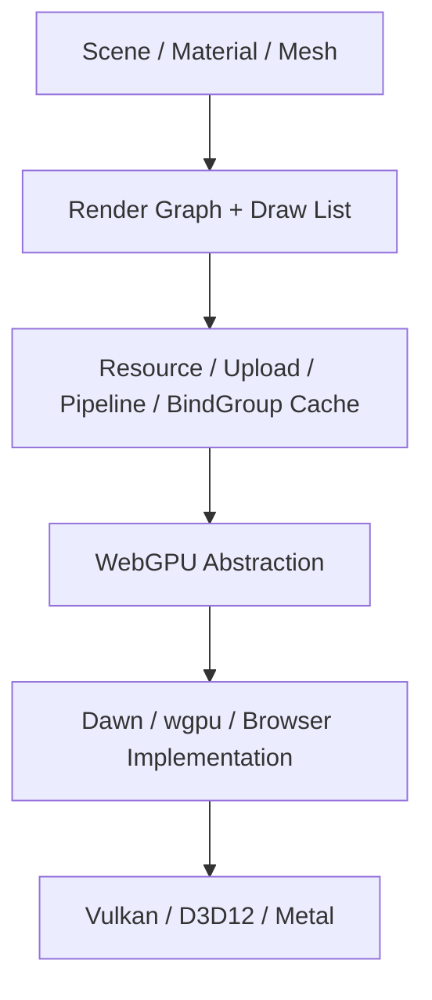

---

## 15. Dawn 是如何实现 WebGPU 的

### 15.1 Dawn 不是渲染引擎

Dawn 是 WebGPU 的实现。它负责把 WebGPU API 翻译到 Vulkan、D3D12、Metal 等原生 API；它不负责 Scene、Material、Render Graph、PBR 或 UI Renderer。

### 15.2 Dawn 的主要层次

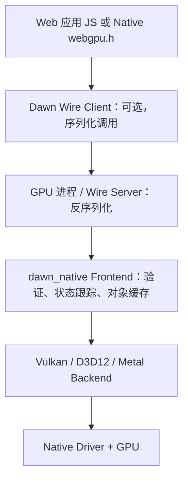

Native 程序可以直接使用 Dawn Native，从而跳过浏览器式 Wire；Chromium 等多进程场景会使用序列化/IPC 架构。

### 15.3 Shader：Tint 把 WGSL 翻译到各后端

Dawn 使用 Tint 处理 WGSL：

```text
WGSL
→ 解析、语义验证、变换
├─ Vulkan SPIR-V
├─ D3D HLSL/DXIL 路径
└─ Metal MSL
→ Native Driver 编译/创建 Pipeline
```

因此 WebGPU 的 `GPUShaderModule` 并不是 GPU 直接运行 WGSL 文本；最终仍要转换成后端可接受的表示和厂商机器码。

### 15.4 Command Encoder：先记录 WebGPU 命令，再翻译 Native Command Buffer

Dawn 前端会保存命令与资源 usage 信息。Vulkan 后端随后遍历命令，概念上执行：

```text
WebGPU Copy/Pass/Draw/Dispatch
→ 检查资源初始化状态
→ 根据前端预计算 usage 准备同步范围
→ TransitionUsageNow / 生成需要的 Vulkan transition
→ 记录 vkCmdCopy* / vkCmdDraw* / vkCmdDispatch 等
```

Dawn 当前 Vulkan 后端源码中的 `CommandBufferVk.cpp` 可以直接看到：

- WebGPU copy 被翻译为 `CmdCopyBuffer`、`CmdCopyBufferToImage` 等；
- 在 copy/pass 前调用资源 usage transition；
- Render/Compute Pass 前准备 resource usages；
- `WriteBuffer` 使用内部 dynamic uploader，再录制 copy；
- 某些驱动问题通过 toggle 拆分 Command Buffer 或选择替代路径。

这正是“WebGPU 没有显式 Barrier，但底层 Vulkan 仍有 Barrier”的落点。

### 15.5 Bind Group：翻译成后端绑定结构

前端 `GPUBindGroupLayout`/`GPUBindGroup` 会被 backend 实现为：

- Vulkan Descriptor Set/Layout、Descriptor Buffer/资源表等适用路径；
- D3D12 Descriptor Heap/Table；
- Metal Argument Buffer 或对应资源绑定。

具体实现会随 Dawn 版本、feature 和后端能力演进，不应在引擎里假设“一个 Bind Group 永远就是一个 VkDescriptorSet”。稳定的是 WebGPU 接口语义。

### 15.6 Dawn 的 Vulkan 内存管理

Dawn Vulkan backend 自己有资源内存分配层，而不是把 `VkDeviceMemory` 暴露给 WebGPU 应用。

从当前 `ResourceMemoryAllocatorVk.cpp` 可看到的核心结构：

```text
ResourceMemoryAllocator
→ 按 Vulkan memory type 建 allocator
→ Resource heap：大块 VkDeviceMemory
→ Buddy allocator 做 suballocation
→ 大资源或不适合 suballocate 的资源走 direct allocation
→ 记录 allocated/used/lazy memory
→ 按 GPU execution serial 延迟释放
```

当前实现还会考虑：

- `VkMemoryRequirements`；
- memory kind 与最佳 memory type；
- `bufferImageGranularity`；
- `nonCoherentAtomSize`；
- mappable 与 non-mappable 资源；
- 内存回收时不能立即产生危险 alias。

这与 VMA 解决的问题很相似，但它是 Dawn 自己的实现细节。**使用 Dawn 的 WebGPU 应用不需要、也无法给 `GPUBuffer` 直接附加一个 VMA allocation。**

### 15.7 Dawn 还补了哪些 WebGPU 语义

| 能力 | Dawn 的角色 |
|---|---|
| Validation | 检查对象、usage、limits、Pass 内资源冲突等 |
| Resource initialization | 对未初始化资源做安全清零/跟踪，防止信息泄露 |
| State tracking | 跟踪资源上次用途，准备后端同步 |
| Dynamic uploader | 为 `writeBuffer` 等管理内部上传空间和 copy |
| Fenced deletion | GPU 完成到相应 serial 后才销毁原生对象/内存 |
| Object cache | 缓存一些不可变且昂贵的对象，例如 Pipeline/Layout |
| Driver workaround | 通过 adapter/device toggle 选择安全路径 |
| Wire | 在内容进程和 GPU 进程之间序列化、验证调用 |
| Error model | 把后端错误映射到 WebGPU error scope/device loss 语义 |

### 15.8 读 Dawn 源码的建议路线

| 想理解什么 | 先看目录/文件 |
|---|---|
| 总体架构 | `docs/dawn/overview.md` |
| Device 提供的设施 | `docs/dawn/device_facilities.md` |
| Vulkan 命令翻译 | `src/dawn/native/vulkan/CommandBufferVk.cpp` |
| Buffer/Texture 状态 | `BufferVk.*`、`TextureVk.*` |
| 内存选择/分配 | `MemoryTypeSelector.*`、`ResourceMemoryAllocatorVk.*`、`ResourceHeapVk.*` |
| Bind Group | `BindGroupLayoutVk.*`、`BindGroupVk.*`、`DescriptorSetAllocator.*`、`ResourceTableVk.*` |
| Pipeline | `PipelineLayoutVk.*`、`RenderPipelineVk.*`、`ComputePipelineVk.*` |
| Queue/提交 | `QueueVk.*`、`CommandRecordingContextVk.*` |
| 延迟释放 | `FencedDeleter.*` |
| WGSL 翻译 | `src/tint/` 与 Dawn ShaderModule 后端文件 |

读源码时始终问：这段属于 WebGPU frontend 语义，还是 Vulkan backend 翻译？这能避免把 Dawn 的某个后端策略误认为 WebGPU 规范。

---

## 16. VMA：Vulkan Memory Allocator

### 16.1 VMA 的一句话定位

VMA 是 AMD/GPUOpen 维护的 Vulkan 内存分配库：

> 它替直接 Vulkan 应用完成 memory type 选择、大块 `VkDeviceMemory` 分配、suballocation、资源绑定、mapping、budget、pool 和 defragmentation 等工程工作。

它位于这里：

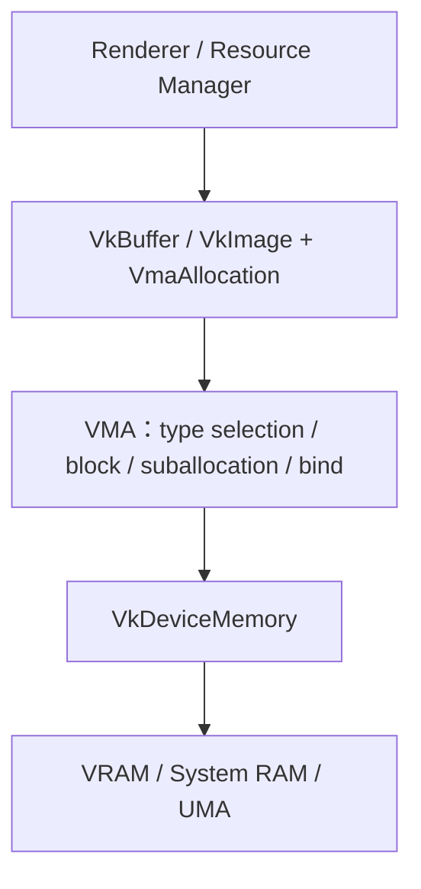

### 16.2 不用 VMA 与使用 VMA

裸 Vulkan：

```text
vkCreateBuffer
→ vkGetBufferMemoryRequirements
→ findMemoryType
→ vkAllocateMemory / suballocate
→ vkBindBufferMemory
```

VMA：

```text
vmaCreateBuffer
→ 返回 VkBuffer + VmaAllocation，内存已经选择、分配并绑定
```

### 16.3 核心对象

| VMA 对象 | 含义 |
|---|---|
| `VmaAllocator` | 一个 `VkDevice` 对应的总内存管理器 |
| `VmaAllocation` | 某个资源占用的 allocation；常是大 `VkDeviceMemory` 中的 offset/size，不等于 `VkDeviceMemory` |
| `VmaAllocationInfo` | memory type、device memory、offset、size、mapped pointer 等查询信息 |
| `VmaPool` | 指定 memory type/算法/块大小的专用池 |
| `VmaVirtualBlock` | 只管理虚拟 offset 的通用 suballocator，不自动分配 Vulkan memory |

### 16.4 内部结构

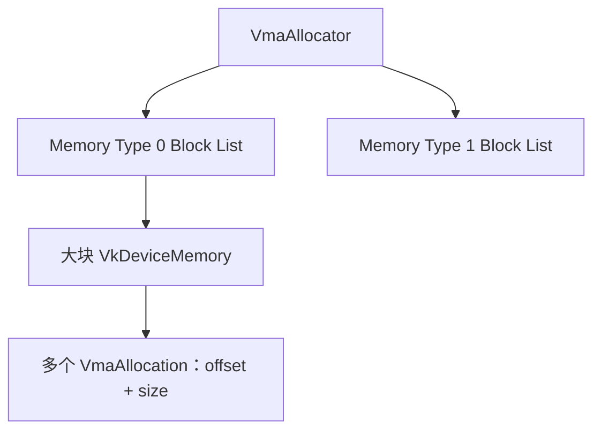

最重要的关系：

```text
VkBuffer/VkImage
→ 绑定到 VmaAllocation 表示的区域
→ 该区域可能只是某个 VkDeviceMemory Block 的一小段
```

只有 dedicated allocation 等场景，`VmaAllocation` 才可能独占一个 `VkDeviceMemory`。

### 16.5 创建 VMA Allocator

VMA 官方建议：每个 `VkDevice` 通常创建一个 allocator；在 Device 之后创建，在 Device 之前销毁。

```cpp
VmaAllocatorCreateInfo allocatorInfo{};
allocatorInfo.instance = instance;
allocatorInfo.physicalDevice = physicalDevice;
allocatorInfo.device = device;
allocatorInfo.vulkanApiVersion = VK_API_VERSION_1_3;

// 只在实际启用相应 Vulkan 能力后设置对应 VMA flags。
allocatorInfo.flags = VMA_ALLOCATOR_CREATE_EXT_MEMORY_BUDGET_BIT;

VmaAllocator allocator = VK_NULL_HANDLE;
vmaCreateAllocator(&allocatorInfo, &allocator);

// ...程序结束且相关资源均已销毁后：
vmaDestroyAllocator(allocator);
```

单头文件集成时，在且只在一个 `.cpp` 中：

```cpp
#define VMA_IMPLEMENTATION
#include "vk_mem_alloc.h"
```

### 16.6 用 VMA 创建 Device-local Vertex Buffer

```cpp
VkBufferCreateInfo bufferInfo{
    .sType = VK_STRUCTURE_TYPE_BUFFER_CREATE_INFO,
    .size = bytes,
    .usage = VK_BUFFER_USAGE_TRANSFER_DST_BIT |
             VK_BUFFER_USAGE_VERTEX_BUFFER_BIT,
    .sharingMode = VK_SHARING_MODE_EXCLUSIVE,
};

VmaAllocationCreateInfo allocInfo{};
allocInfo.usage = VMA_MEMORY_USAGE_AUTO_PREFER_DEVICE;

VkBuffer vertexBuffer = VK_NULL_HANDLE;
VmaAllocation vertexAllocation = VK_NULL_HANDLE;

vmaCreateBuffer(
    allocator,
    &bufferInfo,
    &allocInfo,
    &vertexBuffer,
    &vertexAllocation,
    nullptr);
```

VMA 内部会查询 requirements、选择允许且合适的 memory type、从 block suballocate 或 dedicated allocate，并绑定 Buffer。

### 16.7 用 VMA 创建 persistently mapped Staging Buffer

```cpp
VkBufferCreateInfo stagingInfo{
    .sType = VK_STRUCTURE_TYPE_BUFFER_CREATE_INFO,
    .size = bytes,
    .usage = VK_BUFFER_USAGE_TRANSFER_SRC_BIT,
    .sharingMode = VK_SHARING_MODE_EXCLUSIVE,
};

VmaAllocationCreateInfo stagingAllocInfo{};
stagingAllocInfo.usage = VMA_MEMORY_USAGE_AUTO_PREFER_HOST;
stagingAllocInfo.flags =
    VMA_ALLOCATION_CREATE_HOST_ACCESS_SEQUENTIAL_WRITE_BIT |
    VMA_ALLOCATION_CREATE_MAPPED_BIT;

VkBuffer stagingBuffer = VK_NULL_HANDLE;
VmaAllocation stagingAllocation = VK_NULL_HANDLE;
VmaAllocationInfo stagingAllocationInfo{};

vmaCreateBuffer(
    allocator,
    &stagingInfo,
    &stagingAllocInfo,
    &stagingBuffer,
    &stagingAllocation,
    &stagingAllocationInfo);

std::memcpy(stagingAllocationInfo.pMappedData, sourceData, bytes);

// 对 coherent memory 是安全 no-op；对 non-coherent memory 处理 flush。
vmaFlushAllocation(allocator, stagingAllocation, 0, bytes);
```

然后仍然要由应用：

```text
录制 vkCmdCopyBuffer
→ 加正确 Barrier/Queue 同步
→ submit
→ 等完成后回收 staging region
```

VMA 只处理 backing memory，不会自动替你录制或提交 copy。

### 16.8 `AUTO`、Host Access Flag 与旧枚举

VMA 3.x 推荐以 `VMA_MEMORY_USAGE_AUTO*` 为主：

- `VMA_MEMORY_USAGE_AUTO`：根据资源创建信息和 flags 自动选择。
- `AUTO_PREFER_DEVICE`：在满足要求的类型里偏好设备侧。
- `AUTO_PREFER_HOST`：偏好 Host 侧。

如果需要 map，还要给出意图：

- `HOST_ACCESS_SEQUENTIAL_WRITE`：CPU 顺序写，常见 staging/upload。
- `HOST_ACCESS_RANDOM`：CPU 随机读写，常见 readback 或真正随机访问。
- `MAPPED`：persistent mapping，并通过 `VmaAllocationInfo::pMappedData` 获取指针。

旧的 `GPU_ONLY`、`CPU_ONLY`、`CPU_TO_GPU`、`GPU_TO_CPU` 等枚举为兼容仍存在，但官方文档已建议新代码使用 `AUTO*`。

### 16.9 Pool、Dedicated、Linear Algorithm

#### 默认 allocator

绝大多数资源先使用默认 VMA 分配即可。VMA 自动维护各 memory type 的 block list。

#### Custom Pool

适合已知的专用策略：

- 每帧 transient allocations；
- 固定 memory type 的资源；
- 明确 block size；
- 外部内存/特殊分配约束；
- 线性、栈、双栈、ring 式生命周期。

不要因为“Pool 听起来性能高”就给每类资源各建一个 Pool；过度分池会降低 block 利用率。

#### Dedicated Allocation

适合：

- 驱动明确要求/建议 dedicated；
- 很大的 Image/Buffer；
- 特殊外部内存场景；
- 默认大 block 失败但精确大小能成功等情况。

VMA 可以自动决策，也可通过 flag 强制。Dedicated 意味着资源通常绑定到 offset 0 的独立 `VkDeviceMemory`。

### 16.10 Budget、统计与 Debug

VMA 提供：

- heap budget/usage 查询；
- allocation/block 统计；
- JSON stats dump；
- allocation name/user data；
- 可选调试 margin、corruption detection、leak 辅助；
- memory priority 等扩展集成。

引擎应将 VMA 统计接入自己的资源类别：Texture、RT、Mesh、Upload、Readback、Acceleration Structure，而不是只有一条“显存用了多少”。

### 16.11 Defragmentation 与 Aliasing

VMA 可以帮助计划/执行 defragmentation，但 GPU 资源移动不是普通 CPU `memmove`：

- 资源可能仍被 GPU 使用；
- Image/Buffer 绑定与内容搬迁要遵守 API；
- 应用需要按 VMA API 协调 pass、copy 或资源替换；
- Device address、映射、外部内存等会增加限制。

VMA 也支持显式 resource aliasing/virtual allocation 等高级能力。只有在 Render Graph 已经能准确证明两个资源生命周期不重叠时，aliasing 才安全。

### 16.12 VMA 不负责什么

| 不负责 | 仍由谁负责 |
|---|---|
| Shader/Pipeline | Renderer/Pipeline 系统 |
| Descriptor | Descriptor/Material 系统 |
| Command Buffer/Queue | Renderer/提交系统 |
| Barrier/Semaphore/Fence | 同步/Render Graph |
| 何时可销毁资源 | 引擎生命周期/完成 serial；VMA 不会替你等 Fence |
| Texture mip streaming 策略 | Resource Manager |
| Draw/Dispatch | Renderer |

最危险的误区：

```cpp
vkQueueSubmit2(...);
vmaDestroyBuffer(allocator, buffer, allocation); // GPU 若仍在使用，就是错误。
```

正确方式是等相关 Fence/Timeline value，或 deferred delete 到对应 completion serial。

### 16.13 VMA 与 Dawn 的关系

| 使用场景 | 是否直接使用 VMA |
|---|---|
| 自己写 Vulkan Renderer | 推荐考虑 VMA，除非确实需要自研 allocator |
| 使用 Dawn/WebGPU | 应用层不直接使用 VMA 管 `GPUBuffer/GPUTexture`；Dawn backend 有自己的原生内存管理 |
| 同一引擎有 Vulkan 与 WebGPU 后端 | Vulkan backend 可用 VMA；WebGPU backend 使用 `GPUBuffer/GPUTexture`，在更高层统一 Resource Manager 语义 |

不要把 VMA 塞到 WebGPU API 与 Dawn 之间。两者处在不同抽象层。

---

## 17. 最终心智模型、串讲提纲与检查清单

### 17.1 用十句话串通 Vulkan

1. `VkInstance` 建立应用与 Vulkan 实现的连接；`VkPhysicalDevice` 用来查询硬件能力。
2. `VkDevice` 启用所需 features/extensions 并创建逻辑设备，`VkQueue` 是设备工作提交入口。
3. `VkBuffer`/`VkImage` 只是资源描述，真正内容位于绑定的 `VkDeviceMemory`；VMA 可以管理这层。
4. CPU 普通数据通常先写 Host-visible staging/upload memory，再由 copy 命令进入 device-local 资源。
5. Shader 通过 Vertex Input、Descriptor 和 Push Constant 找到数据；Image 通常还经 Image View/Sampler。
6. Descriptor Set Layout 定义单组资源接口，Pipeline Layout 组合各组接口和 Push Constants。
7. Pipeline 把 Shader、Pipeline Layout 和固定功能状态组合成 draw/dispatch 使用的程序状态。
8. Command Buffer 记录 bind/copy/draw/dispatch/barrier；Queue submit 后才进入 GPU 时间线。
9. Barrier 管命令间依赖，Semaphore 管 submission 间依赖，Fence/Host-wait Timeline 让 CPU 知道完成。
10. GPU 写完 swapchain image 后，Present Queue/窗口系统/显示引擎共同把结果呈现到屏幕。

### 17.2 一张对象—内存—命令—同步表

| 阶段 | 核心 Vulkan 对象 | 内存发生什么 | 同步重点 |
|---|---|---|---|
| 设备初始化 | Instance、PhysicalDevice、Device、Queue | 查询 heaps/types/limits | 暂无帧内同步 |
| 资源创建 | Buffer、Image、DeviceMemory、View、Sampler | allocate/suballocate/bind/map | 对象生命周期 |
| 上传 | Staging、Transfer Command Buffer | CPU write → GPU copy | flush、copy barrier、upload completion |
| 资源绑定 | Descriptor Layout/Pool/Set、Pipeline Layout | Descriptor 引用资源，不复制内容 | 不更新正在使用的 Set |
| 程序状态 | Shader Module、Pipeline | 驱动可能分配 Host/device 内部数据并编译 | Pipeline 创建并发/缓存 |
| 录制 | Command Pool/Buffer | Host-side 命令存储 | Pool 外部同步、Pending 生命周期 |
| 执行 | Queue、Submission | GPU 读取命令和资源 | Barrier/Semaphore |
| 帧复用 | Fence、Timeline | 重写 upload/uniform、回收内存 | 等对应 completion |
| 显示 | Surface、Swapchain、Present | swapchain memory 由实现拥有 | acquire/render/present binary semaphores |

### 17.3 90 分钟团队串讲建议

| 时间 | 内容 | 要让听众回答的问题 |
|---:|---|---|
| 0–10 分钟 | 总图与三条线 | Vulkan 到底显式了哪三类责任？ |
| 10–25 分钟 | Shader 数据流 | 一个 `std::vector<Vertex>` 怎样被 Vertex Shader 使用？ |
| 25–40 分钟 | Heap/Type/Resource/Memory/VMA | `VkBuffer` 为什么不等于显存？ |
| 40–55 分钟 | Descriptor/Pipeline | Shader 的 `set/binding` 怎样连到实际 Texture？ |
| 55–65 分钟 | Command/Submit/GPU | `vkCmdDraw` 调用时 GPU 执行了吗？ |
| 65–77 分钟 | Barrier/Semaphore/Fence | 同 Queue、跨 Queue、CPU wait 分别选什么？ |
| 77–83 分钟 | Swapchain/Frames in Flight | frame slot 和 image index 为什么不同？ |
| 83–90 分钟 | WebGPU/Dawn/VMA | 哪些复杂度消失了，哪些只是下沉了？ |

### 17.4 每次设计资源时问

- 谁创建数据：CPU、Transfer、Compute、Graphics？
- 最终放 Buffer 还是 Image？usage flags 是否完整？
- 需要 Host-visible 还是优先 Device-local？
- 是长期资源、每帧资源还是 transient resource？
- 谁第一次使用、谁最后一次使用？
- 是否跨 Queue/Queue Family？
- 何时可回收 staging、Descriptor、Command Buffer 和 allocation？

### 17.5 每次写 Barrier 时问

- 具体 resource/range/subresource 是什么？
- 前一个 producer stage/access 是什么？
- 后一个 consumer stage/access 是什么？
- Image old/new layout 是什么？
- 是否真正需要 memory dependency，还是只要 execution dependency？
- 跨 Queue 时是否有 Semaphore？
- 跨 Queue Family 时是否有 ownership transfer？

### 17.6 每次卡顿时分层定位

| 现象 | 优先检查 |
|---|---|
| CPU 提交慢 | 过多 draw/submit、Descriptor 更新、Pipeline 切换、Validation |
| Pipeline 首次使用卡顿 | Shader/Pipeline 编译、Pipeline cache/预热 |
| GPU 空泡 | Barrier 过宽、submit 过碎、数据未及时上传、Pass 依赖 |
| VRAM 爆涨 | 临时 Texture、延迟销毁、Pool 碎片、Streaming/Budget |
| 偶发花屏 | 缺 Barrier、错误 Layout、过早复用 frame resource |
| 某显卡才错 | feature/limit/format 假设、未定义行为、驱动 workaround |
| Resize 后挂起 | Swapchain 重建、Fence reset 失败路径、旧资源仍在途 |

### 17.7 最终四层关系

```text
Renderer / Render Graph
决定：画什么、有哪些 Pass、逻辑资源何时读写

↓

Vulkan 或 WebGPU
描述：资源、绑定、Pipeline、命令、提交

↓

Driver / Dawn Backend
完成：校验、Shader 编译、原生状态、内存、Barrier/命令翻译

↓

GPU + Display System
执行：访存、Shader、光栅化、写附件、合成与呈现
```

Vulkan 把更多 native 责任交给应用；WebGPU 把一部分责任下沉到 Dawn 等实现。VMA 只替 Vulkan 应用管理资源 backing memory。三者不处在同一个替代关系上。

---

## 18. 官方资料

### Vulkan / Khronos

- [Vulkan Specification：Memory Allocation](https://docs.vulkan.org/spec/latest/chapters/memory.html)
- [Vulkan Specification：Descriptor Sets](https://docs.vulkan.org/spec/latest/chapters/descriptorsets.html)
- [Vulkan Specification：Pipelines](https://docs.vulkan.org/spec/latest/chapters/pipelines.html)
- [Vulkan Specification：Command Buffers](https://docs.vulkan.org/spec/latest/chapters/cmdbuffers.html)
- [Vulkan Specification：Synchronization and Cache Control](https://docs.vulkan.org/spec/latest/chapters/synchronization.html)
- [Vulkan Specification：Devices and Queues](https://docs.vulkan.org/spec/latest/chapters/devsandqueues.html)
- [Vulkan Specification：Window System Integration](https://docs.vulkan.org/spec/latest/chapters/VK_KHR_surface/wsi.html)
- [Khronos Vulkan Guide：Memory Allocation](https://docs.vulkan.org/guide/latest/memory_allocation.html)
- [Khronos Vulkan Tutorial：Frames in flight](https://docs.vulkan.org/tutorial/latest/03_Drawing_a_triangle/03_Drawing/03_Frames_in_flight.html)
- [Khronos Vulkan Tutorial：Synchronization2 and frame pacing](https://docs.vulkan.org/tutorial/latest/Building_a_Simple_Engine/Advanced_Topics/Synchronization_2_Frame_Pacing.html)

### WebGPU / WGSL

- [WebGPU Specification](https://gpuweb.github.io/gpuweb/)
- [WebGPU Explainer](https://gpuweb.github.io/gpuweb/explainer/)
- [WebGPU Shading Language Specification](https://gpuweb.github.io/gpuweb/wgsl/)

### Dawn

- [Dawn repository overview](https://dawn.googlesource.com/dawn/+/refs/heads/main/docs/dawn/overview.md)
- [Dawn Device facilities](https://dawn.googlesource.com/dawn/+/refs/heads/main/docs/dawn/device_facilities.md)
- [Dawn Vulkan backend source tree](https://dawn.googlesource.com/dawn/+/refs/heads/main/src/dawn/native/vulkan/)
- [Dawn Vulkan CommandBuffer implementation](https://dawn.googlesource.com/dawn/+/refs/heads/main/src/dawn/native/vulkan/CommandBufferVk.cpp)
- [Dawn Vulkan ResourceMemoryAllocator implementation](https://dawn.googlesource.com/dawn/+/refs/heads/main/src/dawn/native/vulkan/ResourceMemoryAllocatorVk.cpp)

### VMA

- [Vulkan Memory Allocator documentation](https://gpuopen-librariesandsdks.github.io/VulkanMemoryAllocator/html/index.html)
- [VMA Quick start](https://gpuopen-librariesandsdks.github.io/VulkanMemoryAllocator/html/quick_start.html)
- [VMA Choosing memory type](https://gpuopen-librariesandsdks.github.io/VulkanMemoryAllocator/html/choosing_memory_type.html)
- [VMA Recommended usage patterns](https://gpuopen-librariesandsdks.github.io/VulkanMemoryAllocator/html/usage_patterns.html)
- [VMA Staying within budget](https://gpuopen-librariesandsdks.github.io/VulkanMemoryAllocator/html/staying_within_budget.html)

---

> 建议：先用本文把主线讲通，再分别用 Validation Layer、RenderDoc 和一个最小 Vulkan Demo 验证每个对象的真实生命周期。能从“CPU 顶点数组”一路讲到“Fence 完成后复用 FrameContext”，就已经真正建立了 Vulkan 的整体认知。
