# Vulkan 渲染流程、内存模型与 VMA

> 适用场景：约 60 分钟的内部技术分享或面试知识梳理  
> 推荐对象：已经接触过 C/C++、图形学基础或 Vulkan API，但还没有形成整体认知的人  
> 贯穿示例：加载并绘制一个带纹理、带索引的 Mesh

---

## 0. 这次分享要解决什么问题

Vulkan 难学，主要不是因为某个 API 特别复杂，而是因为下面几件事经常混在一起：

1. Shader 到底在哪些阶段执行，每个阶段需要什么数据。
2. 模型、顶点、索引、纹理和 Shader 文件如何从硬盘进入 CPU 内存。
3. `VkBuffer`、`VkImage` 与 `VkDeviceMemory` 分别是什么，它们为什么需要创建、分配和绑定三步。
4. Descriptor、Pipeline、Command Buffer 之间到底是什么关系。
5. CPU 写完数据以后，GPU 什么时候才能安全读取。
6. 为什么不能给每个资源单独调用一次 `vkAllocateMemory`。
7. VMA 解决了哪些工程问题，又有哪些事情仍然必须由我们自己处理。

这次分享用一条主线把这些概念串起来：

> **Shader 提出数据需求，CPU 进程准备资源与执行描述，Command Buffer 记录使用方式，Queue 提交工作，GPU 在同步约束下读取显存并完成渲染。VMA 只负责资源背后的内存分配层。**

---

## 1. 建议讲解时间安排

| 部分 | 内容 | 建议时间 |
|---|---|---:|
| 开场 | 一帧渲染的全局地图 | 3 分钟 |
| 第一部分 | Shader 阶段与各阶段所需数据 | 7 分钟 |
| 第二部分 | 文件、CPU 内存、staging 与 VRAM | 13 分钟 |
| 第三部分 | Descriptor、Pipeline、Command Buffer、Submit | 11 分钟 |
| 第四部分 | Barrier、Semaphore、Fence 与多帧并行 | 6 分钟 |
| 第五部分 | 对齐、分配次数、子分配与碎片 | 4 分钟 |
| 第六部分 | VMA 的架构、用法与边界 | 8 分钟 |
| 收尾 | 完整流程复盘 2 分钟、提问 6 分钟 | 8 分钟 |
| **合计** |  | **约 60 分钟** |

讲解时不需要逐行解释全部代码。代码用于证明对象之间的关系，重点是讲清楚数据怎样流动、对象怎样协作、同步为什么存在。

---

# 第一部分：先看 Shader，再追问数据从哪里来

## 2. 一帧渲染的全局地图

先建立一张全局图，后面的所有 Vulkan 对象都可以放回这张图中。

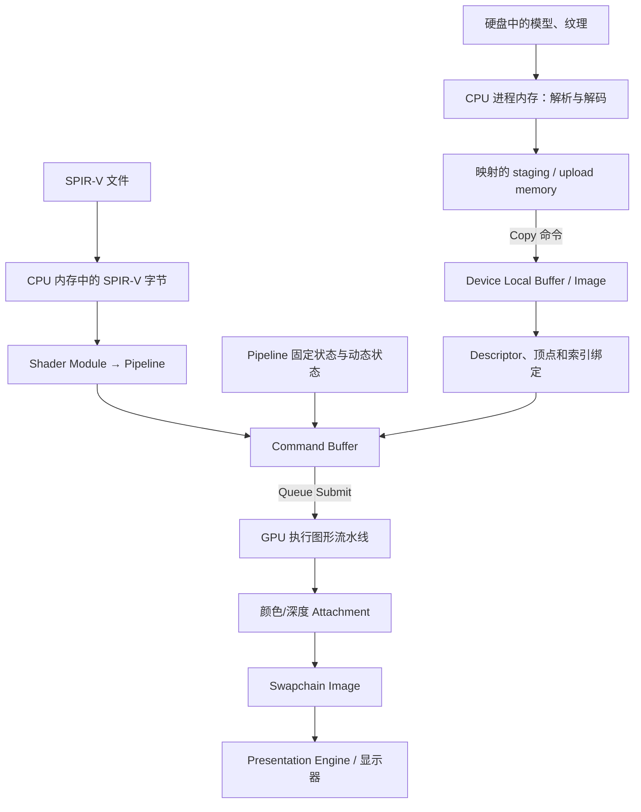

这里先记住四个层次：

- **数据层**：顶点、索引、纹理、Uniform、Storage Buffer、Render Target。
- **接口层**：Descriptor Set、顶点绑定、索引绑定、Push Constant、Attachment。
- **执行描述层**：Pipeline、Command Buffer。
- **执行与同步层**：Queue、Barrier、Semaphore、Fence。

### 讲师提示

开场时可以先问听众：“`VkBuffer` 创建成功以后，里面有数据了吗？”答案是没有。`VkBuffer` 先只是资源对象，必须有 backing memory，并且还要把文件中的字节上传进去。

---

## 3. 图形流水线不等于全部都是 Shader

经典 Vulkan 图形流水线可以简化成下面的结构：

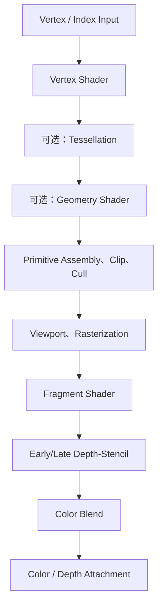

需要明确：

- Vertex Input、Primitive Assembly、Rasterization、Depth/Stencil、Blending 是固定功能或配置化阶段。
- Vertex、Tessellation、Geometry、Fragment 才是经典图形管线中的可编程 Shader 阶段。
- Mesh Shader 管线会替代一部分传统 Vertex Input 和 Primitive Assembly，但本次先讲经典管线。
- 这张图描述的是逻辑阶段，不保证 GPU 内部严格按图中的方框逐个串行执行。真实硬件会流水、并行、缓存和重排，正确性由 Vulkan 的同步规则保证。

---

## 4. 每个阶段需要什么数据

| 阶段 | 典型输入 | 数据从哪里进入 Vulkan | 是否通常需要显式 backing memory |
|---|---|---|---|
| Vertex Input | 顶点属性、索引 | `vkCmdBindVertexBuffers`、`vkCmdBindIndexBuffer` | 是，通常为 `VkBuffer` |
| Vertex Shader | 顶点属性、矩阵、骨骼、实例数据 | 顶点输入、Descriptor、Push Constant | Buffer/Image 需要，Push Constant 不需要应用侧 `VkDeviceMemory` |
| Tessellation / Geometry | 上一 Shader 阶段输出、控制参数 | Shader 接口、Descriptor、Push Constant | 外部资源通常需要 |
| Rasterization | Primitive、viewport、scissor、光栅化状态 | Pipeline 固定状态或动态状态命令 | 状态对象本身不是上传数据 Buffer |
| Fragment Shader | 插值属性、纹理、材质参数、输入附件 | Descriptor、Push Constant、Shader 输入 | 纹理和 Buffer 需要 |
| Depth / Stencil | 深度附件、模板附件、测试状态 | Render Pass / Dynamic Rendering、Pipeline | Attachment Image 需要 |
| Color Blend | Fragment 输出、颜色附件、混合状态 | Pipeline、Attachment | Attachment Image 需要 |
| Present | Swapchain Image | WSI 与 `vkQueuePresentKHR` | Swapchain 内存由实现管理，应用不使用 VMA 绑定 |

### 一个重要修正

`Framebuffer` 不是“上传给 Shader 的一块普通数据”。在传统 Render Pass 模型中，`VkFramebuffer` 把一组 `VkImageView` 组织成 Attachment。使用 Dynamic Rendering 时，应用直接在 `VkRenderingInfo` 中指定 Attachment。Fragment Shader 可以通过 input attachment 或采样方式读取图像，但普通 framebuffer 对象本身不会作为 Shader 参数。

---

## 5. Shader 读取数据的五条主要入口

### 5.1 顶点与索引绑定

顶点和索引通常不放在 Descriptor Set 中：

```cpp
vkCmdBindVertexBuffers(cmd, 0, 1, &vertexBuffer, offsets);
vkCmdBindIndexBuffer(cmd, indexBuffer, 0, VK_INDEX_TYPE_UINT32);
```

Pipeline 中的 Vertex Input State 说明每个 binding 的 stride、每个 attribute 的 format 和 offset。Draw Indexed 时，Index Input 先从索引 Buffer 取索引，再由 Vertex Input 按索引抓取顶点属性。

### 5.2 Descriptor Set

Descriptor 常用于：

- Uniform Buffer 与 Storage Buffer。
- Sampled Image、Storage Image、Sampler。
- Combined Image Sampler。
- Input Attachment。

Descriptor 不拥有纹理或 Buffer 的数据。它保存的是资源绑定信息，作用更像一张“Shader 参数表”。

### 5.3 Push Constant

少量、频繁变化的数据可以通过：

```cpp
vkCmdPushConstants(cmd, pipelineLayout,
                   VK_SHADER_STAGE_VERTEX_BIT,
                   0, sizeof(DrawConstants), &constants);
```

Push Constant 的可见范围由 `VkPipelineLayout` 中的 `VkPushConstantRange` 定义。它不要求应用创建一个 Uniform Buffer，但容量受 `maxPushConstantsSize` 限制。

### 5.4 动态状态

Viewport、Scissor 等状态可以被 Pipeline 固化，也可以配置为 Dynamic State 后由命令写入：

```cpp
vkCmdSetViewport(cmd, 0, 1, &viewport);
vkCmdSetScissor(cmd, 0, 1, &scissor);
```

这些是命令状态，不是普通的 Shader Buffer。

### 5.5 Render Attachment

颜色、深度、模板 Attachment 由 Render Pass/Framebuffer 或 Dynamic Rendering 绑定。Fragment Shader 产生候选输出，后续的深度模板测试和颜色混合阶段决定最终写入内容。

---

## 6. 贯穿示例：一个带纹理 Mesh 的数据路径

假设 Vertex Shader 需要位置、法线、UV 和 MVP 矩阵，Fragment Shader 需要材质参数、纹理和 Sampler。

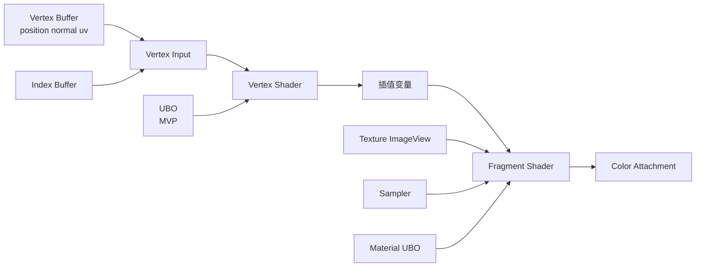

在 Vulkan 中，真正让这些数据同时生效的是 Draw 前的命令状态：

```cpp
vkCmdBindPipeline(cmd, VK_PIPELINE_BIND_POINT_GRAPHICS, pipeline);
vkCmdBindDescriptorSets(cmd, VK_PIPELINE_BIND_POINT_GRAPHICS,
                        pipelineLayout, 0, 1, &descriptorSet, 0, nullptr);
vkCmdBindVertexBuffers(cmd, 0, 1, &vertexBuffer, offsets);
vkCmdBindIndexBuffer(cmd, indexBuffer, 0, VK_INDEX_TYPE_UINT32);
vkCmdDrawIndexed(cmd, indexCount, 1, 0, 0, 0);
```

`vkCmdDrawIndexed` 消费当时已经记录好的 Pipeline、Descriptor、Vertex/Index Buffer、动态状态和 Attachment 状态。

---

## 7. Shader 文件走的是一条特殊路径

不要把 Shader 文件与顶点、纹理的 staging 上传混为一谈。

常见 Shader 路径是：

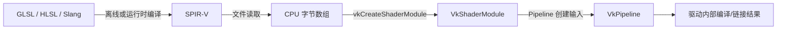

关键点：

- 普通 Vulkan Shader Module 使用 SPIR-V，不直接把 GLSL 当作纹理一样上传到显存。
- `vkCreateShaderModule` 接收 CPU 地址空间中的 SPIR-V 字节。
- Pipeline 创建时，驱动根据 Shader Stage、固定功能状态、Pipeline Layout 等进行编译和链接。
- Pipeline 创建完成后，若没有其他用途，应用可以销毁 `VkShaderModule`。Pipeline 内部执行代码由驱动管理。
- VMA 不参与 `VkShaderModule` 和 `VkPipeline` 的内部代码内存管理。

---

# 第二部分：文件如何经过 CPU、staging 到达 GPU 可用内存

## 8. CPU 侧进程到底在做什么

可以把 `main.cpp` 所在的渲染进程理解为 Vulkan 的“资源准备者和工作调度者”。它主要完成：

1. 初始化 Instance、Physical Device、Device、Queue、Surface 和 Swapchain。
2. 从磁盘读取模型、纹理、材质和 SPIR-V。
3. 在 CPU 地址空间中解析、解码、重排资源数据。
4. 创建 Vulkan Buffer/Image，并给资源分配和绑定内存。
5. 建立 Descriptor Layout、Descriptor Set、Pipeline Layout 和 Pipeline。
6. 记录 Copy、Barrier、Draw 等命令。
7. 将 Command Buffer 提交到 Queue，并通过同步对象管理资源复用。

CPU 不会逐个执行 Vertex Shader。CPU 创建的是资源、状态和命令；GPU 执行图形/计算工作。

---

## 9. 从文件系统进入 CPU 内存

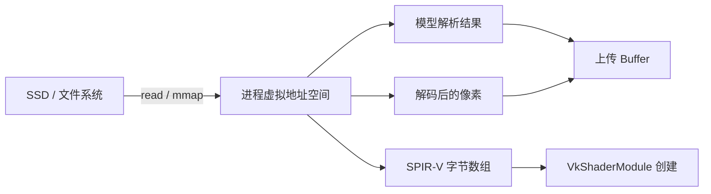

几种资源在 CPU 内存中的形态不同：

- glTF/OBJ 文件先变成顶点数组、索引数组、材质结构和资源引用。
- PNG/JPEG 通常先解码成 RGBA 像素，或者转成 GPU 支持的压缩纹理块。
- SPIR-V 直接读成 4 字节对齐的二进制数组，用来创建 Shader Module。
- CPU 内存中的结构只是进程数据。GPU 能否直接访问，取决于后续选择的 Vulkan Memory Type。

“文件已经在 RAM”不等于“GPU 已经可以安全高效地读取”。

---

## 10. 资源对象与内存对象必须分开理解

### 10.1 `VkBuffer` / `VkImage`

它们描述资源的逻辑属性：

- Buffer 的 size、usage、sharing mode。
- Image 的 format、extent、mipLevels、tiling、usage、samples。

创建成功时，资源未必已经有可用的 backing memory。

### 10.2 `VkDeviceMemory`

它代表从某个 Vulkan Memory Type 分配出的设备内存对象。它可能对应独显 VRAM、系统 RAM，或一种 CPU/GPU 都可见的内存区域。

### 10.3 Binding

`vkBindBufferMemory` 或 `vkBindImageMemory` 把资源绑定到一块内存及其 offset。绑定以后，资源才有存储位置。

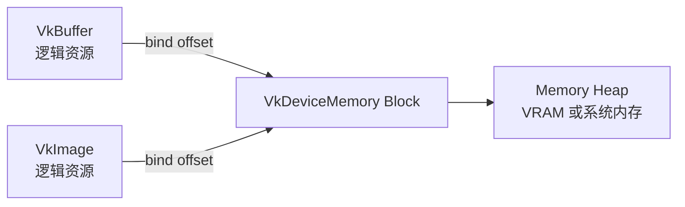

因此要避免一句容易误导的话：“创建 Buffer 就是在显存里申请空间。”裸 Vulkan 中，这两个动作是分开的。

---

## 11. 裸 Vulkan 创建 Vertex Buffer 的完整内存步骤

```cpp
VkBuffer buffer = VK_NULL_HANDLE;
vkCreateBuffer(device, &bufferInfo, nullptr, &buffer);

VkMemoryRequirements req{};
vkGetBufferMemoryRequirements(device, buffer, &req);

uint32_t memoryTypeIndex = findMemoryType(
    req.memoryTypeBits,
    VK_MEMORY_PROPERTY_DEVICE_LOCAL_BIT);

VkMemoryAllocateInfo allocInfo{
    .sType = VK_STRUCTURE_TYPE_MEMORY_ALLOCATE_INFO,
    .allocationSize = req.size,
    .memoryTypeIndex = memoryTypeIndex,
};

VkDeviceMemory memory = VK_NULL_HANDLE;
vkAllocateMemory(device, &allocInfo, nullptr, &memory);
vkBindBufferMemory(device, buffer, memory, 0);
```

每一步分别回答一个问题：

1. `vkCreateBuffer`：我要什么资源。
2. `vkGetBufferMemoryRequirements`：它需要多大、怎样对齐、能用哪些 Memory Type。
3. `findMemoryType`：在兼容类型中选择满足用途的类型。
4. `vkAllocateMemory`：从选定类型分配 `VkDeviceMemory`。
5. `vkBindBufferMemory`：把资源绑定到该内存的合法 offset。

真实引擎通常不会为每个 Buffer 单独执行第 4 步，而是从大块 `VkDeviceMemory` 中做子分配。VMA 正是负责这一层。

---

## 12. Memory Heap、Memory Type 与属性位

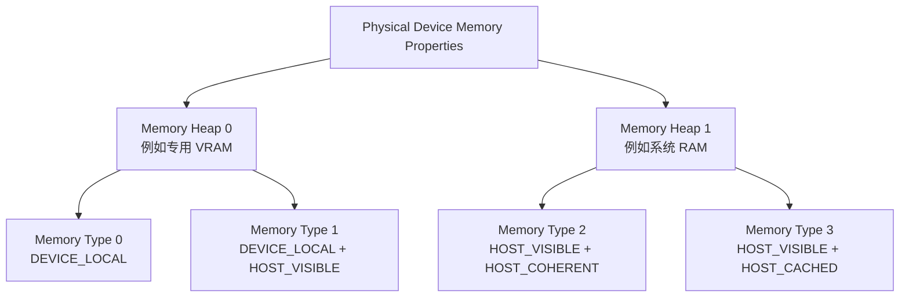

这只是示意。实际组合由硬件和驱动报告，不能写死。

| 属性 | 含义 | 常见用途 |
|---|---|---|
| `DEVICE_LOCAL` | 对设备访问有利，物理位置由架构决定 | 静态顶点、索引、纹理、Render Target |
| `HOST_VISIBLE` | CPU 可以通过 `vkMapMemory` 获得地址 | staging、动态 Uniform、readback |
| `HOST_COHERENT` | 主机域的 flush/invalidate 可由实现自动维护 | 简化 CPU 写入，但不替代 GPU 执行同步 |
| `HOST_CACHED` | CPU 读取更友好 | GPU 到 CPU 的 readback |
| `LAZILY_ALLOCATED` | 某些设备可为瞬态 Attachment 延迟实际 backing | 移动端 tile-based GPU 的 transient attachment |

### 独显与 UMA

- 独显常见路径：CPU 写 HOST_VISIBLE 的系统内存，再通过 Copy 进入 DEVICE_LOCAL VRAM。
- UMA 设备共享物理内存，可能存在 `HOST_VISIBLE | DEVICE_LOCAL` 类型，可直接写最终 Buffer，减少一次 staging copy。
- 某些独显也可能暴露 CPU 可见的 DEVICE_LOCAL 区域。不能仅凭属性名推断绝对物理位置或性能，要看设备报告并测量。

---

## 13. staging Buffer 的本质

staging Buffer 是一个“CPU 方便写、作为 Transfer Source 使用”的临时或循环复用 Buffer。

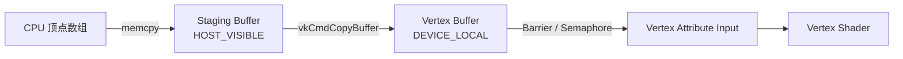

对应步骤：

1. 创建 `VK_BUFFER_USAGE_TRANSFER_SRC_BIT` 的 staging Buffer。
2. 给 staging 选择 `HOST_VISIBLE` 的内存并 map。
3. CPU `memcpy` 数据；若非 coherent，则 flush 对齐后的 range。
4. 创建同时带 `TRANSFER_DST` 和 `VERTEX_BUFFER` usage 的目标 Buffer。
5. 目标 Buffer 通常使用 `DEVICE_LOCAL` 内存。
6. 在 Command Buffer 中记录 `vkCmdCopyBuffer`。
7. 建立 Transfer Write 到 Vertex Attribute Read 的内存依赖。
8. Queue 提交；GPU 完成后才可回收或覆盖 staging 区域。

### staging 不是一种 Vulkan 专用内存类型

“staging”是应用层用途。它通常只是一个使用 HOST_VISIBLE memory 的 `VkBuffer`。Vulkan 不会替你自动创建或上传。

---

## 14. 顶点上传的 Synchronization2 示例

同一 Queue 中，Copy 之后马上用于顶点输入时，可以建立如下依赖：

```cpp
vkCmdCopyBuffer(cmd, stagingBuffer, vertexBuffer, 1, &copyRegion);

VkBufferMemoryBarrier2 barrier{
    .sType = VK_STRUCTURE_TYPE_BUFFER_MEMORY_BARRIER_2,
    .srcStageMask = VK_PIPELINE_STAGE_2_COPY_BIT,
    .srcAccessMask = VK_ACCESS_2_TRANSFER_WRITE_BIT,
    .dstStageMask = VK_PIPELINE_STAGE_2_VERTEX_ATTRIBUTE_INPUT_BIT,
    .dstAccessMask = VK_ACCESS_2_VERTEX_ATTRIBUTE_READ_BIT,
    .srcQueueFamilyIndex = VK_QUEUE_FAMILY_IGNORED,
    .dstQueueFamilyIndex = VK_QUEUE_FAMILY_IGNORED,
    .buffer = vertexBuffer,
    .offset = 0,
    .size = VK_WHOLE_SIZE,
};

VkDependencyInfo dependency{
    .sType = VK_STRUCTURE_TYPE_DEPENDENCY_INFO,
    .bufferMemoryBarrierCount = 1,
    .pBufferMemoryBarriers = &barrier,
};

vkCmdPipelineBarrier2(cmd, &dependency);
```

这段 Barrier 同时表达：

- **执行依赖**：后面的 Vertex Attribute Input 不应越过 Copy。
- **内存依赖**：Transfer Write 的结果对 Vertex Attribute Read 可见。

如果 Copy 在专用 Transfer Queue、Draw 在 Graphics Queue，还要处理：

1. Transfer Queue 上的 release ownership barrier。
2. Semaphore 连接两个 Queue Submit。
3. Graphics Queue 上的 acquire ownership barrier。

当资源使用 concurrent sharing mode，queue family ownership 规则会不同，但仍然需要适当的执行和内存依赖。

---

## 15. 纹理上传比 Buffer 多了 Image Layout

典型路径：

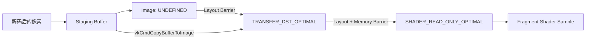

常见步骤：

1. 创建 optimal tiling 的 `VkImage`，usage 包含 `TRANSFER_DST` 与 `SAMPLED`。
2. 从 `UNDEFINED` 转到 `TRANSFER_DST_OPTIMAL`。
3. 记录 `vkCmdCopyBufferToImage`。
4. 从 Transfer Write 建立到 Fragment Shader Sampled Read 的依赖。
5. 同时把 layout 转到 `SHADER_READ_ONLY_OPTIMAL` 或适用的 read-only layout。
6. 创建 `VkImageView` 和 `VkSampler`，写入 Descriptor Set。

Buffer 通常不需要 layout。Image layout 同时参与数据解释、缓存策略和使用合法性，所以纹理上传不能只复制字节。

---

## 16. Map、Flush 与 GPU 同步不是一回事

### 16.1 Map

`vkMapMemory` 只让 CPU 获得 HOST_VISIBLE memory 的地址。它不表示 GPU 已经读完，也不自动等待任何 Queue。

### 16.2 Flush / Invalidate

- CPU 写入非 HOST_COHERENT 内存后，用 `vkFlushMappedMemoryRanges` 让写入进入主机域可见范围。
- CPU 读取 GPU 写过的非 HOST_COHERENT 内存前，用 `vkInvalidateMappedMemoryRanges`。
- Range 需要遵守 `nonCoherentAtomSize` 对齐规则。

### 16.3 Queue Submit 的 Host 到 Device 域操作

只要 host write 在 Queue Submit 之前发生，Submit 会执行必要的 host-to-device domain operation。对 staging 上传而言，通常不需要在 Copy 之前再放一个 HOST 到 TRANSFER 的 Pipeline Barrier，但非 coherent memory 仍要先 flush。

### 16.4 资源复用

CPU 想覆盖一段 upload memory，必须先确认 GPU 已经不再读取这段区域。常见做法是：

- 每帧使用不同的 ring-buffer 区段。
- 用 Fence 或 Timeline Semaphore 的完成值决定何时回收区段。

---

## 17. 静态资源和动态资源采用不同策略

| 场景 | 推荐方向 | 原因 |
|---|---|---|
| 静态顶点/索引 | staging 上传到 DEVICE_LOCAL | 上传一次，GPU 读取很多次 |
| 静态纹理 | staging + optimal tiled Image | GPU 采样和缓存更合适 |
| 每帧小量 Uniform | 持久映射 upload buffer，按帧分区 | 降低 map/unmap 与分配次数 |
| 高频大数据更新 | staging ring + 批量 Copy | 合并传输和同步 |
| GPU Readback | HOST_VISIBLE，优先 HOST_CACHED | CPU 读取性能更重要 |
| UMA 设备 | 评估直接使用 HOST_VISIBLE + DEVICE_LOCAL | 可能减少一次 Copy |

不要把“所有数据都走 staging”当成绝对规则。Vulkan 给的是能力集合，最终策略要结合资源更新频率、GPU 架构和测量结果。

---

# 第三部分：Descriptor、Pipeline、Command Buffer 与 Submit

## 18. 正确的 Vulkan 对象关系图

原稿中“Resource → DescriptorSet → Pipeline → CommandBuffer”容易被理解为包含关系。更准确的关系是多个对象在 Draw 时汇合：

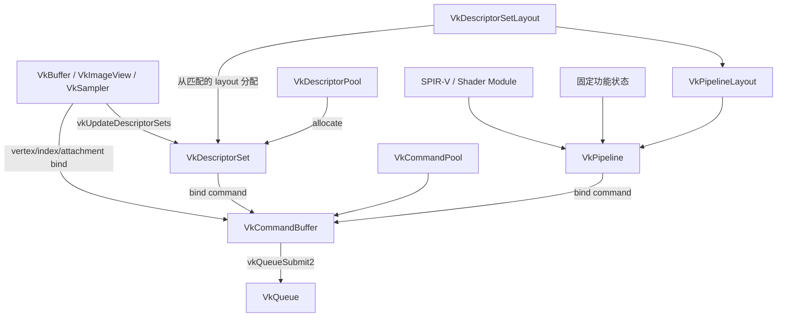

必须区分：

- Descriptor Set Layout 描述 Shader 资源接口的形状。
- Descriptor Pool 提供分配 Descriptor Set 所需的池容量。
- Descriptor Set 保存实际资源绑定。
- Pipeline Layout 组合若干 Descriptor Set Layout 和 Push Constant Range。
- Graphics Pipeline 组合 Shader 与大部分固定功能状态，并引用 Pipeline Layout。
- Command Buffer 不“拥有”这些对象，只记录绑定、复制、绘制和同步命令；对象必须在 GPU 使用期间保持有效。

---

## 19. Descriptor 系统的四个对象

### 19.1 `VkDescriptorSetLayout`

定义 set 内每个 binding 的：

- binding number。
- descriptor type。
- descriptor count。
- 可访问的 Shader stage。

它是接口契约，不保存具体纹理内容。

### 19.2 `VkDescriptorPool`

声明最多分配多少 Set，以及各种 Descriptor Type 的总容量。它管理 Descriptor 对象自身所需的实现资源，不是纹理显存池。

### 19.3 `VkDescriptorSet`

从 Pool 按 Layout 分配，然后通过 `vkUpdateDescriptorSets` 写入实际 `VkBuffer`、`VkImageView`、`VkSampler` 等引用。

### 19.4 `VkPipelineLayout`

按 set 编号组合若干 Descriptor Set Layout，并定义 Push Constant Range。Shader 中的 `(set, binding)` 必须与 Pipeline Layout 中相应的接口兼容。

```cpp
VkDescriptorSetLayout setLayouts[] = { frameLayout, materialLayout };

VkPipelineLayoutCreateInfo info{
    .sType = VK_STRUCTURE_TYPE_PIPELINE_LAYOUT_CREATE_INFO,
    .setLayoutCount = 2,
    .pSetLayouts = setLayouts,
    .pushConstantRangeCount = 1,
    .pPushConstantRanges = &pushRange,
};
vkCreatePipelineLayout(device, &info, nullptr, &pipelineLayout);
```

---

## 20. Pipeline 到底包含什么

经典 `VkGraphicsPipeline` 通常由下面的输入创建：

- Shader Stages 与 Entry Point。
- Vertex Input 与 Input Assembly。
- Tessellation 状态（若使用）。
- Viewport/Scissor 状态，或声明为动态。
- Rasterization、Multisample、Depth/Stencil、Color Blend。
- `VkPipelineLayout`。
- Render Pass/Subpass 兼容信息，或 Dynamic Rendering 的 attachment format 信息。

Pipeline 的价值是让驱动提前完成 Shader 接口链接、状态组合和硬件配置准备，Draw 时减少昂贵验证。

### Pipeline 不包含什么

- 它不包含某一帧的具体 MVP 数值。
- 它不拥有 Texture 像素。
- 它不拥有 Descriptor Pool。
- 它不拥有 Command Buffer。
- 动态状态不会因 Pipeline 绑定自动获得应用想要的具体值，仍要记录相应 `vkCmdSet*` 命令。

---

## 21. Command Buffer 记录的是“如何使用对象”

典型一帧的记录顺序：

```cpp
vkBeginCommandBuffer(cmd, &beginInfo);

// 必要的资源 Barrier 或布局转换
vkCmdPipelineBarrier2(cmd, &dependencyInfo);

vkCmdBeginRendering(cmd, &renderingInfo); // 或 vkCmdBeginRenderPass
vkCmdBindPipeline(cmd, VK_PIPELINE_BIND_POINT_GRAPHICS, pipeline);
vkCmdSetViewport(cmd, 0, 1, &viewport);
vkCmdSetScissor(cmd, 0, 1, &scissor);
vkCmdBindDescriptorSets(cmd, VK_PIPELINE_BIND_POINT_GRAPHICS,
                        pipelineLayout, 0, 1, &set, 0, nullptr);
vkCmdBindVertexBuffers(cmd, 0, 1, &vertexBuffer, offsets);
vkCmdBindIndexBuffer(cmd, indexBuffer, 0, VK_INDEX_TYPE_UINT32);
vkCmdDrawIndexed(cmd, indexCount, 1, 0, 0, 0);
vkCmdEndRendering(cmd);

vkEndCommandBuffer(cmd);
```

Command Buffer 还可以记录 Copy、Clear、Dispatch、Query、Barrier 和执行 Secondary Command Buffer 等命令。

### 生命周期状态

`Initial → Recording → Executable → Pending → Executable/Invalid`

处于 Pending 状态时，CPU 不能随意 reset、free 或改写 Command Buffer，也不能销毁 GPU 仍可能访问的资源。

---

## 22. Submit 之后发生什么

`vkQueueSubmit2` 把一个或多个提交批次放入 Queue。提交信息包括：

- 要等待的 Semaphore 及等待 stage。
- 要执行的 Command Buffer。
- 执行后要 signal 的 Semaphore。
- 可选的 Fence，用于让 Host 知道整批工作已经完成。

不要把内部过程描述成“GPU 逐字解释 C 结构体”。Vulkan 只定义可观察行为，不规定实现细节。驱动可能在下面几个阶段做工作：

- Pipeline 创建时编译和链接 Shader。
- Command Buffer 记录时构造驱动命令流或保存中间表示。
- Submit 时修补地址、组织批次、提交硬件队列。
- GPU Command Processor 读取实现生成的命令流，驱动图形引擎工作。

应用能够依赖的是 Vulkan 规范的对象生命周期、命令顺序与同步语义，而不是某个厂商的内部翻译时机。

---

## 23. Render Target、Swapchain 与显示

典型显示流程：

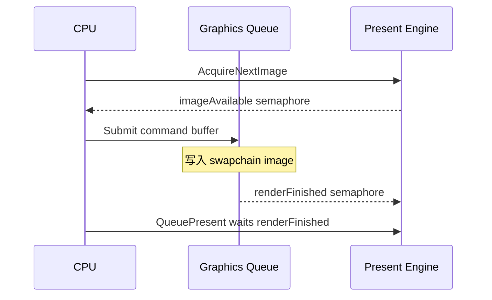

经典一帧通常包含：

1. `vkAcquireNextImageKHR` 获取可用的 Swapchain Image 索引。
2. Graphics Submit 等待 `imageAvailable`。
3. Command Buffer 把结果写到 Swapchain Image 或先写离屏 Image 再复制/合成。
4. Submit signal `renderFinished`。
5. `vkQueuePresentKHR` 等待 `renderFinished` 后交给 Presentation Engine。

Swapchain Image 由 WSI 实现创建。应用可以创建 ImageView，但不能像普通自建 `VkImage` 那样用 VMA 给它分配并绑定内存。

---

# 第四部分：同步解决“什么时候能用”

## 24. Vulkan 同步先回答三个问题

看到任意同步问题时，依次问：

1. **谁先执行，谁后执行？** 这是 execution dependency。
2. **前一个写入何时对后一个读取或写入可见？** 这是 memory dependency。
3. **资源属于哪个 Queue Family，Image 当前是什么 layout？** 这是 ownership 与 layout 状态。

常见 Hazard：

- RAW：Read After Write。后续读依赖前面写。
- WAR：Write After Read。通常至少需要执行依赖；若涉及 layout transition，还会有内存操作。
- WAW：Write After Write。必须防止两个写入错误重排或覆盖。

“命令写在前面”只定义 submission order，不自动形成所有需要的 execution 和 memory dependency。

---

## 25. Barrier、Semaphore、Fence 的职责

| 工具 | 主要方向 | 典型用途 | CPU 是否阻塞 |
|---|---|---|---|
| Pipeline Barrier | Command Buffer 内/同 Queue 工作间 | Copy 后读、Shader 写后读、Image Layout 转换 | 不直接阻塞 CPU |
| Semaphore | Queue Operation 之间，也连接 WSI | Transfer Queue 到 Graphics Queue、Acquire/Present | 二进制 Semaphore 通常由 Queue wait；Timeline 也支持 Host 操作 |
| Fence | Queue 到 Host | CPU 等待某帧或某次上传完成 | `vkWaitForFences` 会阻塞或轮询 Host |

记忆方式：

- Barrier 管“管线阶段与内存访问”。
- Semaphore 管“提交批次之间的依赖”。
- Fence 管“GPU 完成后通知 CPU”。

VMA 不会替你创建、等待或推导这些同步对象。

---

## 26. 多帧并行为什么需要每帧资源

如果只用一个 Uniform Buffer、一个 Command Buffer 和一个 Fence，每帧都等 GPU 完成后才开始下一帧，CPU 与 GPU 很难重叠。

常见 Frames In Flight 结构：

```text
FrameContext[0]
  commandPool / commandBuffer
  fence
  imageAvailable / renderFinished
  uniformOffset 或 per-frame buffer

FrameContext[1]
  commandPool / commandBuffer
  fence
  imageAvailable / renderFinished
  uniformOffset 或 per-frame buffer
```

一帧开始时：

1. 等待当前 FrameContext 的 Fence。
2. Fence signal 以后，说明该上下文关联的 Command Buffer 和临时资源可复用。
3. reset Fence 与 Command Pool/Buffer。
4. 写入当前帧独有的 upload 区域。
5. record 和 submit，并让该 Fence 在完成时 signal。

Swapchain Image 数量与 Frames In Flight 数量是两个概念。它们经常接近，但不要求相等。

---

## 27. 资源销毁也属于同步问题

下面的代码即使 VMA 调用本身成功，也可能是错的：

```cpp
vmaDestroyBuffer(allocator, vertexBuffer, vertexAllocation);
```

如果 GPU 仍在执行引用该 Buffer 的 Command Buffer，资源被提前销毁，行为不合法。

安全销毁通常采用：

- 等关联 Fence signal 后销毁。
- 使用 deferred deletion queue，把资源放到未来某个已完成帧再销毁。
- 用 Timeline Semaphore 的完成值标记资源最后一次使用。

同理，Descriptor Set 如果仍可能被 pending command 使用，也不能在不满足更新规则的情况下覆盖绑定内容。

---

# 第五部分：对齐、分配次数与子分配

## 28. Vulkan 中常见的四类对齐

### 28.1 资源内存绑定对齐

`VkMemoryRequirements::alignment` 规定资源绑定 offset 的对齐。做子分配时：

```text
allocationOffset % requirements.alignment == 0
```

### 28.2 动态 Buffer Offset 对齐

Dynamic Uniform/Storage Buffer 的动态 offset 要遵守：

- `minUniformBufferOffsetAlignment`
- `minStorageBufferOffsetAlignment`

### 28.3 非一致内存的 Flush/Invalidate 对齐

映射非 HOST_COHERENT 内存时，flush/invalidate range 要覆盖并对齐到 `nonCoherentAtomSize` 边界。

### 28.4 Buffer 与 Image 相邻子分配

某些线性或 optimal tiling 资源相邻放置时需要考虑 `bufferImageGranularity`，避免页粒度冲突。

VMA 会自动处理资源内存要求、子分配 offset、`bufferImageGranularity` 和非一致内存相关的对齐约束。但 Shader 数据结构自身的 std140/std430/scalar layout 规则仍需应用和 Shader 保持一致。

---

## 29. 为什么不能一个资源一次 `vkAllocateMemory`

`vkAllocateMemory` 不是普通 `malloc`：

- 它可能进入驱动或操作系统的重量级分配路径。
- 设备暴露 `maxMemoryAllocationCount`，限制同时存在的 `VkDeviceMemory` 数量。
- 大量小分配增加管理开销，也难以统一控制预算和碎片。

错误的规模化方式：

```text
20,000 VkBuffer
20,000 vkAllocateMemory
20,000 VkDeviceMemory
```

更合理的方式：

```text
VkDeviceMemory Block 256 MiB
├── Vertex A      offset 0 MiB
├── Vertex B      offset 4 MiB
├── Index A       offset 12 MiB
├── Texture A     offset 16 MiB
└── Free regions
```

这就是 **Suballocation**。应用从少量大块 `VkDeviceMemory` 中切出满足 size、alignment、memory type 和 granularity 的区间。

---

## 30. 子分配仍然需要一个真正的分配器

一个可用的 GPU 内存分配器至少要维护：

- 每个 Memory Type 对应的 Memory Block 列表。
- 每个 Block 中已用区间与空闲区间。
- 对齐后的 size 与 offset。
- 空洞重用策略。
- Dedicated Allocation 的判断。
- Host mapping 的引用关系。
- Heap budget、统计与错误回退。
- 多线程访问保护。
- 可选的线性池、ring 模式与 defragmentation。

这已经不是几行 `findMemoryType` 能解决的问题。VMA 的价值就在于提供经过大量硬件与驱动验证的实现。

---

# 第六部分：VMA 的位置、架构与正确用法

## 31. VMA 在 Vulkan 架构中的位置

VMA 全称 Vulkan Memory Allocator，由 AMD GPUOpen 维护。

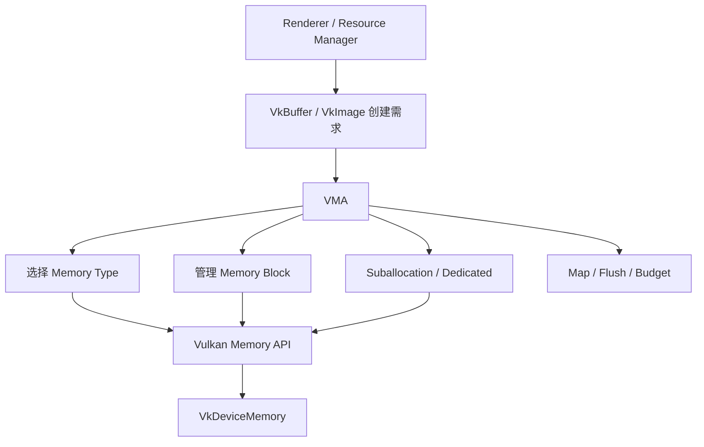

一句话定位：

> VMA 管理 `VkBuffer` / `VkImage` 背后的内存选择、分配、子分配、绑定与映射便利接口。

VMA 不负责：

- Shader、Pipeline 与 Descriptor 设计。
- Command Buffer 记录。
- Barrier、Semaphore、Fence。
- Queue Submit、Present。
- 资源语义生命周期与 GPU 使用完成判断。

---

## 32. VMA 的四个核心对象

### 32.1 `VmaAllocator`

通常每个 `VkDevice` 创建一个。它持有物理设备、逻辑设备、Memory Type/Heap 信息，以及默认池与 Block 管理状态。

### 32.2 `VmaAllocation`

表示一次分配。它通常是某个大 `VkDeviceMemory` Block 中的一段区间，而不等于一个完整 `VkDeviceMemory`。

### 32.3 `VmaAllocationInfo`

用于查询 allocation 的 memory type、device memory、offset、size、mapped pointer 和 user data 等信息。

### 32.4 `VmaPool`

可选的自定义池，用于显式选择 Memory Type、Block Size、Block 数量或线性分配算法。默认池已经适合大多数资源，不应仅为了“分类好看”就创建很多自定义池。

```text
VmaAllocator
├── Memory Type 0 默认池
│   ├── VkDeviceMemory Block A
│   │   ├── VmaAllocation 1
│   │   ├── VmaAllocation 2
│   │   └── Free
│   └── VkDeviceMemory Block B
└── Memory Type 1 默认池
    └── VkDeviceMemory Block C
```

---

## 33. VMA 初始化

VMA 在 `VkInstance`、`VkPhysicalDevice`、`VkDevice` 已创建后初始化，在 `VkDevice` 销毁前销毁。

```cpp
VmaAllocatorCreateInfo allocatorInfo{};
allocatorInfo.instance = instance;
allocatorInfo.physicalDevice = physicalDevice;
allocatorInfo.device = device;
allocatorInfo.vulkanApiVersion = VK_API_VERSION_1_3;

// 仅在应用实际启用对应 Vulkan 扩展/能力时设置相应 VMA flag
allocatorInfo.flags = VMA_ALLOCATOR_CREATE_EXT_MEMORY_BUDGET_BIT;

VmaAllocator allocator = VK_NULL_HANDLE;
VK_CHECK(vmaCreateAllocator(&allocatorInfo, &allocator));
```

工程中通常在一个 `.cpp` 文件里定义 `VMA_IMPLEMENTATION`，其余文件只包含声明。VMA 是 single-header 风格，但实现部分仍需恰好编译一次。

---

## 34. 用 VMA 创建 Buffer 与 Image

裸 Vulkan 的五步：

```text
Create Resource
Get Memory Requirements
Choose Memory Type
Allocate Memory
Bind Memory
```

VMA 可以合并为：

```cpp
VkBufferCreateInfo bufferInfo{
    .sType = VK_STRUCTURE_TYPE_BUFFER_CREATE_INFO,
    .size = size,
    .usage = VK_BUFFER_USAGE_VERTEX_BUFFER_BIT |
             VK_BUFFER_USAGE_TRANSFER_DST_BIT,
};

VmaAllocationCreateInfo allocInfo{};
allocInfo.usage = VMA_MEMORY_USAGE_AUTO_PREFER_DEVICE;

VkBuffer buffer = VK_NULL_HANDLE;
VmaAllocation allocation = VK_NULL_HANDLE;

VK_CHECK(vmaCreateBuffer(
    allocator,
    &bufferInfo,
    &allocInfo,
    &buffer,
    &allocation,
    nullptr));
```

Image 同理使用 `vmaCreateImage`。销毁时资源与 allocation 成对传入：

```cpp
vmaDestroyBuffer(allocator, buffer, allocation);
vmaDestroyImage(allocator, image, allocation);
```

---

## 35. 三种常用 VMA 分配策略

### 35.1 GPU 高频读取的静态资源

```cpp
allocInfo.usage = VMA_MEMORY_USAGE_AUTO_PREFER_DEVICE;
```

Buffer/Image usage 中保留 `TRANSFER_DST`，由 staging 上传。

### 35.2 CPU 顺序写入的 staging/upload Buffer

```cpp
allocInfo.usage = VMA_MEMORY_USAGE_AUTO;
allocInfo.flags =
    VMA_ALLOCATION_CREATE_HOST_ACCESS_SEQUENTIAL_WRITE_BIT |
    VMA_ALLOCATION_CREATE_MAPPED_BIT;
```

`VMA_MEMORY_USAGE_AUTO*` 下，如果需要 map，必须同时提供合适的 HOST_ACCESS flag。`MAPPED_BIT` 只表示在最终选到 HOST_VISIBLE memory 时保持映射，本身不保证 Memory Type 可映射。

### 35.3 CPU 随机读取的 readback Buffer

```cpp
allocInfo.usage = VMA_MEMORY_USAGE_AUTO_PREFER_HOST;
allocInfo.flags = VMA_ALLOCATION_CREATE_HOST_ACCESS_RANDOM_BIT;
allocInfo.preferredFlags = VK_MEMORY_PROPERTY_HOST_CACHED_BIT;
```

VMA 3.x 推荐 `VMA_MEMORY_USAGE_AUTO*`。旧的 `GPU_ONLY`、`CPU_TO_GPU`、`GPU_TO_CPU` 等 usage 为兼容保留，但已经不再是新代码的首选。

---

## 36. VMA 版静态 Vertex Buffer 上传

```cpp
struct AllocatedBuffer {
    VkBuffer buffer = VK_NULL_HANDLE;
    VmaAllocation allocation = VK_NULL_HANDLE;
    VkDeviceSize size = 0;
};

// 1. staging：CPU 可写，持久映射
VkBufferCreateInfo stagingInfo{
    .sType = VK_STRUCTURE_TYPE_BUFFER_CREATE_INFO,
    .size = dataSize,
    .usage = VK_BUFFER_USAGE_TRANSFER_SRC_BIT,
};
VmaAllocationCreateInfo stagingAllocInfo{};
stagingAllocInfo.usage = VMA_MEMORY_USAGE_AUTO;
stagingAllocInfo.flags =
    VMA_ALLOCATION_CREATE_HOST_ACCESS_SEQUENTIAL_WRITE_BIT |
    VMA_ALLOCATION_CREATE_MAPPED_BIT;

VmaAllocationInfo stagingResult{};
AllocatedBuffer staging{.size = dataSize};
VK_CHECK(vmaCreateBuffer(allocator, &stagingInfo, &stagingAllocInfo,
                         &staging.buffer, &staging.allocation,
                         &stagingResult));

// vmaCopyMemoryToAllocation 可在需要时自动完成 flush
VK_CHECK(vmaCopyMemoryToAllocation(
    allocator, cpuVertices, staging.allocation, 0, dataSize));

// 2. 最终 Vertex Buffer：优先 DEVICE_LOCAL
VkBufferCreateInfo vertexInfo{
    .sType = VK_STRUCTURE_TYPE_BUFFER_CREATE_INFO,
    .size = dataSize,
    .usage = VK_BUFFER_USAGE_TRANSFER_DST_BIT |
             VK_BUFFER_USAGE_VERTEX_BUFFER_BIT,
};
VmaAllocationCreateInfo vertexAllocInfo{};
vertexAllocInfo.usage = VMA_MEMORY_USAGE_AUTO_PREFER_DEVICE;

AllocatedBuffer vertex{.size = dataSize};
VK_CHECK(vmaCreateBuffer(allocator, &vertexInfo, &vertexAllocInfo,
                         &vertex.buffer, &vertex.allocation, nullptr));

// 3. 记录 Copy 与 Barrier
vkCmdCopyBuffer(cmd, staging.buffer, vertex.buffer, 1, &copyRegion);
vkCmdPipelineBarrier2(cmd, &copyToVertexDependency);

// 4. Submit 后，等待对应完成点再回收 staging
```

VMA 简化了“内存从哪里分、如何绑定、如何 map/flush”。Copy、Barrier、Submit 和完成后的回收时机仍由应用控制。

---

## 37. VMA 的高级能力要准确理解

### 37.1 Dedicated Allocation

超大资源或驱动要求/建议 dedicated 时，VMA 可以让一个资源独占一块 `VkDeviceMemory`。也可以通过 flag 显式请求，但不要对所有资源都这样做。

### 37.2 Custom Pool

适合经过测量后确实需要：

- 固定 Block 大小或最大 Block 数量。
- 隔离某类特殊 allocation。
- 自定义最小对齐或 pNext。
- 线性、stack、double stack、ring 等生命周期模式。

默认池优先。过多自定义池会让每个池保留各自 Block，反而增加空闲浪费并削弱 VMA 的 Memory Type 回退能力。

### 37.3 Budget 与统计

`vmaGetHeapBudgets` 可以获取每个 Heap 的 Block、Allocation、Usage 和 Budget 统计。启用 `VK_EXT_memory_budget` 并告知 VMA 后，预算信息通常更接近系统实际状态，可用于纹理流送和资源淘汰决策。

### 37.4 Defragmentation

VMA 能计算需要移动的 allocation，并预留目标位置，但不会自动重建 Buffer/Image、记录 Copy、等待 GPU、更新 Descriptor。应用必须配合完成这些动作。因此 defragmentation 不是一个无需停顿的一键函数。

---

## 38. 在引擎中怎样封装 VMA

```cpp
struct Buffer {
    VkBuffer handle = VK_NULL_HANDLE;
    VmaAllocation allocation = VK_NULL_HANDLE;
    VkDeviceSize size = 0;
    VkBufferUsageFlags usage = 0;
};

struct Image {
    VkImage handle = VK_NULL_HANDLE;
    VkImageView view = VK_NULL_HANDLE;
    VmaAllocation allocation = VK_NULL_HANDLE;
    VkFormat format = VK_FORMAT_UNDEFINED;
    VkExtent3D extent{};
};

class VulkanMemoryManager {
public:
    Buffer createBuffer(...);
    Image createImage(...);
    void destroy(Buffer&);
    void destroy(Image&);
    UploadTicket upload(...);  // 记录完成值，决定 staging 何时回收
private:
    VmaAllocator allocator_{};
};
```

上层 Renderer 通常不需要直接接触 `VkDeviceMemory`，但仍要知道：

- 资源最后一次在哪个 Queue 使用。
- 对应的 Fence/Timeline 值是否完成。
- Image 当前 layout 和 Queue Family ownership。
- Descriptor 是否引用了将被移动或销毁的资源。

好的封装隐藏繁琐 API，不隐藏正确性所需的状态。

---

# 第七部分：从初始化到显示的完整复盘

## 39. 初始化阶段

```text
1. vkCreateInstance
2. 创建 Surface（需要显示时）
3. 枚举并选择 VkPhysicalDevice
4. 查询 Queue Family、Memory Heap/Type、Features、Limits、Formats
5. vkCreateDevice，并获取 Graphics / Transfer / Present Queue
6. 创建 VmaAllocator
7. 创建 Swapchain 与 Swapchain ImageView
8. 创建 Depth/Color 等自建 Attachment Image
9. 创建 DescriptorSetLayout
10. 创建 PipelineLayout
11. 创建 ShaderModule 和 Graphics Pipeline
12. 创建 DescriptorPool 并分配 DescriptorSet
13. 创建 CommandPool、CommandBuffer、Semaphore、Fence
```

这里的依赖顺序不是说所有对象必须严格一次性串行创建，而是表示对象创建需要哪些前置句柄与查询结果。

---

## 40. 资源加载阶段

```text
文件系统
  ↓
CPU 解析模型 / 解码纹理 / 读取 SPIR-V
  ↓
VMA 创建 staging 与 DEVICE_LOCAL 资源
  ↓
CPU 写 staging，必要时 flush
  ↓
记录 Copy 与 Image Layout Transition
  ↓
Queue Submit
  ↓
Barrier / Semaphore 保证后续读取正确
  ↓
完成点到达后回收 staging 区域
```

资源加载后：

- Vertex/Index Buffer 用命令绑定。
- ImageView/Sampler/UBO 等写入 Descriptor Set。
- Pipeline Layout 保证 Shader 资源接口兼容。

---

## 41. 每帧渲染阶段

```text
等待当前 FrameContext Fence
  ↓
Acquire Swapchain Image
  ↓
更新当前帧 Uniform / Upload Ring 区域
  ↓
Record Command Buffer
  ├── Layout / Memory Barrier
  ├── Begin Rendering
  ├── Bind Pipeline
  ├── Bind Descriptor Sets
  ├── Bind Vertex / Index Buffers
  ├── Draw / DrawIndexed
  └── End Rendering
  ↓
Queue Submit
  ├── wait imageAvailable
  ├── execute command buffer
  ├── signal renderFinished
  └── signal inFlight Fence
  ↓
Queue Present waits renderFinished
```

一帧执行完并不意味着所有资源都能立刻销毁。要根据资源最后一次使用的完成点判断。

---

## 42. 最容易讲错的十句话

1. **“VkBuffer 就是一块显存。”**  
   更准确：它是 Buffer 资源对象，必须绑定到满足要求的 memory。

2. **“HOST_VISIBLE 就是 CPU 和 GPU 性能相同的共享内存。”**  
   更准确：它表示可 map；物理位置、缓存和访问性能取决于设备架构与 Memory Type。

3. **“HOST_COHERENT 就不需要同步。”**  
   更准确：它简化 host cache 的 flush/invalidate，不替代 Queue、Barrier 或资源复用同步。

4. **“所有文件都通过 staging 上传。”**  
   更准确：顶点和纹理数据常这样上传；SPIR-V 通常由 CPU 内存直接用于 Shader Module/Pipeline 创建。

5. **“Descriptor Set 里面装着纹理。”**  
   更准确：Descriptor Set 保存对 ImageView、Sampler、Buffer 等资源的绑定描述。

6. **“Descriptor Pool 是 GPU 资源内存池。”**  
   更准确：它为 Descriptor Set 和 descriptor 数量提供分配容量，不管理纹理像素或 Vertex Buffer backing memory。

7. **“Pipeline 包含 Descriptor Set。”**  
   更准确：Pipeline 引用 Pipeline Layout；实际 Descriptor Set 在 Command Buffer 中绑定，并与 layout 兼容。

8. **“命令按记录顺序自然完成所有同步。”**  
   更准确：submission order 存在，但执行依赖和内存可见性仍需正确的同步机制。

9. **“VMA 会自动上传并加 Barrier。”**  
   更准确：VMA 负责 allocation/binding/mapping 便利功能，上传命令和同步由应用负责。

10. **“VmaAllocation 就是 VkDeviceMemory。”**  
    更准确：大多数情况下它是某个 `VkDeviceMemory` Block 中带 offset 和 size 的子分配。

---

## 43. 最终记忆模型

把整套 Vulkan 渲染流程压缩成六句话：

1. **Shader 决定需要哪些输入和产生哪些输出。**
2. **CPU 从文件中准备字节，在 Vulkan 中创建资源对象。**
3. **资源对象需要绑定合适 Memory Type 上的 backing memory。**
4. **Descriptor、Pipeline 和 Command Buffer 描述 GPU 怎样访问资源并执行工作。**
5. **Barrier、Semaphore 和 Fence 决定访问何时安全、结果何时可见、资源何时可复用。**
6. **VMA 把 Memory Type 选择、Block、Suballocation、对齐、映射和预算管理工程化，但不接管渲染与同步。**

最核心的一张 VMA 图：

```text
VkBuffer / VkImage
        │
        │ 需要 backing memory
        ▼
       VMA
        ├── 选择 Memory Type
        ├── 管理 VkDeviceMemory Block
        ├── Suballocation / Dedicated
        ├── Alignment / Granularity
        ├── Map / Flush / Invalidate
        └── Budget / Statistics
        ▼
VmaAllocation = Block 中的一段 offset + size
        ▼
VkDeviceMemory
        ▼
VRAM / System RAM / Unified Memory
```

---

## 44. 可用于现场互动的五个问题

1. `vkCreateBuffer` 成功但还没 bind memory，这个 Buffer 能否用于 Draw？
2. `HOST_COHERENT` 能否替代 Copy 后的 Transfer-to-Vertex Barrier？
3. 为什么 Vertex Buffer 通常不通过 Descriptor Set 绑定？
4. Transfer Queue 和 Graphics Queue 不属于同一 Queue Family 时，除了 Semaphore 还需要考虑什么？
5. VMA defragmentation 为什么无法完全自动完成？

参考答案：

1. 不能，需要先满足资源 memory binding 要求。
2. 不能，两者解决的问题不同。
3. 经典顶点输入有专门的绑定命令和 Pipeline Vertex Input State。
4. Queue Family ownership transfer，或使用适当的 concurrent sharing mode。
5. 它不知道完整资源创建语义，也不记录 Copy 命令；应用还要重建资源、复制内容、等待完成并更新引用。

---

## 45. 官方参考资料

以下资料用于校正本文中的 Vulkan 与 VMA 概念：

- [Khronos Vulkan Guide：Memory Allocation](https://docs.vulkan.org/guide/latest/memory_allocation.html)
- [Khronos Vulkan Guide：Synchronization Examples](https://docs.vulkan.org/guide/latest/synchronization_examples.html)
- [Vulkan Specification：Command Buffers](https://docs.vulkan.org/spec/latest/chapters/cmdbuffers.html)
- [Vulkan Specification：Synchronization and Cache Control](https://docs.vulkan.org/spec/latest/chapters/synchronization.html)
- [Vulkan Specification：Descriptor Sets and Pipeline Layouts](https://docs.vulkan.org/spec/latest/chapters/descriptorsets.html)
- [Vulkan Specification：Pipelines](https://docs.vulkan.org/spec/latest/chapters/pipelines.html)
- [Khronos Vulkan Tutorial：Shader Modules](https://docs.vulkan.org/tutorial/latest/03_Drawing_a_triangle/02_Graphics_pipeline_basics/01_Shader_modules.html)
- [Vulkan Memory Allocator：Quick Start](https://gpuopen-librariesandsdks.github.io/VulkanMemoryAllocator/html/quick_start.html)
- [Vulkan Memory Allocator：Choosing Memory Type](https://gpuopen-librariesandsdks.github.io/VulkanMemoryAllocator/html/choosing_memory_type.html)
- [Vulkan Memory Allocator：Memory Mapping](https://gpuopen-librariesandsdks.github.io/VulkanMemoryAllocator/html/memory_mapping.html)
- [Vulkan Memory Allocator：Custom Memory Pools](https://gpuopen-librariesandsdks.github.io/VulkanMemoryAllocator/html/custom_memory_pools.html)
- [Vulkan Memory Allocator：Statistics](https://gpuopen-librariesandsdks.github.io/VulkanMemoryAllocator/html/statistics.html)
- [Vulkan Memory Allocator：Defragmentation](https://gpuopen-librariesandsdks.github.io/VulkanMemoryAllocator/html/defragmentation.html)

---

## 46. 一小时讲解时的节奏建议

- 前 3 分钟只讲全局图，先让听众知道接下来每个对象会放在哪里。
- Shader 部分不要深挖数学公式，重点是列出“数据需求”和“绑定入口”。
- staging 部分用 Vertex Buffer 作为主例子，再用 Texture 解释为什么 Image 还多一个 Layout 维度。
- Descriptor/Pipeline/Command Buffer 部分一定画对象关系图，避免听众把它们理解为层层包含。
- 同步部分始终用“谁写、谁读、在哪个 Stage、通过哪个 Queue”四个问题推导。
- 讲到 allocation count 和 suballocation 时，再引出 VMA，逻辑会非常自然。
- VMA 部分重点讲 `VmaAllocation` 通常不等于 `VkDeviceMemory`，以及 VMA 不负责同步。
- 最后用“初始化、资源加载、每帧渲染”三段复盘，让听众把散落的 API 放回真实程序生命周期。
