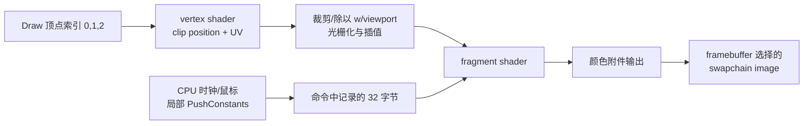

# 00 · 给你已有的时间线加上数据与接口

你已经理解了“谁等待谁”。本章把等待前后的工作打开，建立以后读任何 Vulkan 功能都能使用的模型。

## 1. 用六个问题拆一个渲染任务

| 问题 | 你需要记录的事实 | 当前项目的答案 |
|---|---|---|
| 能不能做？ | 设备、feature、limit、格式、queue family、surface 支持 | 一个 graphics/present 设备，swapchain 扩展 |
| 数据是什么？ | 字节含义、格式、数量、坐标空间 | 32 字节参数、三个生成顶点、RGBA 颜色 |
| 数据放哪？ | host 内存、资源、allocation、偏移/子资源 | CPU 局部结构、命令参数、交换链图像存储 |
| 怎样解释？ | shader 接口、pipeline layout、顶点属性、image view | push constant offset、location 0、颜色附件 0 |
| 谁做什么？ | 命令、阶段、访问类型、读写范围 | vertex 计算位置，fragment 计算颜色，颜色输出写 image |
| 什么时候安全？ | 同步、布局、所有权、最后一次使用完成证据 | acquire wait、render pass dependency、graphics fence、present 生命周期 |

今后遇到一个陌生 API，不要先背所有字段，先确定它在回答哪一列。例如 `vkBindBufferMemory` 回答存储关联，`vkCmdBindDescriptorSets` 回答本次命令使用哪个资源接口，`vkCmdPipelineBarrier` 回答设备访问依赖和可选的布局/所有权变化。

## 2. 四张不同的图，分别推理

### 2.1 对象依赖图：创建时需要谁？

```text
instance -> physicalDevice -> device -> queues
instance + window -> surface
device + surface + selected capabilities -> swapchain -> images -> image views
shader modules + pipeline layout + render-pass compatibility -> graphics pipeline
render pass + actual image views + extent -> framebuffers
device + queue family -> command pool -> command buffers
```

箭头表示这里的创建或使用关系，不全是拥有关系。例如 pipeline 创建成功后可以销毁 shader module；swapchain 返回的 image 由交换链管理，应用不能对它自行 `vkDestroyImage`。

### 2.2 数据图：谁产生、谁消费？



shader 中的局部 `vec2 p`、`vec3 color` 是每次 shader invocation 的工作值。你不需要为每个局部变量创建 Vulkan buffer；编译器决定它们如何映射到寄存器或其它存储。Vulkan 应用主要配置跨调用、跨阶段或跨任务需要的资源与接口。

### 2.3 执行依赖图：谁先允许谁访问？

```text
acquire image
    -- imageAvailable wait + 合适的目标阶段 --> 颜色附件访问
    -- render pass 的转换/依赖 --> 所需 image layout 与写入
graphics submit
    -- renderFinished --> present 操作
graphics submit
    -- frame fence --> CPU 复用相关帧槽资源
```

这不是要求 GPU 每一帧从头到尾完全串行。独立顶点任务、独立提交可以重叠；应用声明的是相关工作必须满足的依赖。需要“访问同一数据”时，不能拿图中别的箭头代替证明。

### 2.4 生命周期图：什么时候不再有人用它？

```text
创建 -> 写入/录制引用 -> 提交 -> GPU 使用 -> 得到对应完成证据 -> 改写/重录/销毁
```

函数返回和资源不再使用是两件事。`vkCmdPushConstants` 会取走调用时提供的参数字节，因此本项目的局部 `constants` 可在函数返回时消失；`vkCmdBindVertexBuffers` 引用的 buffer 存储则要保留到相关设备读取完成。普通 descriptor 绑定也不会把整张纹理内容复制进命令缓冲。

命令缓冲的状态与其引用对象的生命周期规则见 [Command Buffers](https://docs.vulkan.org/spec/latest/chapters/cmdbuffers.html)；push constant 参数语义见 [vkCmdPushConstants](https://docs.vulkan.org/refpages/latest/refpages/source/vkCmdPushConstants.html)。

## 3. 把名称相似的对象分开

| 名称 | 里面/背后是什么 | 不是哪一种对象 |
|---|---|---|
| `VkBuffer` | 有大小、usage 的字节范围资源，通常要绑定 device memory | 不是 CPU `std::vector`，不是命令列表 |
| `VkCommandBuffer` | 由应用录制、提交给设备执行的命令 | 不是 shader 读写数组的 SSBO |
| `VkFramebuffer` | 某次经典 render pass 使用的附件 image view 集合及尺寸 | 不是隐含的 CPU 像素数组 |
| `VkDeviceMemory` | 从某个 memory type 获得的 allocation | 不是一个 descriptor，也不自带像素格式 |
| `VkImage` | 按图像方式使用的资源：格式、extent、mip、layer、usage | 不是可随意强转成 RGBA 指针的 host 内存 |
| `VkImageView` | 以指定格式/子资源范围访问 image 的视图 | 创建 view 不复制图像 |
| `VkDescriptorSet` | 某组 shader 资源槽位当前指向哪些资源/范围 | 不拥有其指向的纹理和 buffer 内容 |
| `VkPipelineLayout` | descriptor set layouts + push constant ranges 的接口契约 | 不是 image layout，也不是顶点内存排布 |
| `VkPipeline` | shader 与固定功能状态组合 | 不是 queue，也不是一帧 |

“Layout”尤其容易混淆：image layout 是图像访问状态；pipeline layout 是资源接口；`std140/std430` 是 shader block 字节排布规则。它们不互相代替。

## 4. 追踪一个具体数值

假定本帧 `time=2`、尺寸 `1280×720`、鼠标在中心。

1. CPU 在 `recordCommandBuffer()` 中填入八个 `float`；宽高比约 `1.77778`，鼠标归一化后约 `(0.5,0.5)`。
2. `vkCmdPushConstants` 记录从 offset 0 开始的 32 字节。shader 把前 16 字节解释为 `timeResolution`，后 16 字节解释为 `mouse`。
3. 片元着色器某次调用的输入可能是 `vUV≈(0.5,0.5)`；这是光栅化器插值产生的，并非 CPU 单独上传了这个像素的 UV。
4. `p=vUV*2-1≈(0,0)`；宽高比修正只乘 X，中心鼠标偏移是零。
5. 六次循环分别计算该点到六条变形环的“距离式亮度指标”，累加颜色，再做暗角与 tone mapping。
6. `outColor` 接到本 subpass 的颜色输出槽 0；framebuffer 指定它对应 `swapChainImageViews_[imageIndex]`。
7. 设备侧同步使写入与呈现满足依赖；CPU 等到该 graphics fence，只能据此回收这个提交覆盖的资源。

偶数分辨率的严格像素中心不一定恰好位于归一化 `(0.5,0.5)`，上述中心值用于连续函数手算；第 1 章会说明像素中心。

你可以对任何后续资源复用这个模板：例如“矩阵中的第 13 个 float”“纹理第 0 层第 3 个 mip”“compute 写出的第 7 个粒子”。

## 5. Vulkan、图形学、shader 语言各管什么

| 层面 | 例子 | 错误表现 |
|---|---|---|
| 图形学数学 | `P*V*M*position`、法线、插值、颜色空间 | 模型变形、远近关系不对、光照不合理 |
| shader 语言与接口 | GLSL 类型、location、set/binding、offset、入口与 SPIR-V | 编译错误、接口不匹配、读错字段 |
| Vulkan 资源与执行 | allocation、pipeline、descriptor、barrier、submit | 资源不可用、同步 race、验证错误 |
| 平台与设备 | WSI、GPU 能力、外部 handle、设备丢失 | resize/呈现失败、跨机器差异 |

Vulkan 不会自动创建“世界”“相机”或“光源”。它只要求你按接口提供 shader 需要的数据、位置输出和合法资源访问。世界坐标与相机矩阵是应用为了组织场景选择的数学模型。

同样，Validation Layer 能找很多 Vulkan 用法错误，但它不知道你想画圆还是椭圆。错误的宽高比常常完全符合 Vulkan 规范。

## 6. 对当前源码的定位地图

以下位置以本次读取的原文件为准；修改后用函数名搜索更稳妥。

| 想回答的问题 | 在 [`main.cpp`](../src/main.cpp) 搜索 | 关键关系 |
|---|---|---|
| shader 参数是什么 | `struct PushConstants`，约 83 行 | 八个 float 与两个 vec4 |
| 对象从哪里建立 | `initVulkan()`，约 255 行 | 创建顺序与依赖 |
| 图像哪里来 | `createSwapChain()`，约 480 行 | format/extent/usage/sharing |
| 输出槽如何接到图像 | `createRenderPass()` + `createFramebuffers()` | attachment index → view → image |
| shader 入口及状态 | `createGraphicsPipeline()`，约 625 行 | `main`、静态 viewport、无顶点输入 |
| 每帧哪些命令 | `recordCommandBuffer()`，约 787 行 | begin/bind/push/draw/end |
| 什么时候运行/等待 | `drawFrame()`，约 866 行 | 你已经掌握的时间线 |
| 尺寸改变影响什么 | `recreateSwapChain()` + `cleanupSwapChain()` | 等待与依赖重建 |

## 7. 本章自检

先自己回答，再看提示：

1. 一个 `VkBuffer` 创建成功，是否已经可以 `memcpy(buffer, data, size)`？
2. GPU 正在读一个 descriptor 指向的 buffer，CPU 换了局部变量保存的 buffer handle，GPU 会改读新 buffer 吗？
3. `vUV` 这个变量名换成 `texCoord`，另一个阶段必须同时改同名吗？
4. 想显示“红色”，应该先排查 fence 还是 shader 输出与 color attachment？

提示：1，需要兼容内存绑定与合法映射，handle 不是指针；2，局部 handle 变量变化不更改已记录的绑定，资源更新还受使用中规则约束；3，用户阶段接口主要按 location/component/类型等规则匹配，不按 C++ 式名字链接；4，先确认 draw 实际执行且目标正确，再看数据与颜色；若任务根本没执行，才沿提交/等待关系定位。

下一章：[图形学基础](01_graphics_foundations.md)。
