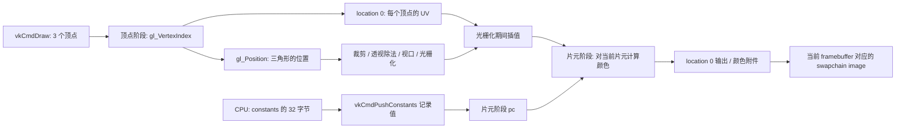

# 02：从 CPU 的 32 字节，一直追到屏幕上的一个片元

本文对应当前项目的 `src/main.cpp`、`shaders/fullscreen.vert`、`shaders/neon.frag` 和 `shaders/shadertoy_adapter.frag`。原文件保持原样；配套完整 shader 在 [examples/shaders](examples/shaders/README.md)。这里只做了源码阅读、数学推导和规范核对，**没有在本机编译、运行或验证渲染结果**。文中的画面描述是供你在另一台电脑核对的预期。

你已经能沿着 `drawFrame()` 追踪“什么时候执行”。现在增加另外两条主线：“一次执行读到哪些数值”和“这些数值如何变成颜色”。不要把同步概念丢掉，而是让它回答正确的问题：fence 不能解释圆为什么是圆；`length(p)` 不能保证下一帧安全复用资源。

读完应能独立回答：屏幕某个位置的 `vUV` 是多少？`pc.timeResolution.x` 的第一个字节来自哪一行 C++？为什么无需顶点 buffer？为什么只画三个顶点却出现六个光圈？修改 shader 的哪一项才会真正改变图形？

## 1. 先把整条路径接起来



这些箭头表达数据依赖，不表示 CPU 在每一箭头处等待。CPU 录制命令后，队列提交才让设备执行这些命令。顶点阶段和片元阶段是 graphics pipeline 的两个程序阶段，CPU 不会按像素去调用 `neon.frag::main()`。

先采用一个够用的片元模型：**对于三角形覆盖的每个采样位置，求出输入值，然后计算候选颜色**。真实执行还涉及 helper invocation、MSAA、丢弃、深度测试等，不能把“一个像素恰好调用一次 shader”当作 Vulkan 的普遍保证。当前项目只有一个全屏三角形、单采样、没有深度附件，因而这个简化模型很适合起步。

`neon.frag` 的局部变量 `p`、`q`、`ring`、`color` 属于当前 invocation 的计算；另一个片元有自己的值。GPU 同时处理很多 invocation，并不承诺从屏幕左上角逐行执行。这里没有“先画第一圈，再由另一条 draw 画第二圈”：**同一个片元在自己的 `for` 循环里累加六个光圈对此位置的贡献**。

## 2. 看懂 GLSL 声明：先识别数据从哪里来

从 `neon.frag` 的开头开始：

```glsl
#version 450
layout(location = 0) in vec2 vUV;
layout(location = 0) out vec4 outColor;

layout(push_constant) uniform PushConstants {
    vec4 timeResolution;
    vec4 mouse;
} pc;
```

`#version 450` 指 GLSL 语言版本，不代表 Vulkan 4.5。项目用 `glslc --target-env=vulkan1.1` 生成对应 Vulkan 环境的 SPIR-V；应用加载 `.spv`，不会在运行时直接解释 `.frag` 文本。

`float` 是这里的单精度标量；`vec2/vec3/vec4` 分别是 2/3/4 个浮点分量。`in` 表示本阶段输入，`out` 表示本阶段输出；`uniform` 表示这一类数据不是按顶点或片元插值得到的。“uniform”不等于“必定在 uniform buffer 内”：这里带有 `push_constant`，它是 push constant block。`PushConstants` 是 block 名，`pc` 是访问该 block 的实例名。

常见表达式要这样读：

| GLSL | 展开理解 |
|---|---|
| `vec3(0.2)` | 三个分量都是 `0.2` |
| `vec4(vUV, 0.0, 1.0)` | `(vUV.x, vUV.y, 0, 1)` |
| `pc.timeResolution.yz` | 提取第二、第三个分量，得到 `vec2(width,height)` |
| `vUV.xy` / `vUV.rg` | 对同一两个分量使用坐标/颜色别名；别在一次 swizzle 中混用命名组 |
| `vUV * 2.0 - 1.0` | 两个分量分别乘 2、减 1 |
| `vec3A * vec3B` | 逐分量相乘；不是点积，点积写 `dot(A,B)` |
| `mat2A * vec2B` | 矩阵乘列向量 |
| `float(i)` | 把整数循环序号转换为浮点数 |
| `color += tint * amount` | 各颜色分量分别累加 |
| `void mainImage(out vec4 c, in vec2 p)` | 自定义函数；通过输出参数写回颜色，不是 Vulkan 自动调用的入口 |

向量构造和矩阵构造是语言定义的操作；特别是矩阵参数按列填充，不能因为源代码写成两行就按行理解。[GLSL 构造与运算](https://docs.vulkan.org/glsl/latest/chapters/operators.html)

### 2.1 三套编号不能混为一谈

| 声明中的东西 | 对应什么 | 本项目例子 |
|---|---|---|
| shader 阶段接口的 `location` | 阶段之间传递的属性/颜色输出槽位 | VS 的 `out vec2` 对上 FS 的 `in vec2` |
| descriptor 的 `set`、`binding` | pipeline layout 中的 descriptor set 和该 set 中的资源槽 | 当前不存在；以后纹理可能是 `layout(set=0,binding=1) uniform sampler2D tex;` |
| block 成员的 `offset` | block 开头起算的字节偏移 | `timeResolution` 从 0 开始，`mouse` 从 16 开始 |
| `gl_Position`、`gl_VertexIndex` | Vulkan/GLSL 定义的内置接口 | 不需要自定义 `location` |

这四类名字可能都出现“0”，但它们不共享同一个编号空间。顶点 buffer 的 `VkVertexInputBindingDescription::binding` 又是顶点输入自身的绑定编号，不是 descriptor binding。

当前顶点 shader 的 `layout(location=0) out vec2 vUV` 和片元 shader 的 `layout(location=0) in vec2 vUV` 按接口槽和类型对应。可以把片元变量改名成 `pixelUV`，接口仍然成立；只改片元的 location 为 1 就会破坏匹配。入门阶段在两侧写完全相同的类型和插值限定词，先不要使用复杂的 component 打包。[Vulkan Shader Interfaces](https://docs.vulkan.org/spec/latest/chapters/interfaces.html)

片元的 `layout(location=0) out vec4 outColor` 属于**另一段接口**。它写到当前 subpass 的 `pColorAttachments[0]` 所引用的附件；该引用再关联 framebuffer 中的 image view。它不是指“交换链第 0 张图”，也不是直接通过 `imageIndex` 命名资源。`imageIndex` 在 CPU 端用来选择本次 render pass 的 framebuffer。

## 3. CPU 的 8 个 float，如何变成 shader 的 2 个 vec4

当前 C++ 声明的是：

```cpp
struct PushConstants {
    float time, width, height, aspect;
    float mouseX, mouseY, padding0, padding1;
};
```

在项目目标的常见 C++ ABI 中，`float` 为 4 字节，下面是需要保持的接口：

| 字节偏移 | C++ 字段 | GLSL 表达式 | 当前值的来源 |
|---:|---|---|---|
| 0 | `time` | `pc.timeResolution.x` | 稳定时钟减去启动时刻，单位秒 |
| 4 | `width` | `pc.timeResolution.y` | swapchain extent 宽度，像素 |
| 8 | `height` | `pc.timeResolution.z` | swapchain extent 高度，像素 |
| 12 | `aspect` | `pc.timeResolution.w` | `width / height` |
| 16 | `mouseX` | `pc.mouse.x` | `cursorX / width`，有高 DPI 注意项，见后文 |
| 20 | `mouseY` | `pc.mouse.y` | `1 - cursorY / height` |
| 24 | `padding0` | `pc.mouse.z` | `constants{}` 零初始化，当前不传点击信息 |
| 28 | `padding1` | `pc.mouse.w` | 同上 |
| 32 | block 末尾 | — | 共 32 字节 |

这里按**字节布局**对应，不按 C++/GLSL 字段名称对应。C++ 不必也叫 `timeResolution`，shader 不认识 C++ 字段的名字。

本例两个 `vec4` 各占 16 字节，第二个从 16 开始。push constant 可以使用 `std430` 风格布局；这个简单结构在常见的 `std140`/`std430` 规则下结果恰好相同。别把这种巧合推广到 `float[]`、`vec3`、矩阵、嵌套结构：对齐、数组步长和矩阵步长都要逐项核对。[Shader Memory Layout](https://docs.vulkan.org/guide/latest/shader_memory_layout.html)

配套示例把约定写得更明确：

```glsl
layout(push_constant, std430) uniform PushConstants {
    layout(offset = 0) vec4 timeResolution;
    layout(offset = 16) vec4 mouse;
} pc;
```

以后你在另一台电脑编辑 C++ 时，可以在该结构后加下面的编译期检查；本文没有修改当前源文件：

```cpp
#include <cstddef>
#include <type_traits>
static_assert(sizeof(float) == 4);
static_assert(std::is_standard_layout_v<PushConstants>);
static_assert(sizeof(PushConstants) == 32);
static_assert(offsetof(PushConstants, time) == 0);
static_assert(offsetof(PushConstants, aspect) == 12);
static_assert(offsetof(PushConstants, mouseX) == 16);
static_assert(offsetof(PushConstants, padding1) == 28);
```

接下来三个环节必须相互一致：

1. `createGraphicsPipeline()`：`VkPushConstantRange` 声明 `[0,32)` 字节给 fragment 阶段使用，并放入 `VkPipelineLayout`。
2. `recordCommandBuffer()`：`vkCmdPushConstants(commandBuffer, pipelineLayout_, VK_SHADER_STAGE_FRAGMENT_BIT, 0, sizeof(constants), &constants)` 把对应值记录到命令缓冲状态。
3. `neon.frag`：用相同偏移和类型解释这些值。

记录完成后，修改 CPU 栈上的 `constants.time` 不会回头修改已经记录的值；GPU 也不会在未来去解引用 `&constants` 这个 C++ 栈地址。再次录制相应命令才能改变该次 draw 使用的值。[Push Constants](https://docs.vulkan.org/guide/latest/push_constants.html)

如果你把 `pc` 也加入 vertex shader，不能只改 GLSL：pipeline layout 中的可见阶段、push 命令的阶段范围都要对应顶点的读取范围。descriptor 则还需要创建/更新 descriptor set 并在 draw 前绑定；只写一个 `set/binding` 声明不会凭空得到纹理。

## 4. 三个顶点如何覆盖整个窗口

当前 draw 是：

```cpp
// vertexCount=3, instanceCount=1, firstVertex=0, firstInstance=0
vkCmdDraw(commandBuffer, 3, 1, 0, 0);
```

逻辑上，这个 draw 请求的三个顶点索引分别是 0、1、2。VS 用这个内置索引从常量数组取值，所以 `VkPipelineVertexInputStateCreateInfo` 可以没有顶点属性，也不需要 `vkCmdBindVertexBuffers`。

| `gl_VertexIndex` | `position` | `gl_Position` | `vUV = position*0.5+0.5` |
|---:|---|---|---|
| 0 | `(-1,-1)` | `(-1,-1,0,1)` | `(0,0)` |
| 1 | `(3,-1)` | `(3,-1,0,1)` | `(2,0)` |
| 2 | `(-1,3)` | `(-1,3,0,1)` | `(0,2)` |

`gl_Position` 是 clip coordinates。标准 Vulkan 裁剪体要求 `-w≤x≤w`、`-w≤y≤w`、`0≤z≤w`；超出的部分会被裁剪，不是“顶点坐标绝不能超过 1”。这里 `w=1,z=0`，裁剪后的可见区域正好覆盖 NDC 的 `[-1,1]×[-1,1]` 方形。大型三角形的斜边从 `(3,-1)` 连到 `(-1,3)`，其直线是 `x+y=2`，屏幕方形全部位于三角形内或边界上。[Vertex Post-Processing](https://docs.vulkan.org/spec/latest/chapters/vertexpostproc.html)

为什么 `vUV` 允许出现 2？它是自定义浮点属性，名字中有 UV 并不自动限制为 `[0,1]`。三角形在可见窗口中的插值结果才落在 `[0,1]` 附近。将两个越界顶点的 UV 强行限制为 1，会改变整幅画面的插值，不再是全屏标准 UV。

不要把 draw 改成 `vkCmdDraw(...,6,1,0,0)` 试图“更多顶点更清晰”：数组只有三个元素，索引 3、4、5 会越界。改 `firstVertex` 同样会影响 `gl_VertexIndex`，这个 shader 假设它为 0。draw 的顶点数不控制片元分辨率，分辨率来自 framebuffer、viewport 等状态。

### 4.1 `vUV` 是怎么从三个值变成几百万个值的

对屏幕空间中的某一点，三角形的重心权重记为 `λ0,λ1,λ2`，三者和为 1。浮点接口默认使用 `smooth` 透视正确插值；一般公式是：

```text
u = (λ0*u0/w0 + λ1*u1/w1 + λ2*u2/w2)
    / (λ0/w0 + λ1/w1 + λ2/w2)
```

当前三个 `w` 都是 1，所以简化为普通加权平均。在屏幕几何中心 `(NDC x=0,y=0)`，相对这个大三角形的权重是 `(0.5,0.25,0.25)`：

```text
vUV = 0.5*(0,0) + 0.25*(2,0) + 0.25*(0,2) = (0.5,0.5)
```

`flat` 表示取 provoking vertex 对应值而不插值；`noperspective` 表示按屏幕空间线性插值。整数类型的片元输入通常需要 `flat`。本项目保留默认 `smooth` 就好。[GLSL 插值限定词](https://docs.vulkan.org/glsl/latest/chapters/variables.html#interpolation-qualifiers)

### 4.2 当前窗口方向必须用实际 viewport 推导

本项目 `viewport.x=y=0`、`width=W>0`、`height=H>0`。变换为：

```text
x_framebuffer = (x_ndc + 1) * W/2
y_framebuffer = (y_ndc + 1) * H/2
```

所以当前 `vUV` 的左上角接近 `(0,0)`，右下角接近 `(1,1)`；**y 向下增大**。对通常的像素中心采样，像素 `(j,k)` 约为 `vUV=((j+0.5)/W,(k+0.5)/H)`，角落像素并不恰好读到 0 或 1。[VkViewport 的变换定义](https://docs.vulkan.org/refpages/latest/refpages/source/VkViewport.html)

这不是所有 Vulkan 程序必须采用的唯一坐标习惯：可以通过投影矩阵或负 viewport height 等办法翻转，但要同时检查裁剪、正反面和鼠标约定。此处先依据**当前代码**理解。实验 [01_uv.frag](examples/shaders/01_uv.frag) 直接把 `x→红`、`y→绿`，左上黑、右上红、左下绿、右下黄，能检查你是否把方向想反了。

## 5. 第一个图形：一个位置为什么会被涂成圆环

建议先看完整的 [02_ring.frag](examples/shaders/02_ring.frag)，再回到原来的 neon。

```glsl
vec2 p = vUV * 2.0 - 1.0;
p.x *= pc.timeResolution.w;
float signedDistance = length(p) - 0.45;
float distanceToRing = abs(signedDistance);
```

第一行把坐标原点移到屏幕中心，原 `[0,1]` 范围变为 `[-1,1]`。第二行对 x 乘 `W/H`，让横纵方向的一个坐标单位对应同样数量的像素：

```text
每向右一个像素: Δp.x = (2/W)*(W/H) = 2/H
每向下一个像素: Δp.y = 2/H
```

如果不修正，在 1280×720 窗口里，`length(p)=0.45` 会产生横半径 288 像素、纵半径 162 像素的椭圆。修正后两方向半径都为 `0.45*720/2=162` 像素。

`length(p)=sqrt(p.x*p.x+p.y*p.y)` 是当前点离圆心的距离。减半径得到圆的有符号距离：内部负、边界零、外部正。取绝对值后得到离圆周的距离，内部外部都变成非负。这里符号消失是有意的，因为我们只想画边，不想填满整个圆。

| 当前 `p` | `length(p)` | `length(p)-0.45` | 取绝对值后 | 对环的理解 |
|---|---:|---:|---:|---|
| `(0,0)` | 0 | -0.45 | 0.45 | 圆心离圆周很远，暗 |
| `(0.45,0)` | 0.45 | 0 | 0 | 位于圆周，亮 |
| `(0.46,0)` | 0.46 | 0.01 | 0.01 | 圆周外侧附近 |
| `(0,0.44)` | 0.44 | -0.01 | 0.01 | 圆周内侧附近，同样距离 |

剩下的任务是把距离映射成颜色。最粗糙的办法是 `distanceToRing<0.008 ? 1.0 : 0.0`；但它会在阈值处突变，边缘容易闪烁或有锯齿。示例用了：

```glsl
float aa = max(fwidth(signedDistance), 2.0 / max(pc.timeResolution.z, 1.0));
float coverage = 1.0 - smoothstep(0.008, 0.008 + aa, distanceToRing);
```

`fwidth(x)` 估计邻近片元间 `x` 的变化尺度；这里让过渡宽度随当前像素尺度变化，至少保留一个近似像素宽度。它不是对任意不连续函数都准确的魔法抗锯齿器，也不等价于启用 MSAA。将导数计算放在全片元一致的控制流中更容易推理。

**你没有把圆的顶点传给 GPU。你传的是覆盖屏幕的三角形；片元程序按每个位置到圆周的距离决定颜色。** 这就是程序化图形的一种基本方法。

## 6. 原始 neon.frag：按计算阶段逐句读

### 6.1 时间、屏幕比例和微小位移

```glsl
float time = pc.timeResolution.x;
float aspect = pc.timeResolution.w;
vec2 p = vUV * 2.0 - 1.0;
p.x *= aspect;
p += (pc.mouse.xy - 0.5) * 0.16;
vec3 color = vec3(0.006, 0.009, 0.025);
```

前四行刚刚已经推导。第五行以鼠标归一化坐标的中点为零，位移幅度约在 `[-0.08,+0.08]`；最后一行建立略带蓝色的暗背景。

注意：对采样位置加 `offset`，图形通常向 `-offset` 移动，因为图形中心满足 `p+offset=0`。这和“移动物体的位置加正值”不是同一句操作。当前鼠标 y 与 `vUV.y` 的方向不同，后文会专门拆开。

### 6.2 `for` 循环：六个距离场加在一个片元上

```glsl
for (int i = 0; i < 6; ++i) {
    float fi = float(i);
    vec2 q = rotate2D(time * (0.08 + fi * 0.017)) * p;
    // 后续对这一个环求颜色贡献
}
```

`fi` 依次为 0、1、2、3、4、5。它同时改变半径、角速度、波纹频率、颜色相位，所以六个环不像完全同步复制的六个副本。`q` 是为了当前环构造的局部采样坐标；下一次循环重新从 `p` 出发，不会继承上一环的扭曲。

### 6.3 `mat2(c,-s,s,c)` 到底转向哪里

原函数为：

```glsl
float s = sin(angle);
float c = cos(angle);
return mat2(c, -s, s, c);
```

构造参数按列填写，所以常规书写的矩阵为：

```text
M = [ c   s ]     M * [x] = [ c*x + s*y ]
    [-s   c ]         [y]   [-s*x + c*y ]
```

用 `angle=π/2`、`p=(1,0)` 检验，结果为 `(0,-1)`。在数学 y 向上的坐标纸上，这是向量顺时针转 90°；在当前屏幕 y 向下的坐标里，这个向量从右指向上。再考虑“转的是采样坐标，所见图案往往相反转”，就知道为什么仅凭函数名不能断言动画视觉方向。

如果想写数学意义上把向量逆时针旋转的标准矩阵，可写 `mat2(c,s,-s,c)`。不要混淆三件事：构造参数顺序、数学乘法约定、buffer 中矩阵存储布局。后续 CPU 上传 `mat4` 时才会遇到第三件事。

一个更有价值的观察：旋转保持 `length(q)` 不变。**纯圆仅旋转采样坐标，外观不会变化。** neon 之所以能看见旋转，是后续还有角度波纹和非圆对称的坐标扰动。

### 6.4 用正弦扭曲坐标

```glsl
q += 0.10 * vec2(
    sin(q.y * 3.0 + time + fi),
    cos(q.x * 2.6 - time * 0.8 + fi)
);
```

这行右侧使用更新前的 `q`：让 y 影响 x 位移、x 影响 y 位移，最大位移幅度各约 0.10。它改变的是“去哪个数学位置采样”，不是修改三角形顶点，也没有读纹理。`3.0`、`2.6` 调空间变化频率，`time`、`-0.8*time` 调变化速度和方向，`fi` 让每个环错开相位。

把它想成铺在屏幕上的坐标网格被揉皱：原来在该坐标网格中定义的圆，映射回屏幕后就成了扭动的曲线。这类先改输入坐标再算图形的做法常叫 domain warping（坐标域扭曲）。

### 6.5 半径、角度波纹和绝对值

```glsl
float radius = 0.20 + fi * 0.12;
float ring = abs(length(q) - radius);
float wave = sin(atan(q.y, q.x) * (5.0 + fi)
                 - time * (1.2 + fi * 0.08));
ring = abs(ring + wave * 0.018);
```

六个基础半径是 `0.20,0.32,0.44,0.56,0.68,0.80`。`atan(y,x)` 给出方向角，利用两项的符号区分象限；它不是简单的 `atan(y/x)`。乘 `5+fi` 表示绕一整圈重复 5 至 10 次；减去随时间增长的相位让波纹沿角度方向移动。

最后一行不是简单的“把圆半径加一条正弦”。原代码先做过 `abs(length(q)-radius)`，已经丢掉内外符号：

```text
若 wave > 0，ring + wave*0.018 不会等于 0，局部最亮位置会减弱；
若 wave < 0，在原圆周内外相距约 -wave*0.018 的位置都可能出现亮带。
```

因此它会有变亮、变暗、分裂的纹理。若想要更直接的“波浪圆周”，可以把两行合为 `abs(length(q) - radius + wave*0.018)`；这是一个有目的的视觉改动，不是原式的代数等价替换。另外，坐标扭曲后计算值通常不能再当作屏幕空间中的精确距离；叫“距离场式效果”比说“这里处处都是严格 SDF”更准确。

`atan(0,0)` 在 GLSL 中没有定义的结果。虽然扭曲后某个采样位置恰好等于零不常见，配套 `03_neon_fixed.frag` 仍在 `dot(q,q)>1e-12` 时才求角度，在很小的中心邻域把角度选为零，去掉这个边界不确定性。[GLSL atan](https://docs.vulkan.org/glsl/latest/chapters/builtinfunctions.html#atan)

### 6.6 三个通道错相，得到彩色调色板

```glsl
vec3 tint = 0.5 + 0.5 * cos(vec3(0.0, 2.1, 4.2)
                           + fi * 0.7 + time * 0.35);
```

`cos` 对三个分量分别计算。余弦的范围是 `[-1,1]`，乘 0.5 加 0.5 后变为 `[0,1]`。R/G/B 三路初始相位不同，因此不会同时处于相同明暗。`fi*0.7` 给不同环不同色相，`time*0.35` 让它缓慢变色。这些数字在此项目中是作者的美术参数，不是 Vulkan 固定要求。

例如先设 `fi=0,time=0`，红色分量为 `0.5+0.5*cos(0)=1`；绿色分量约为 `0.248`，蓝色分量约为 `0.255`。这三个值来自数学计算，GPU 不知道它们“应该是一种霓虹色”。

### 6.7 从距离到发光强度

```glsl
float glow(float distanceToLine, float radius, float intensity) {
    return pow(radius / max(distanceToLine, 0.0008), intensity);
}
color += tint * glow(ring, 0.006, 1.22) * 0.085;
```

这里 `glow` 的 `radius` 参数是衰减函数的比例参数，和外面“第几个圆环的几何半径”不是同一个变量。靠近曲线时分母小，亮度高；远离时逐渐下降。`max(...,0.0008)` 为分母设下限，限制峰值并避免除零。

| 到线距离 | `0.006/max(d,0.0008)` | `pow(...,1.22)*0.085` 约值 |
|---:|---:|---:|
| `0.0008` 或更小 | 7.5 | 0.993 |
| `0.006` | 1 | 0.085 |
| `0.012` | 0.5 | 0.0365 |

这个亮度再乘 `tint`，并累加六次。多个环在同一片元附近重叠时，某个颜色分量可以大于 1；`vec3` 本身允许这样的浮点值。所谓“发光”是这里手写的距离到亮度函数，没有真正模拟光照传播，也没有自动的 bloom 模糊。以后做 bloom，才会增加离屏 HDR 图像和模糊/合成 pass。

### 6.8 暗角和一个必须知道的规范陷阱

原代码写了：

```glsl
float vignette = smoothstep(1.45, 0.20, length(p));
color *= vignette;
```

看起来想要“中心亮，外圈暗”，某些实现也可能给出那个结果，但 GLSL 要求 `smoothstep` 的 `edge0<edge1`，反过来时结果未定义。完整示例修成：

```glsl
float vignette = 1.0 - smoothstep(0.20, 1.45, length(p));
```

`length(p)≤0.20` 时系数为 1，`≥1.45` 时为 0，中间平滑过渡。这是对意图的规范化写法，不能承诺与所有驱动上原未定义表达式逐像素相同。[GLSL smoothstep](https://docs.vulkan.org/glsl/latest/chapters/builtinfunctions.html#smoothstep)

### 6.9 Tone mapping 与 sRGB：这是两个步骤

```glsl
color = 1.0 - exp(-color * 1.5);
outColor = vec4(color, 1.0);
```

对非负颜色输入，指数映射把很大的值压到接近 1：输入 `0,0.5,1,2` 分别约为输出 `0,0.528,0.777,0.950`。系数 1.5 类似曝光倍率。这样亮处还能保留渐变，不会简单地把所有大于 1 的值直接截成一片白。

但这一步**不是 sRGB 编码**。当前 `chooseSwapSurfaceFormat()` 优先选择 `VK_FORMAT_B8G8R8A8_SRGB` 配合 `VK_COLOR_SPACE_SRGB_NONLINEAR_KHR`。写 sRGB 颜色附件时，RGB 会在存储前从线性值编码为 sRGB；alpha 不做这项编码。shader 仍用 RGBA 顺序输出，不要因为格式名字含 BGRA 就手动交换红蓝。[Framebuffer 的 sRGB 转换规则](https://docs.vulkan.org/spec/latest/chapters/framebuffer.html)

所以这些例子输出的是线性 RGB，不能再无条件加一遍 `pow(color,vec3(1.0/2.2))`，否则在 sRGB 附件路径上重复编码，画面会过亮。反过来，当前代码找不到首选格式时返回 `formats.front()`，**因此不能保证所有设备都用 sRGB 格式**。如果实际选到 UNORM 图像并仍呈现到 sRGB 非线性色彩空间，就需要在最终输出处安排正确编码；其他 colorSpace 也需相应策略。第一步应在另一台电脑记录实际选到的 format/colorSpace，再判断颜色路径，别凭显示器观感猜。

## 7. ShaderToy 适配器究竟适配了什么

现有 `shadertoy_adapter.frag` 建了三个宏：

```glsl
#define iTime       (pc.timeResolution.x)
#define iResolution vec3(pc.timeResolution.yz, 1.0)
#define iMouse      vec4(pc.mouse.xy * pc.timeResolution.yz, 0.0, 0.0)
```

宏是编译前文本替换，不是 Vulkan 自动提供的内置变量。它把当前 32 字节重新命名成常见的 ShaderToy 输入。最后的 `main()` 负责调用用户自己写的 `mainImage()`。

### 7.1 当前 Y 方向对不上

当前调用 `mainImage(outColor,vUV*resolution)` 的输入 y 向下；常见 ShaderToy `fragCoord` 约定 y 从底部向上。因此纵向不对称的内容会翻转。原示例只是一个圆，太对称，很容易掩盖问题。保留当前 viewport 和 fullscreen.vert 时，可以在适配器入口写：

```glsl
vec2 fragCoordYUp = vec2(vUV.x, 1.0 - vUV.y) * pc.timeResolution.yz;
mainImage(outColor, fragCoordYUp);
```

配套 [04_shadertoy_y_up.frag](examples/shaders/04_shadertoy_y_up.frag) 是可替换的完整示例：背景绿色向上增强，橙色点表示鼠标，圆环随时间呼吸。CPU 当前已经把 mouseY 翻为向上，做完片元坐标转换后，二者方向才相符。无需为了“适配所有 ShaderToy”盲目再翻一次纹理 UV；每张输入图像的约定也要单独核对。

### 7.2 鼠标位置、点击状态、高 DPI 是三件事

现有 CPU 只调用 `glfwGetCursorPos()`。适配器 `iMouse.zw` 固定为零，因此没有鼠标按键是否按住、点击起点或其符号约定。依赖这些输入的 ShaderToy 程序不能直接工作。可以把目前的 `padding0/1` 重新设计为点击起点等字段而仍保留 32 字节，但必须同时增加 C++ 的按键/事件状态跟踪并清晰定义编码；不是改一下宏就能补全。

另外，GLFW cursor 位置以窗口内容区域左上角为原点，使用窗口的 screen coordinates。framebuffer 像素尺寸在高 DPI 屏幕上可能与窗口尺寸不同；当前用 cursor 除以 swapchain 像素尺寸，会产生归一化错误。[GLFW 光标位置](https://www.glfw.org/docs/latest/input_guide.html#cursor_pos)、[GLFW framebuffer 尺寸](https://www.glfw.org/docs/latest/window_guide.html#window_fbsize)

例如窗口逻辑尺寸是 `1280×720`，framebuffer 是 `2560×1440`：鼠标在窗口中心得到 `(640,360)`，原式给 `mouseX=0.25,mouseY=0.75`，实际应该是 `(0.5,0.5)`。shader 无法仅凭已有的 32 字节恢复缺失的窗口逻辑尺寸。

另一台电脑上可在 `recordCommandBuffer()` 的鼠标归一化部分采用下面的改法；它仅展示 CPU 修改点，没有在当前文件中应用：

```cpp
int windowWidth = 0;
int windowHeight = 0;
glfwGetWindowSize(window_, &windowWidth, &windowHeight);
constants.mouseX = windowWidth > 0
    ? static_cast<float>(cursorX / static_cast<double>(windowWidth)) : 0.5F;
constants.mouseY = windowHeight > 0
    ? 1.0F - static_cast<float>(cursorY / static_cast<double>(windowHeight)) : 0.5F;
// constants.width/height 仍使用 swapchain extent：shader 分辨率需要真实像素数。
```

这个版本保留鼠标 y 向上，配合上面的 `fragCoordYUp`。如果希望整个应用统一 y 向下，则去掉 CPU 的 `1-`，同时让相应 shader 用 y 向下坐标；要统一改契约。光标离开内容区时数值可能超出 `[0,1]`，是否 clamp 是交互设计选择，不是接口要求。

### 7.3 还有哪些东西没有适配

| ShaderToy 功能 | 当前状态 | 实现时要增加的东西 |
|---|---|---|
| `iTime` | 已有 | 时钟定义；暂停/重置时的策略 |
| `iResolution.xy` | 已有 | 来自 swapchain extent |
| `iResolution.z` | 固定 1 | 不代表第三维体积大小 |
| `iMouse.xy` | 有位置，方向/高 DPI 需按上述核对 | 窗口尺寸归一化 |
| `iMouse.zw` | 无点击信息 | CPU 输入状态及数据契约 |
| `iFrame` / `iTimeDelta` / `iDate` | 无 | 新的 CPU 数据与 shader 布局 |
| `iChannel0..3` | 无 | 图像、image view、sampler、descriptor，以及上传与布局转换 |
| Buffer A/B 等多 pass | 无 | 中间图像、pass 依赖；读上帧结果时通常还要 ping-pong 图像 |
| 音频输入 | 无 | 音频获取与频谱等数据处理，再通过纹理/buffer 提供 |

现有 `mainImage()` 示例的 `d=length(uv)-0.45-0.04*sin(2*iTime)` 是“随时间改半径”；`0.012/max(abs(d),0.001)` 是另一种距离衰减亮度。它没有 tone mapping，强度超过 1 时写到常见归一化颜色附件会截断高光，所以这只是函数接口示范，不代表完整色彩管理。

将外部 shader 的函数搬进来前还要看它声明了什么输入、依赖什么 pass、原内容采用什么颜色约定。看似只有几十行 `mainImage` 并不等于只需这几十行就能复现完整效果。

## 8. 现在需要补多少三维图形学

理解当前 neon，无需先学完整的相机系统。你已经需要并正在使用：向量、长度、三角函数、二维变换、采样、插值、距离场、颜色。当前全屏三角形直接写 clip coordinates，**没有模型空间、世界空间或相机矩阵参与**。

但成为能开发三维渲染器的 Vulkan 开发者，需要再把下列流程建立起来：

```text
模型顶点 --M--> 世界坐标 --V--> 相机/观察坐标 --P--> clip coordinates
                                                  |
                                            裁剪、除以 w
                                                  v
                                                 NDC
                                                  |
                                               viewport
                                                  v
                                           framebuffer 坐标
```

`gl_Position=P*V*M*vec4(position,1)` 是一种常用约定，Vulkan 本身不强制你的“世界坐标是左手还是右手”。齐次坐标让平移和投影可以用矩阵表达；透视投影通过最终除以 w 产生近大远小，正交投影没有这种随距离缩小的效果。Vulkan 标准 NDC 深度范围 `[0,1]` 要和投影矩阵一致，不能直接假设所有 OpenGL 教材矩阵都适用。

你接着应该能推导：为什么位置用 `w=1`，方向用 `w=0`；为什么 view 是相机位姿的逆；为什么透视插值要除以 w；为什么法线在非均匀缩放下不能简单乘模型矩阵；深度 buffer 如何决定前后遮挡。这些知识解释画面计算，Vulkan API 则负责提供资源、接口、状态和执行顺序。

## 9. 把 shader 改对，需要同时守住哪些契约

| 改动 | 只改片元源文件够不够 | 为什么 |
|---|---|---|
| 改圆半径、颜色、循环内公式 | 够，之后在另一台电脑重新生成目标 SPIR-V、重新运行程序 | 接口不变 |
| 改 `vUV` 的变量名 | 通常够 | 本例按 location/type 连接 |
| `vec2 vUV` 改为 `vec3` | 不够 | 顶点输出与片元输入都要一致 |
| 增加 push constant 字段 | 不够 | C++ 字节布局、range、shader offset 同时改；检查设备上限 |
| 顶点阶段也读取 push constants | 不够 | stageFlags 和 push 写入范围要匹配 |
| 增加 `sampler2D` | 不够 | 创建图像与 sampler，准备 descriptor，绑定并完成同步 |
| `outColor.a=0.5` 想得到透明窗 | 不够 | 当前 blending 关闭；窗口合成还另有 surface/compositeAlpha 约定 |
| 在片元 shader 中写普通局部变量，想让下一帧保留它 | 不够 | 下一次 invocation 不会继承；需持久资源及同步 |
| 要新功能/新 SPIR-V capability | 不一定 | 查询物理设备支持，在逻辑设备创建时启用对应 feature/extension |

GLSL 编译通过只能说明一部分语言与目标环境要求成立。pipeline 接口、设备 feature、descriptor、image layout 和同步也都必须正确。相反，fence 和 semaphore 全部正确也不能纠正 shader 除零、错误 offset 或错误数学。

当前程序加载名是固定的 `VULKAN_SHADER_DIR/neon.frag.spv`；修改了别的 `.frag` 而实际执行仍是旧 `.spv` 时，画面自然不变。例子 README 给了两条明确的替换路径，不增加库依赖。

## 10. 在另一台电脑按顺序做，先预测再看画面

每个实验只改一个变量。先写下预测，再运行；出现差异时回到数据来源、接口、坐标、数学四个层面定位。

| 次序 | 实验 | 你应预测的现象 | 它验证什么 |
|---:|---|---|---|
| 1 | 使用 `01_uv.frag` | 左上黑、右上红、左下绿、右下黄 | VS→插值→FS 接口与 Y 方向 |
| 2 | 在 01 中打开时间蓝色分量示例 | 蓝色以约 `2π` 秒为周期变化 | CPU time→偏移 0→FS |
| 3 | 使用 `02_ring.frag`，再暂时删除 aspect 修正 | 宽窗口中圆变为横向椭圆 | 坐标单位与实际像素比例 |
| 4 | 02 中把半径改为 `0.45+0.04*sin(2*time)` | 半径在 0.41 至 0.49 间变化 | 时间改变数学图形 |
| 5 | 02 用文件末尾的圆盘输出注释行替换原输出，观察它直接使用 `signedDistance` | 内部填满，外部暗 | signed / unsigned 距离区别 |
| 6 | 使用 `03_neon_fixed.frag`，把循环上限改为 1 | 只剩一层小光环的贡献 | 循环是在每个片元内累加 |
| 7 | 03 去掉坐标扰动，并令 `wave=0` | 剩下圆环，旋转不再能被看见 | 圆的旋转不变性 |
| 8 | 03 将 `tint` 固定为 `vec3(0,1,1)` | 六个环全部是青色 | 调色板与几何相互独立 |
| 9 | 03 暂时去掉 tone mapping | 高光更易饱和失去层次 | HDR 数值与输出范围 |
| 10 | 使用 `04_shadertoy_y_up.frag` | 绿色向上增强；常规 DPI 下橙点跟随鼠标 | 适配器与 Y 统一 |
| 11 | 在不同 DPI 的屏幕间移动窗口，并应用 CPU 归一化修法 | 鼠标点不再因 framebuffer 缩放偏离 | 逻辑窗口与物理像素区别 |

调试数学时可以暂时直接输出中间值：`vec4(vec3(clamp(ring*20.0,0.0,1.0)),1.0)` 看距离带；`vec4(0.5+0.5*p.x,0.5+0.5*p.y,0,1)` 看坐标；`vec4(tint,1)` 看调色板。负值与大于 1 的值在常见显示目标中会被截断，因此调试图也应安排可见范围。

最后做四道口算题，能答出来就说明开始真正掌握数据流：

1. `1280×720` 窗口中，中心右侧 180 像素的点，aspect 修正后的 `p` 是多少？答案：`(0.5,0)`，忽略半像素差与鼠标位移。
2. CPU 把 `aspect` 写到偏移 8，GLSL 不改，会发生什么？答案：覆盖 shader 的 height；aspect 仍来自偏移 12，不会按名字自动找到它。
3. 本例为什么 VS 输出 `(2,0)` 的 UV，而右侧屏幕边界只接近 `u=1`？答案：该顶点在屏幕之外，边界位置读取的是插值值。
4. 鼠标不动、时钟暂停后，当前 neon 还会自己“记住上一帧继续变化”吗？答案：不会。没有读取历史图像或持续修改的资源，相同输入应产生相同数学结果，具体浮点执行仍有实现允许的精度差异。

你已经有“任务何时能执行”的模型；完成本章后，应再拥有“这一次执行读到什么、如何计算、写到哪里”的模型。后面学习 buffer、descriptor、纹理和多 pass，就是把这里的 32 字节输入扩展成更多资源，并对每次资源访问补上正确的内存与同步条件。
