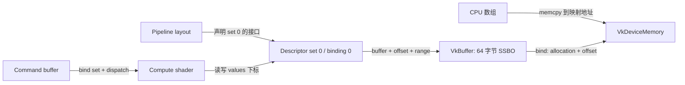

# 03　把资源、存储、接口和同步连成一条数据路径

你已经理解 `drawFrame()` 中 fence / semaphore 连接了哪些执行者。接下来加上四个问题：**数据存在哪里、怎样解释这些字节、shader 如何找到它们、何时允许读写。** 只有“等到了信号”还不足以解释一幅图像从何而来。

本章以现有 [`src/main.cpp`](../src/main.cpp) 为对照，并提供独立完整例 [`examples/compute_buffer`](examples/compute_buffer/README.md)。本章所有 `vkCmdPipelineBarrier` 片段采用 Vulkan 1.1 可用的接口；不会把 Vulkan 1.3 synchronization2 的结构偷偷混入当前项目。代码由静态阅读审查，未在本机配置、编译或运行。

## 1. 先回答当前程序“把内存藏在哪里了”

现有窗口例故意省去了顶点 buffer、纹理、UBO、SSBO 和 descriptor set。三个顶点由 `fullscreen.vert` 的 `gl_VertexIndex` 生成；每帧 CPU 参数通过 `vkCmdPushConstants` 复制进录制的命令；颜色写入交换链提供的 image。你没有漏读一个“申请显存”的函数：这些显式内存管理流程目前确实不存在。

这不表示运行时不占内存。驱动仍为 pipeline、命令、交换链图像等管理存储。对交换链 image，应用创建 image view 和 framebuffer，但不自行调用 `vkAllocateMemory` / `vkBindImageMemory`，也不自行 `vkDestroyImage`；它们遵循交换链生命周期。

需要自己上传模型、相机矩阵、纹理或读回计算结果时，就要加入以下对象：

| 名称 | 它表达什么 | 它不替你完成什么 |
|---|---|---|
| C++ 数组、`std::vector` | CPU 程序中的字节 | 不会自动成为 shader 可访问的 Vulkan 资源 |
| `VkBuffer` | 一段线性数据的逻辑范围、长度、用途 | `vkCreateBuffer` 不等于给应用完成绑定后的存储分配 |
| `VkImage` | 有尺寸、格式、mip、layer、sample 等属性的图像资源 | 不保证能把它当连续 RGBA 数组直接 map |
| `VkDeviceMemory` | 从某种设备 memory type 分配的存储 | 不知道这些字节将代表顶点、纹理还是整数 |
| `VkCommandBuffer` | draw / copy / dispatch / barrier 等命令的记录 | 不是 `VkBuffer`，也不是存放模型顶点的容器 |
| descriptor | 指向资源及访问范围的接口信息 | 不复制资源内容，不自动等 GPU |
| `VkPipelineLayout` | shader 可以使用哪些 set 布局和 push constant 范围 | 不是 image layout，也不是 buffer 内存布局 |

可以把 VkBuffer 看成“这 64 字节允许被当作 SSBO 使用”的声明，把 VkDeviceMemory 看成承载这些字节的存储。普通 buffer 经过 bind 后，GPU 才有满足该声明的 backing memory。buffer handle 也不是能在 CPU 上解引用的地址。



图中最后两条边表示命令执行时的寻址关系，不表示 descriptor 本身负责计算。

## 2. 创建 buffer 的八步分别解决什么

完整例的 `createBufferAndMemory()` 可逐行对应下表。逻辑长度是 `16 × sizeof(uint32_t) = 64` 字节。

| 步骤 | API / 动作 | 你要回答的问题 |
|---|---|---|
| 1 | `vkCreateBuffer` | 要多少逻辑字节、准备用于什么访问？ |
| 2 | `vkGetBufferMemoryRequirements` | 驱动要求多大的绑定区域、怎样对齐、允许哪几种 memory type？ |
| 3 | 查询 `vkGetPhysicalDeviceMemoryProperties` | 本设备有哪些 heap 和 memory type？ |
| 4 | 根据 `memoryTypeBits` 和属性选 type | 合法类型中，哪个满足 CPU/GPU 的访问需求？ |
| 5 | `vkAllocateMemory` | 申请一块属于所选 type 的 allocation |
| 6 | `vkBindBufferMemory` | 把 buffer 绑定到 allocation 的哪个起点？ |
| 7 | `vkMapMemory` | 如果 HOST_VISIBLE，建立 CPU 地址映射 |
| 8 | `memcpy`、必要的 flush、提交 | 真正写入字节，并让之后的设备操作可访问 |

`usage` 描述允许的用途，例如 `VERTEX_BUFFER_BIT`、`INDEX_BUFFER_BIT`、`UNIFORM_BUFFER_BIT`、`STORAGE_BUFFER_BIT`、`TRANSFER_SRC_BIT`、`TRANSFER_DST_BIT`。用途可以按位组合；它不等于“该资源当前归哪个阶段使用”，也不能替代 barrier。

三个 requirements 字段必须分开看：

```text
size           驱动要求为这个资源预留的大小，可能大于逻辑长度
alignment      buffer 绑定到 allocation 的 offset 必须满足的对齐
memoryTypeBits 第 i 位为 1，表示这个资源允许绑定到第 i 个 memory type
```

不是第 `i` 个 heap，也不是属性 flags。选择条件形如 `(memoryTypeBits & (1u << i)) != 0`，然后另查 `memoryTypes[i].propertyFlags` 是否包含所需属性。规则见 [VkMemoryRequirements](https://docs.vulkan.org/refpages/latest/refpages/source/VkMemoryRequirements.html)。

### Heap 与 memory type

heap 是存储容量及属性的描述；memory type 是“指向某个 heap 的一种访问属性组合”。多个 type 可以引用同一个 heap，并不一定代表多份独立内存。

下面是教学用假设，不是你电脑的查询结果：

| Type | Heap | 属性 | 应用能得出的结论 |
|---|---|---|---|
| 0 | A | DEVICE_LOCAL | 倾向适合设备访问；没有 HOST_VISIBLE，不能 map |
| 1 | B | HOST_VISIBLE、HOST_COHERENT | 可映射，通常无需显式 host cache 管理 |
| 2 | B | HOST_VISIBLE、HOST_CACHED | 可映射且 host cached；缺少 coherent 时要 flush/invalidate |
| 3 | A | DEVICE_LOCAL、HOST_VISIBLE、HOST_COHERENT | 同时适合设备访问并可映射，完全合法 |

`DEVICE_LOCAL` 不等于“独显上的、CPU 绝对不可映射的那块显存”。集显的统一内存、独显可映射的设备本地区域都说明这些位应分别理解。`HOST_CACHED` 描述 host 缓存属性；`HOST_COHERENT` 描述是否需要显式 host cache 管理；两者不同。依据 [VkMemoryPropertyFlagBits](https://docs.vulkan.org/refpages/latest/refpages/source/VkMemoryPropertyFlagBits.html)。

完整例只要求与当前 buffer 兼容的 HOST_VISIBLE，优先 coherent；找不到 coherent 时仍可使用非 coherent。实际工程还要结合资源大小、访问频率、读回需求与测量结果选 type，不能机械地把所有资源塞进同一种内存。

## 3. Map、flush、barrier、fence 各自回答不同的问题

`vkMapMemory` 返回一个 CPU 虚拟地址，你可以通过它访问映射区域。它不把 GPU 队列暂停，不提交上传命令，也不自动 invalidate 非 coherent 内存。可以长期保持映射，每帧只更新安全的区段；不需要把 map/unmap 当成上传按钮。`vkUnmapMemory` 也不能代替 flush。

把数据处理想成四层：

| 层 | 问题 | 对应工具 |
|---|---|---|
| 地址 | CPU 怎样访问这些字节？ | HOST_VISIBLE、map |
| host cache | host 修改或观察的缓存状态怎样纳入共享协议？ | flush / invalidate，或 coherent 属性 |
| 内存依赖 | 前一种写入怎样对后一种访问可见？ | 正确 stage/access 的 barrier、相应提交/信号依赖 |
| 执行完成与复用 | CPU 何时能读回、覆盖或释放？ | 等相关 fence 或其他适用的完成机制 |

### CPU 写 → GPU 读

本例采用的顺序是：

```text
确认 GPU 没在用这段内存
  → CPU memcpy
  → 非 coherent 时 flush
  → vkQueueSubmit
  → GPU shader 读取
```

host 写入和必要的 flush 在提交之前完成，提交提供 host → device 内存域操作，因此本例无需再为这次上传增加一个 `HOST_WRITE → SHADER_READ` barrier。若写入来自其他 CPU 线程，仍需 C++ 的 mutex、join 等建立 happens-before，不能让提交线程和写入线程竞争。不要将此规则扩大成“submit 后可以继续随便改”。依据 [Vulkan host writes 与提交](https://docs.vulkan.org/spec/latest/chapters/synchronization.html#synchronization-submission-host-writes)。

### GPU 写 → CPU 读

本例明确记录以下完整链：

```text
compute shader 写 SSBO
  → barrier: COMPUTE_SHADER / SHADER_WRITE → HOST / HOST_READ
  → submit 关联的 fence signal
  → CPU vkWaitForFences 成功返回
  → 非 coherent 时 invalidate
  → CPU memcpy 读回
```

fence 让 CPU 等到工作完成；barrier 中 host 访问的目标作用域参与建立设备写向 host 的内存依赖；invalidate 让已经可用于 host 域的写入对 host 访问可见。invalidate 本身不等待设备，不能提前拿它当 fence。依据 [vkInvalidateMappedMemoryRanges 的依赖链](https://docs.vulkan.org/refpages/latest/refpages/source/vkInvalidateMappedMemoryRanges.html)。

coherent 省掉的是 flush/invalidate。上述 GPU → host barrier 和执行等待仍保留；它不授权 CPU 与 GPU 同时无序地读写相同位置。

### 非 coherent 的 atom 对齐，为什么只刷新“我写的 4 字节”可能不合法

`nonCoherentAtomSize` 是 host cache 管理范围必须考虑的粒度。假设 atom 为 256，allocation 中 CPU 修改 `[260, 264)`，覆盖它的完整 atom 是 `[256, 512)`。flush/invalidate 的 offset 相对于 allocation 起点，必须按 atom 对齐。通常把末尾向上对齐；若到达 allocation 最末尾，则允许这个尾部不是 atom 的整数倍；整个范围也必须处于映射区域内。具体条件见 [VkMappedMemoryRange](https://docs.vulkan.org/refpages/latest/refpages/source/VkMappedMemoryRange.html)。

```text
逻辑 buffer 区段:        [260, 264)
实际 cache 管理范围: [256,             512)
```

同一 atom 内另一个资源即使只占“别的字节”，也可能因扩大后的访问范围参与数据竞争。ring buffer 的两个在途帧槽尤其要隔离这个粒度。数学上可以向下对齐起点、向上对齐终点并限制到 allocation 尾部；实现时还需检查加法溢出和映射边界，不能无条件 `offset + size + atom - 1`。

完整例避免过早写 allocator：单独分配、从 0 整块 map、`offset=0, size=VK_WHOLE_SIZE` 刷新/失效到 allocation 末尾。这个写法满足 atom 条件，即使 allocation 只有 64 字节而 atom 为 256。只有真的整块映射时，才可这样使用。

## 4. Shader 怎样找到 buffer：描述符是一张接口表

完整例 GLSL 的接口：

```glsl
layout(std430, set = 0, binding = 0) buffer Values {
    uint values[];
} data;
```

沿着 `data.values[3]` 追踪：

```text
compute pipeline 的 pipeline layout
  → 当前 bind 在 set 0 的 descriptor set
  → 其中 binding 0 的 storage buffer descriptor
  → descriptor 的 buffer、offset=0、range=64
  → buffer 绑定的 allocation 与 bind offset
  → std430 数组第 3 项：成员起点 + 3 × 4 字节
```

`Values`、`data`、C++ 的 `buffer_` 名字可以不同。对应关系由 set / binding / descriptor type / stage 与二进制布局确定；Vulkan 不根据 C++ 字段名寻找 GLSL 变量。`location=0` 用于另一类 stage 输入输出接口，不是 descriptor 的 binding 0。概念依据 [Mapping Data to Shaders](https://docs.vulkan.org/guide/latest/mapping_data_to_shaders.html)。

| 对象 / 操作 | 完整例的内容 | 类比 |
|---|---|---|
| `VkDescriptorSetLayout` | binding 0，STORAGE_BUFFER，数量 1，COMPUTE stage | 这类表的字段定义 |
| `VkDescriptorPool` | 最多分配 1 个 set，提供 1 个 storage buffer descriptor | 分配表的容量 |
| `VkDescriptorSet` | 从 pool 按 layout 分配出来的具体 set | 一张具体表 |
| `vkUpdateDescriptorSets` | 写入 buffer、offset、range | 填表；不复制数组内容 |
| `VkPipelineLayout` | `pSetLayouts[0] = setLayout`，另有 4 字节 push constant | pipeline 的完整资源接口 |
| `vkCmdBindDescriptorSets` | `firstSet=0`，绑定这个 set | 给后续 dispatch 选择这张表 |

这些 API 都在 CPU 侧调用。update 是修改 descriptor 内容；bind 是录制选择哪个 set 的命令；GPU 读取的是资源内容。和 push constants 复制字节到命令流不同，bind descriptor 不会给整个资源做一份快照。

默认规则下，不能在 pending 命令使用 descriptor set 时更新它。某些非 pending 状态的已录制命令也可能因更新其引用的 descriptor 而失效，故初学时采用“等该帧槽完成 → 更新 descriptor（若需）→ 重新录制 → 提交”。update-after-bind 等需要特性与标志的更复杂协议以后再学。既要保护 descriptor 表自身，又要保护表指向的资源内容，这两种危险不是同一件事。具体规则见 [vkUpdateDescriptorSets](https://docs.vulkan.org/refpages/latest/refpages/source/vkUpdateDescriptorSets.html)。

### 字节布局是第二份接口契约

完整例 C++ 是连续 `uint32_t` 数组；shader 是 std430 的 `uint[]`，32 位元素、4 字节步长。shader 的 count 来自单独 4 字节 push constant。不会把 CPU 指针、`std::vector` 对象内部结构或 C++ `bool` 原样发给 GPU。

UBO、SSBO、push constant 可用的布局规则有差别。Vulkan 1.1 基线教学中，UBO 先使用 std140；SSBO 可使用 std430。std140 的标量数组步长常为 16，std430 的 `uint[]` 步长为 4；`vec3`、矩阵与数组可能引入 padding。UBO 使用 std430 需要对应的 `uniformBufferStandardLayout` 特性支持和启用，不能仅改 GLSL 就假定所有 Vulkan 1.1 设备可用。依据 [Shader Memory Layout](https://docs.vulkan.org/guide/latest/shader_memory_layout.html)。

以后写 C++ UBO 结构时，应列成员 offset、数组 stride、矩阵存储约定，再用 `offsetof` / `sizeof` / `static_assert` 检查。`alignas(16)` 只提高对象对齐，不能自动把所有内部字段变成正确的 shader 布局。

## 5. 完整计算例：把“图形”暂时拿开，只观察数据

打开 [main.cpp](examples/compute_buffer/main.cpp) 与 [transform.comp](examples/compute_buffer/transform.comp)。它保留 instance → physical device → device → queue → command pool → command buffer → submit，但无需 surface、swapchain、render pass 或 framebuffer。

`vkCmdDispatch(1, 1, 1)` 配合 shader `local_size_x=64` 启动 64 次 invocation。`gl_GlobalInvocationID.x = gl_WorkGroupID.x × gl_WorkGroupSize.x + gl_LocalInvocationID.x`，本例范围 `0..63`。push count 是 16，剩下 48 次执行在边界判断处返回。

拿第 3 个元素走一遍：

```text
CPU input[3] = 3
  → memcpy 到映射区域 +12 字节
  → 必要的 flush 与 submit
  → invocation 3 通过 descriptor 读 values[3]
  → 写入 3 × 2 + 1 = 7
  → shader-write → host-read barrier
  → fence 完成、必要的 invalidate
  → CPU output[3] = 7
```

GPU invocation 不保证按下标顺序执行，但每次只访问自己的元素，所以没有冲突。给数组做全体求和时，这个条件就不成立；那将涉及原子操作、shared memory 和多阶段归约。

**不要为了证明缺同步会出错而删 barrier 后看一次结果。** 无同步错误可能因为某个驱动、某次调度或缓存状态碰巧隐藏；结果正确不能证明代码满足 Vulkan 规则。可在另一台电脑启用 Validation / Synchronization Validation，再结合明确的依赖图排查。

## 6. 从这个例子过渡到 staging 和顶点 buffer

大模型顶点常在加载时写一次，GPU 每帧重复读。可以用 host-visible staging buffer 承接 CPU 数据，再复制到适合设备访问的目标 buffer。

```text
CPU 模型数组
  → staging buffer 的 HOST_VISIBLE memory（memcpy + 必要的 flush）
  → vkCmdCopyBuffer
  → DEVICE_LOCAL memory 上的 vertex buffer
  → transfer-write → vertex-input-read barrier
  → 顶点取数阶段按 stride / format / offset 组装属性
  → vertex shader 的 layout(location=...) in
```

顶点 buffer 取数不经过 descriptor set。创建时使用 `VERTEX_BUFFER_BIT | TRANSFER_DST_BIT`，源 staging 使用 `TRANSFER_SRC_BIT`；pipeline 中填写 vertex input binding/attribute 描述，draw 前 `vkCmdBindVertexBuffers`。这条路径和相机 UBO / 材质纹理通过 descriptor 的路径不同。

以下是**集成片段，不是独立程序**：假定 `cmd` 正在录制、两个 buffer 已绑定内存、大小合法，源 host 写与 flush 先于提交；copy、barrier 和后续 draw 录在同一 command buffer，并提交到同一个支持 graphics 的 `VkQueue`，且没有旧的在途访问。上传命令放在 render pass 外。仅仅属于同一 queue family，不足以让不同 queue 自动满足依赖。

```cpp
VkBufferCopy region{};
region.size = vertexBytes;
vkCmdCopyBuffer(cmd, stagingBuffer, vertexBuffer, 1, &region);

VkBufferMemoryBarrier ready{};
ready.sType = VK_STRUCTURE_TYPE_BUFFER_MEMORY_BARRIER;
ready.srcAccessMask = VK_ACCESS_TRANSFER_WRITE_BIT;
ready.dstAccessMask = VK_ACCESS_VERTEX_ATTRIBUTE_READ_BIT;
ready.srcQueueFamilyIndex = VK_QUEUE_FAMILY_IGNORED;
ready.dstQueueFamilyIndex = VK_QUEUE_FAMILY_IGNORED;
ready.buffer = vertexBuffer;
ready.offset = 0;
ready.size = vertexBytes;
vkCmdPipelineBarrier(cmd, VK_PIPELINE_STAGE_TRANSFER_BIT,
    VK_PIPELINE_STAGE_VERTEX_INPUT_BIT, 0,
    0, nullptr, 1, &ready, 0, nullptr);
// 随后按已有 render pass 流程，bind pipeline、vertex buffer，再 draw。
```

`VERTEX_INPUT` 在这里很关键：消费者是 shader 之前的顶点属性取数，并非 `VERTEX_SHADER / SHADER_READ`。如果目标是 vertex shader 读取的 SSBO，则应按 shader 访问选择阶段与 access。同步模式可对照 [Khronos Synchronization Examples](https://docs.vulkan.org/guide/latest/synchronization_examples.html)；该官方页面主要展示 synchronization2，以上片段已按本项目 Vulkan 1.1 接口表达。

staging buffer 的内容必须保留到 copy 完成，不能仅因 `vkCmdCopyBuffer` 返回就销毁。不同 `VkQueue` 即使属于同一 family，仍要建立 semaphore 等跨队列依赖；省掉的只是 family ownership transfer。若 dedicated transfer queue 来自另一个 family，资源采用 exclusive sharing 时还需正确的 release/acquire ownership transfer；不能把这里同队列的一段 barrier 直接照搬。

## 7. Image、image view、sampler 和 layout

纹理要多回答“这个存储怎样解释为 texel，以及怎样取样”。

| 对象 / 状态 | 角色 | 例子 |
|---|---|---|
| `VkImage` | 图像资源及元数据 | 1024×1024、RGBA8、若干 mip levels |
| `VkDeviceMemory` | 图像的 backing memory | optimal-tiled image 绑定的 allocation |
| `VkImageView` | 选择并解释 image 的某些 subresources | 2D view、color aspect、mip 0..N |
| `VkSampler` | 取样规则 | 最近点/线性过滤，repeat/clamp，LOD 选择 |
| `VkImageLayout` | 某个 image subresource 当前允许的使用布局状态 | transfer dst、shader read only、color attachment |
| image descriptor | 把 view、sampler 及期望 layout 接入 shader | combined image sampler |

image view 不复制像素。sampler 不保存纹理图片。image layout 也不等于 CPU 结构体的排列；optimal tiling 的内部像素排列可能由实现决定，不能把 `width × height × 4` 当作 map 后的普遍寻址规则。linear image 若映射读取，还需要支持查询、`vkGetImageSubresourceLayout` 的 offset / rowPitch 等，并满足同步要求。

`UNDEFINED` 表示不要求保留旧内容；用它作为 oldLayout 会允许丢弃旧内容，不能用于“我不知道当前 layout，先随便填它”。`GENERAL` 较通用但不免除同步。image layout 通常按 aspect/mip/layer 子资源跟踪。依据 [VkImageLayout](https://docs.vulkan.org/refpages/latest/refpages/source/VkImageLayout.html)。

### 一张 RGBA8 纹理的首次上传

下面是**同一个 graphics `VkQueue` 的集成片段**，用于理解接口，不是本次新增的第二个完整可执行例。上传、barrier 和后续采样绘制接在同一 command buffer 中；若拆到不同 queues，必须增加相应跨队列依赖。前提是：

1. `texture` 是已分配并绑定的 2D `VK_FORMAT_R8G8B8A8_UNORM` optimal image，1 mip、1 layer、sample count 1，usage 含 `TRANSFER_DST_BIT | SAMPLED_BIT`，初始 layout 为 `UNDEFINED`。
2. 已查询格式/图像组合支持；若使用线性过滤，还要确认相应 format feature。RGBA 解码后的数据在 staging 的偏移 0，逐行紧密排列，足够 `width × height × 4` 字节，整数计算已检查溢出。
3. `staging` usage 包含 `TRANSFER_SRC_BIT`，host 写和必要 flush 在提交前完成；`cmd` 处于 render pass 外。

```cpp
VkImageSubresourceRange subresource{};
subresource.aspectMask = VK_IMAGE_ASPECT_COLOR_BIT;
subresource.baseMipLevel = 0;
subresource.levelCount = 1;
subresource.baseArrayLayer = 0;
subresource.layerCount = 1;

VkImageMemoryBarrier toCopy{};
toCopy.sType = VK_STRUCTURE_TYPE_IMAGE_MEMORY_BARRIER;
toCopy.srcAccessMask = 0; // 首次使用，无需保留旧内容。
toCopy.dstAccessMask = VK_ACCESS_TRANSFER_WRITE_BIT;
toCopy.oldLayout = VK_IMAGE_LAYOUT_UNDEFINED;
toCopy.newLayout = VK_IMAGE_LAYOUT_TRANSFER_DST_OPTIMAL;
toCopy.srcQueueFamilyIndex = VK_QUEUE_FAMILY_IGNORED;
toCopy.dstQueueFamilyIndex = VK_QUEUE_FAMILY_IGNORED;
toCopy.image = texture;
toCopy.subresourceRange = subresource;
vkCmdPipelineBarrier(cmd, VK_PIPELINE_STAGE_TOP_OF_PIPE_BIT,
    VK_PIPELINE_STAGE_TRANSFER_BIT, 0,
    0, nullptr, 0, nullptr, 1, &toCopy);

VkBufferImageCopy copy{};
copy.bufferOffset = 0;
copy.bufferRowLength = 0; // 0 表示按 imageExtent 紧密排列。
copy.bufferImageHeight = 0;
copy.imageSubresource.aspectMask = VK_IMAGE_ASPECT_COLOR_BIT;
copy.imageSubresource.mipLevel = 0;
copy.imageSubresource.baseArrayLayer = 0;
copy.imageSubresource.layerCount = 1;
copy.imageExtent = {width, height, 1};
vkCmdCopyBufferToImage(cmd, staging, texture,
    VK_IMAGE_LAYOUT_TRANSFER_DST_OPTIMAL, 1, &copy);

VkImageMemoryBarrier toSample = toCopy;
toSample.srcAccessMask = VK_ACCESS_TRANSFER_WRITE_BIT;
toSample.dstAccessMask = VK_ACCESS_SHADER_READ_BIT;
toSample.oldLayout = VK_IMAGE_LAYOUT_TRANSFER_DST_OPTIMAL;
toSample.newLayout = VK_IMAGE_LAYOUT_SHADER_READ_ONLY_OPTIMAL;
vkCmdPipelineBarrier(cmd, VK_PIPELINE_STAGE_TRANSFER_BIT,
    VK_PIPELINE_STAGE_FRAGMENT_SHADER_BIT, 0,
    0, nullptr, 0, nullptr, 1, &toSample);
```

然后创建 image view 与 sampler，把下面的 descriptor 信息写入一个类型为 `COMBINED_IMAGE_SAMPLER` 的 set binding；pipeline layout 包含对应 set layout，绘制前 bind set：

```cpp
VkDescriptorImageInfo textureInfo{};
textureInfo.sampler = sampler;
textureInfo.imageView = textureView;
textureInfo.imageLayout = VK_IMAGE_LAYOUT_SHADER_READ_ONLY_OPTIMAL;
// 通过 VkWriteDescriptorSet::pImageInfo 写入对应 binding。
```

```glsl
layout(set = 0, binding = 1) uniform sampler2D colorTexture;
// fragment main 中使用 texture(colorTexture, vUV)。
```

descriptor 的 `imageLayout` 是使用时预期的布局，写这个字段不会执行 layout transition。真正的转换来自 barrier 或合适的 render pass 机制。上述 shader 读取发生在 fragment stage；若改为 compute shader 采样，目标阶段也要改变。若纹理被重新上传，先处理旧 shader 读取与新 transfer 写入之间的依赖，不能再次假定它从未使用过。

## 8. 两个在途帧到底应该复制什么

当前 `currentFrame_` 是 CPU/GPU 资源复用槽，`imageIndex` 是 acquire 得到的交换链图像。把相机改成 UBO 后，最清楚的教学版本是每帧槽一个 UBO 与 descriptor set：

```text
slot 0: fence0 + commandBuffer0 + cameraBuffer0 + cameraSet0
slot 1: fence1 + commandBuffer1 + cameraBuffer1 + cameraSet1
```

每帧等本槽 fence 后才写 cameraBuffer，然后必要 flush、录制时 bind 本槽 cameraSet、submit 并关联本槽 fence。静态纹理和只读模型 buffer 可被多帧共享，只要生命周期覆盖所有使用；需要每帧变化且可能被 GPU 读到的区域才必须有安全的复用策略。

这也是 `vkCmdPushConstants` 当前容易使用的原因：CPU 临时 `constants` 字节在调用期间复制进命令记录，函数返回后局部变量即可结束；它并没有让 GPU 持有这个 C++ 局部变量的地址。若换成 memcpy 到同一个映射 UBO，再立刻准备下一帧覆盖它，性质完全不同。

大工程也可以一个大 buffer 分段：每个 slot 绑定不同 offset/range。但需同时满足 resource bind alignment、`minUniformBufferOffsetAlignment` 或 `minStorageBufferOffsetAlignment`、非 coherent atom 隔离、shader 内部布局等要求。它们作用在不同层，不能看到“对齐”二字就只取一个固定的 16 字节值。

## 9. 为什么不会给每个资源都永远单独 allocate

完整例一 buffer 一 allocation，便于学习；大型引擎频繁调用 `vkAllocateMemory` 会有分配成本，并受 `maxMemoryAllocationCount` 等限制。通常申请较大块，再为 buffer/image 分配子区域。Khronos 建议的资源分配思路见 [Memory Allocation](https://docs.vulkan.org/guide/latest/memory_allocation.html)。

一个合理的 allocator 至少要管理：

- memory type 兼容性和不同 heap 的容量/预算；
- 每个资源的 requirements.size / alignment，以及 buffer/image 混用时适用的 `bufferImageGranularity`；
- non-coherent atom、映射范围与各子区域的使用状态；
- dedicated allocation 的要求/偏好：通过 requirements2 查询，要求 dedicated 时不能塞入共享大块；
- 哪个 fence/timeline 值完成后才能回收区域，碎片与延迟销毁。

完整计算例没有 external-memory buffer 创建信息，普通 buffer 不存在强制 dedicated 的该项要求，因此用基础 `vkGetBufferMemoryRequirements` 已足够；不要把这一前提照搬到外部共享资源。要求和偏好的区别见 [VkMemoryDedicatedRequirements](https://docs.vulkan.org/refpages/latest/refpages/source/VkMemoryDedicatedRequirements.html)。

你之后可学习 Vulkan Memory Allocator（VMA）如何封装这些规则，但本例不引入它、不下载依赖。先读懂这一个 allocation，再使用库会知道库究竟代管了哪些责任。

释放顺序应先确认相关访问完成，销毁或停止使用引用者（command buffer、descriptor 的使用、image view 等），再销毁 buffer/image，最后 free backing memory。多个资源共用 allocation 时，不能仅因其中一个资源结束就释放整块。

## 10. 做到这些，才算这一层模型建立了

不用背函数名，先用自己的话回答：

1. `vkCreateBuffer(size=64)` 后，为什么还要查询 requirements，再 allocate 和 bind？——逻辑资源与存储是分开的，驱动规定合法绑定条件。
2. CPU 怎么把 `input[3]` 对应到 GLSL `values[3]`？——映射写字节；bind 确定 backing 区域；descriptor 确定 buffer 范围；shader 布局确定成员 offset 和 stride。
3. 为什么 coherent UBO 仍不能任意覆盖？——cache 协议简化不等于 GPU 已经停止读取。
4. 为什么 shader 写完、CPU 等到 fence 后，本例还要考虑 invalidate？——执行完成和非 coherent host 可见性是不同责任。
5. 更新 image descriptor 的 layout 字段为什么不能替代 barrier？——它声明使用时状态，不执行状态转换和内存依赖。
6. 换成两个提交队列，现有 barrier 还够吗？——要重新描述跨 queue 的执行/内存依赖；若是 exclusive 资源跨 family，还要检查所有权转移。

建议先在纸上画出本例第 3 个整数从 CPU 到 GPU 再回 CPU 的路径，标明每一段的地址范围、访问者和依赖。再在另一台电脑运行 [compute_buffer](examples/compute_buffer/README.md)，对照实际 memory type 与 shader 结果。之后接回窗口例做相机 UBO 和纹理，你就能分清“渲染公式错误”“接口字节错位”“资源状态错误”和“异步读写冲突”。
