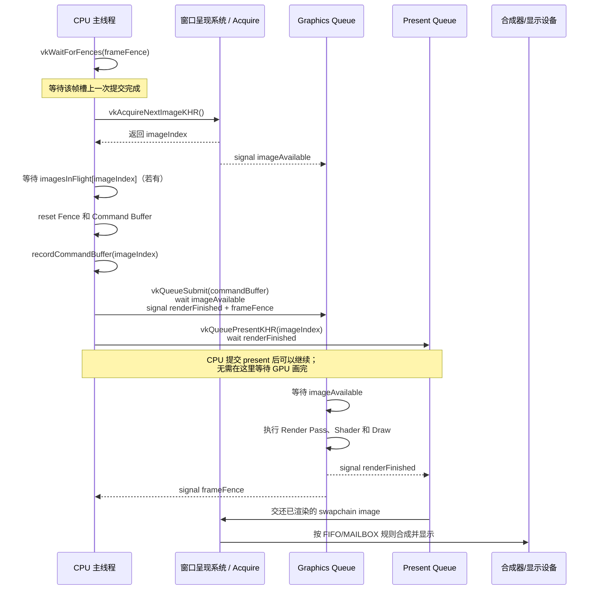
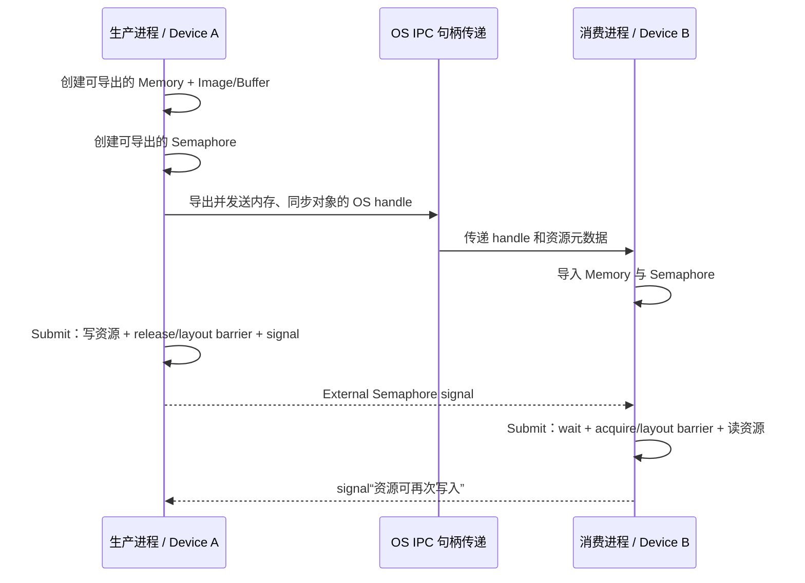

# Vulkan CPU、GPU 与呈现系统的数据流

本文只解释本项目 [`src/main.cpp`](src/main.cpp) 中已经存在的实现，并在最后单独说明如何扩展到多线程、跨进程和跨物理设备。重点是回答以下问题：

- 每个 Vulkan 函数由谁调用，实际工作由谁执行？
- CPU、GPU graphics queue、present queue 和窗口呈现系统之间传递了什么？
- Fence、Semaphore、Render Pass Dependency 分别让谁等待谁？
- `currentFrame_` 与 `imageIndex` 为什么是两个不同的索引？
- 当前代码没有做哪些跨进程、跨 GPU 操作？

---

## 1. 先认识参与者

当前程序是：**一个进程、一个 CPU 主线程、一个逻辑设备 `VkDevice`、最多两个在途帧**。

| 参与者 | 本项目中的对象 | 职责 |
|---|---|---|
| CPU 主线程 | `mainLoop()`、`drawFrame()` | 处理窗口事件、录制命令、提交队列、等待 Fence |
| Vulkan Loader/驱动 | Vulkan API 的实现 | 验证参数、管理对象，把命令交给内核驱动和 GPU |
| 物理设备 | `physicalDevice_` | 被选中的一块 Vulkan GPU，只描述硬件及能力 |
| 逻辑设备 | `device_` | 当前进程访问这块 GPU 的逻辑接口和资源命名空间 |
| 图形队列 | `graphicsQueue_` | 异步执行渲染命令缓冲 |
| 呈现队列 | `presentQueue_` | 把渲染完成的交换链图像交给呈现系统 |
| 窗口呈现系统 | `surface_`、`swapChain_` | 管理可显示图像的获取、排队、合成及显示 |
| 显示设备 | 不直接暴露为 Vulkan 对象 | 最终扫描输出由呈现系统选中的图像 |

这里的 `graphicsQueue_` 和 `presentQueue_` **不代表两块 GPU**。它们可能：

1. 是同一逻辑设备上的同一个队列；
2. 或者属于同一逻辑设备的不同 queue family。

`createLogicalDevice()` 使用 `std::set` 对 queue family 去重；若一个 family 同时支持 graphics 和 present，代码只创建一个 queue，随后取出的两个 queue 句柄通常指向同一个队列。

窗口呈现系统也不一定对应独立硬件。它可能经过操作系统合成器，最后才交给扫描显示硬件。Vulkan 通过 WSI（Window System Integration）把这些差异抽象为 Surface 和 Swapchain。

---

## 2. Vulkan 的对象依赖关系

初始化入口是 [`initVulkan()`](src/main.cpp#L255)，创建顺序体现了对象之间的依赖：

```text
VkInstance
├── VkDebugUtilsMessengerEXT
├── VkSurfaceKHR
└── VkPhysicalDevice（枚举并选择，不由程序创建）
    └── VkDevice
        ├── VkQueue: graphicsQueue_
        ├── VkQueue: presentQueue_
        ├── VkSwapchainKHR
        │   └── VkImage[]                 由交换链拥有
        │       └── VkImageView[]
        │           └── VkFramebuffer[]
        ├── VkRenderPass
        ├── VkPipelineLayout
        ├── VkPipeline
        ├── VkCommandPool
        │   └── VkCommandBuffer[2]
        ├── VkSemaphore[2] × 2
        └── VkFence[2]
```

初始化函数的作用可以压缩为：

| 函数 | 做了什么 | 是否在执行一帧渲染 |
|---|---|---|
| `createInstance()` | 建立 Vulkan 全局入口、扩展和校验层 | 否 |
| `createSurface()` | 把 GLFW 窗口转换成可呈现表面 | 否 |
| `pickPhysicalDevice()` | 枚举 GPU，检查 graphics、present、swapchain 能力 | 否 |
| `createLogicalDevice()` | 创建逻辑设备并取得队列句柄 | 否 |
| `createSwapChain()` | 创建窗口可显示图像的轮换集合 | 否 |
| `createImageViews()` | 规定如何解释交换链图像 | 否 |
| `createRenderPass()` | 规定颜色附件的加载、存储和布局变化 | 否 |
| `createGraphicsPipeline()` | 组合 SPIR-V shader 和固定功能状态 | 否 |
| `createFramebuffers()` | 把每张交换链图像绑定为渲染目标 | 否 |
| `createCommandPool/Buffers()` | 准备 CPU 录制 GPU 命令的容器 | 否 |
| `createSyncObjects()` | 创建 CPU/GPU/呈现系统之间的同步对象 | 否 |
| `drawFrame()` | 获取图像、录制、提交并呈现 | **是** |

一个重要结论是：创建 `VkPipeline`、`VkCommandBuffer` 或调用 `vkCmdDraw`，都不等于画面已经在 GPU 上执行。真正把工作送给 GPU 的边界是 `vkQueueSubmit()`。

---

## 3. 程序中有哪些数据在流动

### 3.1 启动时：Shader 文件到 GPU Pipeline

```text
磁盘上的 .spv 文件
  -> readBinaryFile() 读入 CPU 内存 std::vector<char>
  -> vkCreateShaderModule()
  -> vkCreateGraphicsPipelines()
  -> 驱动生成 GPU 可执行的 Pipeline
  -> 临时 VkShaderModule 被销毁
```

Pipeline 创建后已经吸收创建所需的 shader 信息，因此销毁 `vertexModule` 和 `fragmentModule` 不会让 Pipeline 失效。

### 3.2 每帧：时间和鼠标数据到 Fragment Shader

[`recordCommandBuffer()`](src/main.cpp#L787) 中的数据路径是：

```text
CPU 时钟 + GLFW 鼠标坐标
  -> C++ PushConstants（8 个 float，共 32 字节）
  -> vkCmdPushConstants() 将字节记录到 Command Buffer
  -> vkQueueSubmit()
  -> GPU 执行 Command Buffer
  -> Fragment Shader 的 layout(push_constant) 数据
  -> 计算 outColor
  -> 写入 swapchain image
```

C++ 和 GLSL 的字段映射如下：

| C++ `PushConstants` | GLSL `PushConstants` | 含义 |
|---|---|---|
| `time` | `timeResolution.x` | 启动后的秒数 |
| `width` | `timeResolution.y` | 交换链宽度 |
| `height` | `timeResolution.z` | 交换链高度 |
| `aspect` | `timeResolution.w` | 宽高比 |
| `mouseX` | `mouse.x` | 归一化鼠标 X |
| `mouseY` | `mouse.y` | 翻转后的归一化鼠标 Y |
| `padding0/1` | `mouse.zw` | 对齐占位 |

这里没有创建 Uniform Buffer，也没有由应用显式分配或映射 `VkDeviceMemory`。Push Constant 数据成为命令流的一部分，由驱动负责传给 shader。因此当前示例不存在 `vkMapMemory()`、`vkFlushMappedMemoryRanges()` 或 staging buffer 的数据上传流程。

### 3.3 每帧：顶点与像素的流向

项目没有 Vertex Buffer。[`fullscreen.vert`](shaders/fullscreen.vert) 使用 `gl_VertexIndex` 在 shader 内产生三个顶点：

```text
vkCmdDraw(vertexCount = 3)
  -> Vertex Shader 根据 gl_VertexIndex 生成全屏大三角形
  -> 光栅化器产生覆盖窗口的 fragment
  -> neon.frag 读取 Push Constants 和插值后的 vUV
  -> Fragment Shader 输出 outColor
  -> Color Attachment 写入当前 swapchain image
```

---

## 4. `drawFrame()` 的完整等待关系

[`drawFrame()`](src/main.cpp#L866) 是理解当前程序的核心。

### 4.1 整体时序



图中的 Graphics Queue 和 Present Queue 是逻辑角色。若两个成员指向同一个 `VkQueue`，这些操作仍按同一队列中的顺序处理。

### 4.2 第一步：等待当前帧槽可复用

对应代码：

```cpp
vkWaitForFences(
    device_, 1, &inFlightFences_[currentFrame_], VK_TRUE, UINT64_MAX);
```

这一步由 **CPU 等 GPU**：

- `currentFrame_` 只有 `0`、`1` 两个值；
- 每个帧槽有自己的 Command Buffer、Fence 和两个 Semaphore；
- Fence 在上一次 `vkQueueSubmit()` 完成后被 GPU signal；
- CPU 等到 Fence 后，才能安全 reset 并重录该帧槽的 Command Buffer。

`UINT64_MAX` 表示无限等待；`VK_TRUE` 表示如果传入多个 Fence，就等待全部 Fence。这里实际只传入一个。

第一帧不会卡死，因为 `createSyncObjects()` 创建 Fence 时使用：

```cpp
fenceInfo.flags = VK_FENCE_CREATE_SIGNALED_BIT;
```

也就是把 Fence 初始状态设为 signaled。

### 4.3 第二步：向呈现系统申请一张图像

```cpp
const VkResult acquireResult = vkAcquireNextImageKHR(
    device_,
    swapChain_,
    UINT64_MAX,
    imageAvailableSemaphores_[currentFrame_],
    VK_NULL_HANDLE,
    &imageIndex);
```

这一步做两件事：

1. 得到本帧应写入的交换链图像索引 `imageIndex`；
2. 当该图像可以安全用于后续 GPU 工作时，signal `imageAvailableSemaphore`。

传给 acquire 的是 Semaphore，而不是 Fence。这样 Graphics Queue 可以直接在 GPU/WSI 时间线上等待，无需 CPU 先等待图像，再通知 GPU。

`vkAcquireNextImageKHR()` 使用无限 timeout，所以 CPU 也可能在这里等待可用图像。例如 FIFO 呈现节奏跟不上应用提交节奏时，交换链会产生背压。

### 4.4 `currentFrame_` 与 `imageIndex` 不是一回事

这是最容易混淆的地方。

- `currentFrame_`：应用自己的帧槽索引，固定在 `0` 和 `1` 之间轮转；
- `imageIndex`：呈现系统本次返回的交换链图像索引，取值范围由交换链图像数量决定，顺序也不由应用控制。

假设交换链有 3 张图像，而程序只有 2 个帧槽，一种合法序列可能是：

| 调用次数 | `currentFrame_` | acquire 得到的 `imageIndex` |
|---:|---:|---:|
| 1 | 0 | 1 |
| 2 | 1 | 2 |
| 3 | 0 | 0 |
| 4 | 1 | 1 |

因此：

- Command Buffer 和帧 Fence 用 `currentFrame_` 索引；
- Framebuffer 用 `imageIndex` 索引；
- 不能假设帧槽 0 总是渲染交换链图像 0。

### 4.5 第三步：确认具体图像不再被旧帧使用

```cpp
if (imagesInFlight_[imageIndex] != VK_NULL_HANDLE) {
    vkWaitForFences(
        device_, 1, &imagesInFlight_[imageIndex], VK_TRUE, UINT64_MAX);
}
imagesInFlight_[imageIndex] = inFlightFences_[currentFrame_];
```

`imagesInFlight_` 本身没有创建新的 Fence，它只是一个 **Fence 句柄映射表**：

```text
swapchain image index -> 最近一次使用这张图像的 frame Fence
```

作用是防止应用重新向仍在执行旧渲染工作的图像录入新一帧。等待完成后，再把这张图像关联到当前帧 Fence。

### 4.6 第四步：Reset 并录制命令

```cpp
vkResetFences(device_, 1, &inFlightFences_[currentFrame_]);
vkResetCommandBuffer(commandBuffers_[currentFrame_], 0);
recordCommandBuffer(commandBuffers_[currentFrame_], imageIndex);
```

顺序很重要：Fence 在确认本次会继续提交后才 reset。如果 acquire 返回 `VK_ERROR_OUT_OF_DATE_KHR`，函数会提前重建交换链并 return，Fence 仍保持 signaled；否则下一次等待一个没有任何提交会 signal 的 Fence，将可能永久阻塞。

`recordCommandBuffer()` 内部主要录制：

```text
Begin Command Buffer
  Begin Render Pass（选择 framebuffer[imageIndex]）
    Bind Graphics Pipeline
    Push Constants
    Draw 3 vertices
  End Render Pass
End Command Buffer
```

所有 `vkCmd*` 函数都只是 **录制**。它们返回时，Vertex Shader 和 Fragment Shader 还不一定执行。

### 4.7 第五步：提交 Graphics Queue

提交关系由 `VkSubmitInfo` 描述：

```cpp
submitInfo.pWaitSemaphores = waitSemaphores;       // imageAvailable
submitInfo.pWaitDstStageMask = waitStages;         // COLOR_ATTACHMENT_OUTPUT
submitInfo.pCommandBuffers = &commandBuffer;
submitInfo.pSignalSemaphores = signalSemaphores;   // renderFinished

vkQueueSubmit(graphicsQueue_, 1, &submitInfo, frameFence);
```

可读成一句话：

> Graphics Queue 可以接收这个 Command Buffer，但执行到颜色附件输出阶段并准备写交换链图像之前，必须等 `imageAvailable`；提交完成后 signal `renderFinished` 和 `frameFence`。

等待阶段使用：

```cpp
VK_PIPELINE_STAGE_COLOR_ATTACHMENT_OUTPUT_BIT
```

因为本帧第一次真正访问交换链图像是在颜色输出阶段。这样 GPU 的更早阶段理论上仍可提前进行，而不是把整个 Pipeline 都阻塞在 acquire Semaphore 上。

`vkQueueSubmit()` 通常在 GPU 完成之前就返回。因此 CPU 可以继续排队 present，并在下一轮使用另一个帧槽。这就是“最多 2 帧在途”的来源。

### 4.8 第六步：提交 Present Queue

```cpp
presentInfo.pWaitSemaphores = signalSemaphores; // renderFinished
presentInfo.pSwapchains = &swapChain_;
presentInfo.pImageIndices = &imageIndex;

vkQueuePresentKHR(presentQueue_, &presentInfo);
```

这不是“CPU 先等 GPU 画完，再调用 present”。真实关系是：

1. CPU 立即把 present 操作排入 Present Queue；
2. Present Queue 自己等待 `renderFinished`；
3. Graphics Queue 完成颜色写入后 signal `renderFinished`；
4. Present Queue 才把图像交给呈现系统。

这样避免每帧发生 GPU -> CPU -> GPU 的往返等待。

`vkQueuePresentKHR()` 返回也不代表显示器已经扫描出这一帧。它只说明呈现请求已被 API 接受或返回了相应状态；实际显示仍受 FIFO/MAILBOX、桌面合成器和刷新率影响。

### 4.9 第七步：切换帧槽

```cpp
currentFrame_ = (currentFrame_ + 1) % kMaxFramesInFlight;
```

CPU 下一帧使用另一个 Command Buffer 和另一组同步对象。到两帧之后再次使用原槽位时，开头的 Fence wait 会负责限流。

---

## 5. 三种同步对象各自解决什么问题

### 5.1 同步关系总表

| 对象/机制 | 谁 signal 或产生状态 | 谁 wait 或消费 | 是否阻塞 CPU | 当前用途 |
|---|---|---|---|---|
| `imageAvailableSemaphore` | Acquire/呈现系统 | Graphics Queue | 否 | 图像可开始作为渲染目标 |
| `renderFinishedSemaphore` | Graphics Queue | Present Queue | 否 | 图像渲染完成后才能呈现 |
| `inFlightFence` | Graphics Queue 提交完成 | CPU | 是 | CPU 可复用帧槽资源 |
| `imagesInFlight_` | 不是新同步对象，只保存 Fence | CPU | 取决于指向的 Fence | 保护具体交换链图像 |
| Render Pass Dependency | Command Buffer 中定义 | GPU Pipeline | 否 | 阶段、访问和布局依赖 |
| `vkDeviceWaitIdle()` | 设备所有队列完成 | CPU | 是 | 退出和交换链重建时粗粒度等待 |

### 5.2 Fence：GPU 通知 CPU

Fence 适合 CPU 查询或等待。当前代码把 Fence 传给 `vkQueueSubmit()`，提交完成时驱动 signal 它。

```text
GPU submit 完成 -> frameFence signaled -> vkWaitForFences 返回 -> CPU 可以 reset/重录
```

Fence 不能直接作为 `vkQueuePresentKHR()` 的等待对象。

### 5.3 Semaphore：队列/呈现操作之间传递依赖

当前使用的是 Binary Semaphore，只有 signaled/unsignaled 两种状态。它用于设备侧或 WSI 操作之间的依赖，CPU 不直接 `wait` 它。

```text
Acquire --imageAvailable--> Graphics --renderFinished--> Present
```

更大型的任务图可以使用 Timeline Semaphore，用递增值表示多个时间点；但当前代码没有使用 Timeline Semaphore。

### 5.4 Render Pass Dependency：执行顺序还不够，还要保证内存可见

`createRenderPass()` 中的 dependency：

```cpp
dependency.srcSubpass = VK_SUBPASS_EXTERNAL;
dependency.dstSubpass = 0;
dependency.srcStageMask = VK_PIPELINE_STAGE_COLOR_ATTACHMENT_OUTPUT_BIT;
dependency.dstStageMask = VK_PIPELINE_STAGE_COLOR_ATTACHMENT_OUTPUT_BIT;
dependency.dstAccessMask = VK_ACCESS_COLOR_ATTACHMENT_WRITE_BIT;
```

它表达从 subpass 外部到颜色输出写入的执行与内存依赖，并配合 Render Pass 完成图像布局变化：

```text
VK_IMAGE_LAYOUT_UNDEFINED
  -> VK_IMAGE_LAYOUT_COLOR_ATTACHMENT_OPTIMAL
  -> VK_IMAGE_LAYOUT_PRESENT_SRC_KHR
```

本项目没有显式调用 `vkCmdPipelineBarrier()`；交换链图像的布局转换由 Render Pass 的 attachment 描述和 dependency 隐式完成。

理解 Vulkan 同步时，应同时回答四个问题：

1. 哪个 Pipeline Stage 必须等待？
2. 哪类写入需要对哪类读取可见？
3. 图像需要处于什么 Layout？
4. 资源当前归哪个 Queue Family 或外部实体所有？

只有“代码调用 A 写在 B 前面”通常不足以回答这些问题。

---

## 6. Swapchain 为什么像一个硬件间缓冲队列

Swapchain 图像由呈现系统拥有，应用只取得 `VkImage` 句柄，不自行分配或释放这些图像。

```text
呈现系统拥有图像
  -> vkAcquireNextImageKHR：应用取得本轮使用权
  -> Graphics Queue：把颜色写入图像
  -> vkQueuePresentKHR：应用把图像交还呈现系统
  -> 合成/扫描显示
  -> 图像再次变得可 acquire
```

`createSwapChain()` 优先选择 `MAILBOX`，不可用时退回 `FIFO`：

- `FIFO` 类似垂直同步队列，图像按顺序显示，规范要求实现支持；
- `MAILBOX` 允许新图像替换尚未显示的旧图像，通常降低延迟，但不保证可用。

若 graphics 与 present 使用不同 queue family，本项目选择 `VK_SHARING_MODE_CONCURRENT`。这表示同一 `VkDevice` 内两个 family 可以访问交换链图像，不需要显式 queue-family ownership transfer。它仍然不是跨物理 GPU 共享。

---

## 7. 窗口变化时为什么要等整个设备

以下状态会触发 `recreateSwapChain()`：

- acquire 返回 `VK_ERROR_OUT_OF_DATE_KHR`；
- present 返回 `VK_ERROR_OUT_OF_DATE_KHR` 或 `VK_SUBOPTIMAL_KHR`；
- GLFW framebuffer resize 回调设置 `framebufferResized_`。

重建前调用：

```cpp
vkDeviceWaitIdle(device_);
```

这是 **CPU 等待该逻辑设备所有已提交工作结束**。原因是旧 Framebuffer、Image View、Pipeline、Render Pass 和 Swapchain 可能仍被 GPU 或 Present Queue 引用，不能直接销毁。

本项目的 Viewport 和 Scissor 是 Pipeline 的静态状态，所以尺寸变化时 Pipeline 也需要重建。如果改为动态 Viewport/Scissor，可以减少一部分重建对象，但 Framebuffer 和 Swapchain 相关对象仍需处理。

窗口最小化时宽高可能为 0；代码使用 `glfwWaitEvents()` 等到宽高恢复，再创建合法交换链。

---

## 8. 当前程序的线程模型

当前所有关键操作都发生在调用 `mainLoop()` 的 CPU 主线程：

```text
glfwPollEvents()
  -> framebufferResizeCallback() 也在事件线程执行
drawFrame()
  -> 录制 Command Buffer
  -> vkQueueSubmit()
  -> vkQueuePresentKHR()
```

因此当前代码没有 C++ 数据竞争，也没有多个线程同时访问 Command Pool 或 Queue。

扩展到多线程录制时，通常采用：

```text
Worker 0: CommandPool 0 -> Secondary CommandBuffer 0
Worker 1: CommandPool 1 -> Secondary CommandBuffer 1
Worker 2: CommandPool 2 -> Secondary CommandBuffer 2
                         -> 主线程组合进 Primary CommandBuffer
                         -> 对共享 VkQueue 串行调用 vkQueueSubmit
```

关键规则：

- 同一个 `VkCommandPool` 的 allocate/reset/record 等操作需要应用在 CPU 侧同步，通常每线程一个 Pool；
- 同一个 `VkQueue` 被多个 CPU 线程调用时需要应用侧互斥；
- CPU mutex 只解决 host 线程并发，不能替代 GPU Semaphore、Fence 和 Barrier；
- 不同线程可并行录制相互独立的 Command Buffer，之后统一提交。

---

## 9. 当前程序没有跨进程或跨物理设备共享

当前程序只有一个 `VkDevice`。普通 `VkImage`、`VkDeviceMemory`、`VkSemaphore` 等句柄属于创建它们的 Vulkan 对象范围，不能把句柄数字直接发送给另一个进程或另一个不相关的逻辑设备。

### 9.1 真正的跨进程数据流

跨进程共享通常需要 external memory 与 external semaphore/fence 扩展，并通过操作系统 IPC 传递可导出的 OS 句柄。



除了 OS handle，还要另行传递资源元数据，例如：

- Buffer 大小，或 Image 的 format、extent、usage；
- 外部 handle type；
- 初始布局和 queue-family ownership 约定；
- 双方何时可以再次写入或销毁资源。

只共享内存而不共享完成信号会产生数据竞争；只共享 Semaphore 而没有双方都能访问的存储，也没有数据可以读取。

### 9.2 跨物理 GPU

跨 GPU 首先要查询外部内存兼容性或 Device Group/Peer Memory 能力，不能假设任意两块显卡都能直接共享显存。

支持直接共享时，概念上仍是：

```text
GPU A 写入
  -> release / layout / ownership 处理
  -> signal 可跨设备使用的 Semaphore
  -> GPU B wait
  -> acquire / layout / ownership 处理
  -> GPU B 读取
```

不支持直接共享时，需要经过 Host Staging Memory：

```text
GPU A 本地显存
  -> Transfer Copy 到可供 CPU 访问的 staging memory
  -> Fence：CPU 等复制完成
  -> 必要时 invalidate，CPU/IPC 复制数据
  -> 必要时 flush
  -> Transfer Copy 到 GPU B 本地显存
  -> Barrier/Semaphore：GPU B 的 shader 等复制完成
```

这个 fallback 会经过系统内存，通常比同设备内的显存访问昂贵。当前 `main.cpp` 没有实现上述任一路径。

---

## 10. 当前同步方案的一个进阶注意点

本项目把 `renderFinishedSemaphores_` 按 `currentFrame_` 创建和复用，这是许多入门示例采用的简化写法。但需要认识到：

- `inFlightFence` 只跟踪 Graphics Queue 的 `vkQueueSubmit()`；
- 它不直接证明 `vkQueuePresentKHR()` 已经消费完 `renderFinishedSemaphore`；
- 严格处理复杂 WSI/多队列环境时，常把“呈现等待用 Semaphore”按 **swapchain image** 分配，并在拿到 `imageIndex` 后选择对应 Semaphore；重新 acquire 到该图像可作为上一次 present 已完成该图像使用的重要保证。

这不影响理解当前示例的主链：

```text
imageAvailable -> graphics -> renderFinished -> present
```

但在把 starter 扩展成更严格的生产级渲染循环时，不应简单认为 Graphics Fence 覆盖了 Present Queue 的完整生命周期。

---

## 11. 用一句话读懂每个关键调用

| 调用 | 可以怎样理解 |
|---|---|
| `vkWaitForFences()` | CPU 等 GPU：这个帧槽可以复用了 |
| `vkAcquireNextImageKHR()` | 向呈现系统申请一张本帧可以使用的图像 |
| `vkResetCommandBuffer()` | 清除旧命令，准备在 CPU 上重新录制 |
| `vkCmdPushConstants()` | 把一小段 CPU 数据录入 GPU 命令流 |
| `vkCmdDraw()` | 录制一次绘制；此刻不一定已经执行 |
| `vkQueueSubmit()` | 把命令交给 Graphics Queue 异步执行 |
| `vkQueuePresentKHR()` | 排队等待渲染完成，然后把图像交回呈现系统 |
| `vkDeviceWaitIdle()` | CPU 等整个逻辑设备空闲，简单但阻塞范围很大 |

最终的数据和同步主线是：

```text
CPU 时间/鼠标
  -> Push Constants / Command Buffer
  -> Graphics Queue 等待 imageAvailable
  -> GPU Vertex + Fragment Shader
  -> 写入 swapchain image
  -> signal renderFinished
  -> Present Queue
  -> 窗口呈现系统
  -> 合成器/显示设备

GPU submit 完成
  -> signal frame Fence
  -> CPU 下一次复用该帧槽
```

