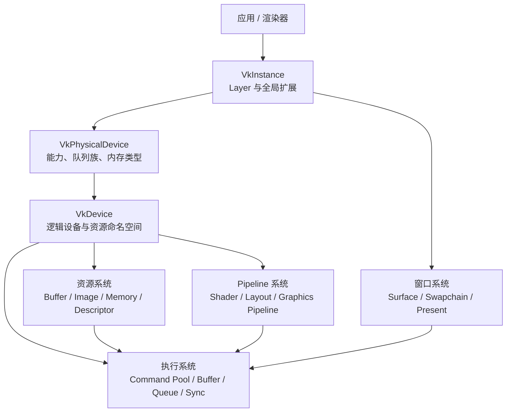
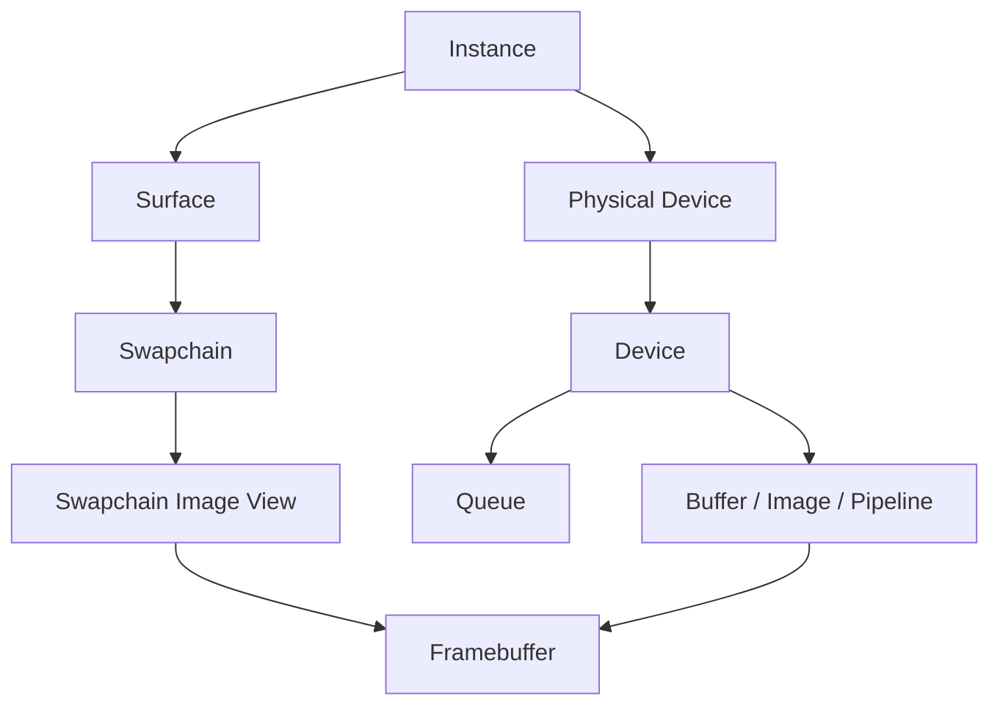
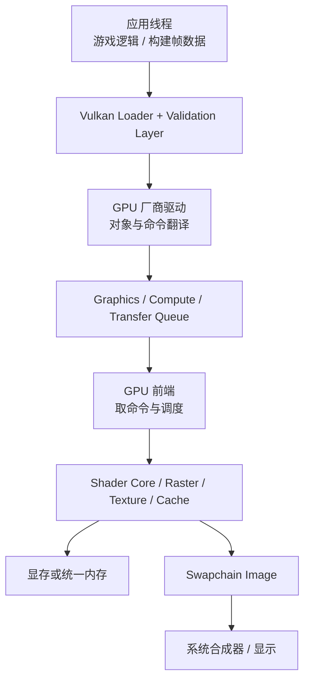
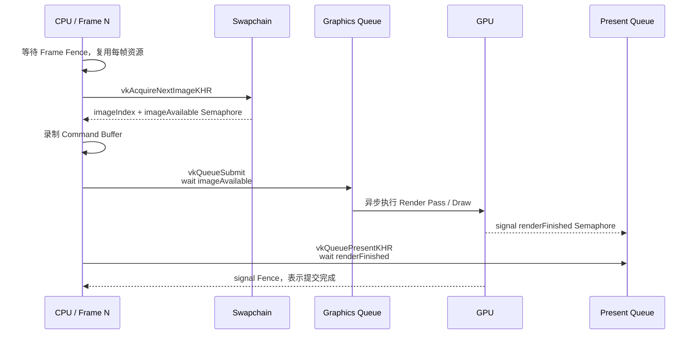
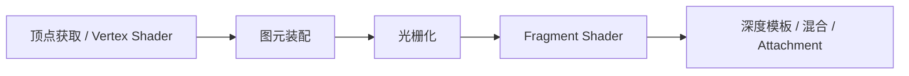
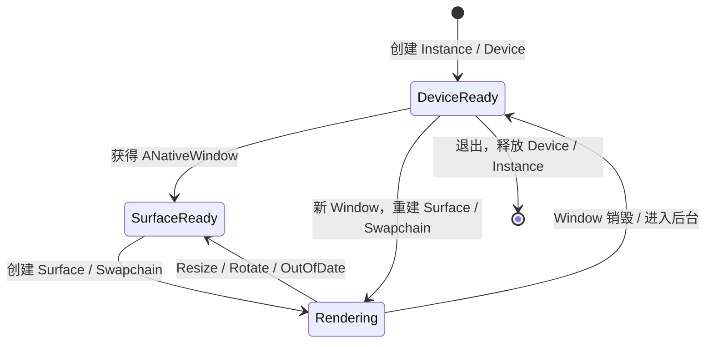

# 从 OpenGL 到 Vulkan：架构、实战、Shader 与能力地图

> 目标：先在桌面上跑通一个动画 Shader，再能解释每个 Vulkan 对象为什么存在；随后把同一套思路迁移到 Android，并形成能做模块修改、性能定位和架构调整的知识骨架。

## 0. 先给结论

把 Vulkan 理解成下面这句话就够你开始：

**CPU 创建资源与 Pipeline，把命令录进 Command Buffer，按明确的同步规则提交给 Queue；GPU 异步执行；Swapchain 负责把完成的图像交给屏幕。**

OpenGL 常把状态追踪、同步、内存布局和部分优化交给驱动；Vulkan 把这些决策大量交回应用。换来的不是“单次 Draw 一定更快”，而是更可预测的 CPU 开销、更好的多线程命令生成和更明确的资源生命周期。Khronos 的当前教程也明确指出：Vulkan 更接近现代 GPU，但应用需要自己负责 framebuffer、内存与更多正确性细节。[Khronos Vulkan Tutorial](https://docs.vulkan.org/tutorial/latest/00_Introduction.html)

建议学习顺序不是“背完 API 再画图”，而是：

1. 运行本包工程，看到霓虹 Shader。
2. 能沿 `drawFrame()` 讲清一帧。
3. 加顶点缓冲、纹理和 Descriptor。
4. 制造并修复同步/生命周期错误。
5. 迁移到 Android Surface 与生命周期。
6. 再做性能分析、渲染器抽象和 Dawn/WebGPU 对照。

---

## 1. OpenGL 思维怎样映射到 Vulkan

| OpenGL 习惯 | Vulkan 对应 | 思维变化 |
|---|---|---|
| Context + 隐式全局状态 | `VkInstance`、`VkDevice`、多个显式对象 | 不再围绕一个巨大状态机编程 |
| `glUseProgram` + 多个状态调用 | `VkPipeline` | 大部分状态在创建 Pipeline 时固定 |
| GLSL 源码运行时编译 | GLSL/Slang/HLSL → SPIR-V → `VkShaderModule` | 构建期编译更常见；Vulkan 接收 SPIR-V |
| `glUniform*` | Push Constants / Uniform Buffer + Descriptor Set | 高频小数据与资源绑定分开设计 |
| `glBindTexture` | `VkImageView` + `VkSampler` + Descriptor | 图像、视图、采样器是独立对象 |
| VBO/IBO | `VkBuffer` + `VkDeviceMemory` | Buffer 与内存分配/绑定分离 |
| FBO | Render Pass + Framebuffer，或 Dynamic Rendering | 附件用途、load/store、布局更明确 |
| `glClear` | Attachment `loadOp=CLEAR` 或清理命令 | 清屏是渲染设计的一部分 |
| `glDrawArrays` 立即进入驱动 | `vkCmdDraw` 先写入 Command Buffer | 录制与执行分离 |
| `SwapBuffers` | `vkAcquireNextImageKHR` + Submit + `vkQueuePresentKHR` | 获取、渲染、呈现显式拆开 |
| 驱动大多替你同步 | Barrier、Semaphore、Fence | 执行顺序与内存可见性都要表达 |
| 驱动管理资源生存期 | 应用销毁每个 Vulkan handle | 父对象通常要比子对象活得久 |

最关键的反直觉点：

- `vkCmdDraw()` **没有立刻画**，它只是把命令编码进 Command Buffer。
- `vkQueueSubmit()` 也通常 **不会等 GPU 做完**。
- Semaphore 主要做 GPU/Queue 间排序；Fence 主要让 CPU 知道某次提交完成；Barrier 解决同一执行图中的阶段与内存依赖。
- `VkPipeline` 不是只有 Shader，它还是 Shader + 顶点输入 + 光栅化 + 混合 + 深度模板 + Render Target 兼容关系的组合。

---

## 2. Vulkan 的对象与模块架构



### 2.1 四层心智模型

| 层 | 主要对象 | 你要回答的问题 |
|---|---|---|
| 平台与能力 | Instance、PhysicalDevice、Surface | 有哪些 GPU、扩展、格式、队列族？窗口能否呈现？ |
| 逻辑设备与内存 | Device、Queue、Buffer、Image、DeviceMemory | 资源放哪，谁能访问，怎样上传？ |
| 渲染描述 | ShaderModule、DescriptorSetLayout、PipelineLayout、Pipeline、RenderPass | 输入是什么，Shader 如何取资源，输出写到哪？ |
| 调度与同步 | CommandPool、CommandBuffer、Semaphore、Fence、Barrier | 命令何时执行，依赖何时满足，CPU 何时可复用资源？ |

### 2.2 常见生命周期关系



销毁的一般原则是创建顺序的逆序。真正工程中应把生命周期封装为 RAII，并对“设备级资源”“Swapchain 相关资源”“每帧资源”分组；不要把所有 handle 堆在一个大类里长期扩张。

建议未来拆成这些模块：

| 模块 | 责任 | 不应该负责 |
|---|---|---|
| `VulkanContext` | Instance、PhysicalDevice、Device、Queue、Feature 查询 | 具体材质和场景 |
| `SwapchainManager` | Surface、Swapchain、ImageView、重建 | 通用纹理上传 |
| `GpuAllocator` | Buffer/Image 内存与映射、VMA 封装 | Pipeline |
| `UploadManager` | Staging、传输命令、上传完成回收 | 帧呈现 |
| `DescriptorManager` | Layout、Pool、Set、资源绑定 | Shader 编译 |
| `PipelineCache` | PipelineLayout、Pipeline Key、缓存 | 资源生命周期 |
| `FrameScheduler` | 每帧 Command Buffer、Semaphore、Fence、Submit | 游戏逻辑 |
| `RenderGraph`（进阶） | Pass、资源依赖、Barrier/别名规划 | 平台窗口 |

---

## 3. CPU 进程、驱动与 GPU 的运行模型

Vulkan API 调用发生在应用进程的 CPU 线程中。Loader 把调用分发给 Layer 和厂商驱动；驱动把 Vulkan 对象/命令转换成设备能理解的形式。GPU 有自己的异步时间线，它不会和主线程逐调用锁步。



### 3.1 一帧的标准时序



本示例使用“两帧并行”：CPU 在准备 Frame N+1 时，GPU 可以仍在执行 Frame N。每个 in-flight frame 有自己的 Command Buffer、Acquire Semaphore、Render-finished Semaphore 和 Fence；Swapchain Image 另用 `imagesInFlight` 避免还在使用时被重复写入。

Khronos 的绘制教程也按“等待上一帧 → acquire → 录制 → submit → present”的路径组织帧循环。[Rendering and presentation](https://docs.vulkan.org/tutorial/latest/03_Drawing_a_triangle/03_Drawing/02_Rendering_and_presentation.html)

### 3.2 三种同步工具别混用

| 工具 | 谁等谁 | 典型用途 | 不是用来做什么 |
|---|---|---|---|
| Fence | CPU 等 GPU | 每帧资源回收、读回完成 | 不负责 GPU 内部资源状态转换 |
| Semaphore | Queue/GPU 工作等另一项 GPU/WSI 事件 | Acquire→Render、Render→Present、跨 Queue | CPU 一般不等待二值 Semaphore |
| Pipeline Barrier | 同一 Queue/命令图中的阶段与内存依赖 | Image Layout 转换、写后读、读后写 | 不直接通知 CPU 完成 |

记忆公式：**顺序不等于可见性**。即使操作 B 在操作 A 后执行，也要用正确的 stage/access mask 让 A 的写入对 B 可见。同步是 Vulkan 最需要系统训练的部分，建议配合 Khronos 的 [Synchronization Guide](https://docs.vulkan.org/guide/latest/synchronization.html) 与 Validation Layer 学习。

---

## 4. 图形 Pipeline 与 GPU 内部流程



本示例没有 VBO：Vertex Shader 根据 `gl_VertexIndex` 生成一个覆盖屏幕的超大三角形。这样你第一天就能专注 Pipeline、Command、同步与 Shader，不被模型加载和内存上传淹没。

对普通三角形/模型，数据路径变成：

1. CPU 创建 Staging Buffer 并写入顶点/索引。
2. Transfer Command 把数据拷到 Device-local Buffer。
3. Barrier 保证复制完成后 Vertex Input 可读。
4. Command Buffer 绑定 Pipeline、Vertex/Index Buffer、Descriptor Set。
5. `vkCmdDrawIndexed()` 写入绘制命令。
6. Submit 后 GPU 才真正执行。

### 4.1 必须先认识的接口

| 阶段 | 关键接口/结构体 | 用一句话解释 |
|---|---|---|
| 初始化 | `vkCreateInstance` | 连接 Vulkan Loader，声明 API 版本与全局扩展 |
| 调试 | `vkCreateDebugUtilsMessengerEXT` | 接收验证层和性能提示 |
| 选卡 | `vkEnumeratePhysicalDevices` | 枚举 GPU |
| 能力 | `vkGetPhysicalDevice*` | 查询 Feature、Property、Queue、Memory、Format |
| 设备 | `vkCreateDevice`、`vkGetDeviceQueue` | 创建资源/提交命令所用的逻辑设备 |
| 窗口 | `vkCreate*SurfaceKHR` | 把原生窗口接到 Vulkan WSI |
| 呈现 | `vkCreateSwapchainKHR` | 管理可呈现图像队列 |
| 资源 | `vkCreateBuffer/Image` | 创建资源描述，尚未自动获得内存 |
| 内存 | `vkAllocateMemory`、`vkBind*Memory` | 分配并把内存绑定给资源 |
| 视图 | `vkCreateImageView` | 指定怎样解释 Image 的格式/层/Mip |
| 绑定 | `vkCreateDescriptorSetLayout`、`vkUpdateDescriptorSets` | 告诉 Shader 在哪个 set/binding 找资源 |
| Pipeline | `vkCreatePipelineLayout`、`vkCreateGraphicsPipelines` | 固化 Shader 与图形状态 |
| 录制 | `vkBeginCommandBuffer`、`vkCmd*` | 编码 GPU 命令 |
| 提交 | `vkQueueSubmit` | 把 Command Buffer 放到 Queue 时间线 |
| 呈现 | `vkAcquireNextImageKHR`、`vkQueuePresentKHR` | 获取与显示 Swapchain 图像 |

第一阶段只需把函数按流程认出来，不需要背参数；更重要的是会从 Validation Error 的 VUID 跳到规范查前置条件。

---

## 5. 用本包搭环境并画出图形

工程目录：

```text
vulkan_shader_starter/
├── CMakeLists.txt
├── vcpkg.json
├── scripts/build_windows.ps1
├── src/main.cpp
└── shaders/
    ├── fullscreen.vert
    ├── neon.frag
    └── shadertoy_adapter.frag
```

Windows 推荐路径：Visual Studio 2022 + Vulkan SDK + vcpkg + CMake + GLFW。Khronos 的环境文档说明 Vulkan SDK 提供 headers、loader、validation layers 和调试工具，并推荐先运行 `vkcube` 验证驱动；GLFW 用于桌面窗口，但不支持 Android。[Development Environment](https://docs.vulkan.org/tutorial/latest/02_Development_environment.html)

完整命令见工程 `README.md`。最低成功标准：

- `vulkaninfo --summary` 能看到 GPU。
- `vkcube` 正常。
- `glslc --version` 正常。
- Debug 构建运行后出现动态霓虹图案。
- 控制台打印实际 GPU，且没有 Validation Error。
- 调整窗口大小后 Swapchain 能重建，不崩溃。

### 5.1 读代码的顺序

不要从 `main.cpp` 第一行顺读。按下面顺序：

1. `drawFrame()`：先抓住帧循环。
2. `recordCommandBuffer()`：看本帧到底录了什么。
3. `createGraphicsPipeline()`：看 Shader 与固定功能状态。
4. `createSwapChain()`：看呈现图像怎样产生。
5. `createLogicalDevice()`：看 Queue 怎样获得。
6. `pickPhysicalDevice()`：看选卡和能力检查。
7. `createInstance()`：最后再看全局初始化。

---

## 6. Shader 网站与“拿来就用”的边界

| 站点 | 适合做什么 | 直接放进 Vulkan 的难度 | 许可证提醒 |
|---|---|---:|---|
| [ISF](https://isf.video/) | 200+ 滤镜、转场、模糊、扭曲等标准 Shader | 中 | 官方称规格、代码与 Shader 为 MIT，可商用；仍保留版权声明 |
| [ShaderToy](https://www.shadertoy.com/) | 视觉效果、SDF、Ray Marching、程序化艺术灵感 | 单 Pass 低，多 Pass 高 | 每份代码分别核对许可证；公开可看不等于可商用复制 |
| [The Book of Shaders](https://thebookofshaders.com/) | 系统学习坐标、噪声、颜色、形状 | 低 | 更适合学原理并自己重写 |
| [GLSL Sandbox](https://glslsandbox.com/e) | 小型实时片元 Shader 实验 | 低到中 | 按作品检查作者/许可 |
| [VertexShaderArt](https://www.vertexshaderart.com/) | 顶点生成、粒子和程序化几何 | 中到高 | 顶点输入模型与 Vulkan 工程差异较大 |
| [glsl.app](https://glsl.app/) | 浏览器里快速写和预览 GLSL | 低 | 编辑器不是作品授权来源 |
| [LYGIA](https://github.com/patriciogonzalezvivo/lygia) | 可复用 GLSL/HLSL/WGSL 函数库 | 中 | 当前许可证不是简单 MIT；产品使用前看其 [license](https://lygia.xyz/license) |

如果目标是“今天复制一个效果到练习工程”，优先顺序是：

1. 本包 `neon.frag`：原创、接口已经匹配。
2. ISF 的明确 MIT Shader：改输入变量与入口。
3. ShaderToy 中文件头明确写 MIT/CC0/允许用途的单 Pass 作品。
4. 多 Pass、纹理/视频输入作品留到学会 Descriptor 和 Render Target 后。

ISF 官方说明其标准库包含 200 多个开放 Shader，规格、代码和 Shader 使用 MIT 许可证，可用于商业或非商业应用。[ISF 官方介绍](https://isf.video/)

### 6.1 ShaderToy 到 Vulkan 的接口适配

ShaderToy 常见入口：

```glsl
void mainImage(out vec4 fragColor, in vec2 fragCoord);
```

Vulkan GLSL 需要显式输入输出：

```glsl
#version 450
layout(location = 0) in vec2 vUV;
layout(location = 0) out vec4 outColor;
```

本包 `shadertoy_adapter.frag` 已处理：

- `mainImage()` → Vulkan `main()`。
- `iTime`、`iResolution`、`iMouse` → Push Constants。
- `fragCoord` → `vUV * resolution`。
- GLSL → 构建期 `glslc` → SPIR-V。

但 `iChannel0..3` 需要 Descriptor + ImageView + Sampler；Buffer A/B/C/D 需要多 Pass 与 Pass 间同步；Cubemap、音频、键盘、摄像头需要宿主程序提供真实数据。Android 官方也强调：与 OpenGL ES 直接提交 GLSL 字符串不同，Vulkan 接收 SPIR-V；Android Studio 可把 `app/src/main/shaders/` 下的 Shader AOT 编译并打入 APK assets。[Android Vulkan shader compilers](https://developer.android.com/ndk/guides/graphics/shader-compilers)

---

## 7. 从桌面工程迁移到 Android

不要第一天同时学习 Vulkan 和 Android 生命周期。先让桌面工程稳定，再把“平台外壳”替换掉：

| 桌面示例 | Android 对应 |
|---|---|
| GLFW Window | Activity/GameActivity + `ANativeWindow` |
| GLFW 创建 Surface | `VK_KHR_android_surface` + `vkCreateAndroidSurfaceKHR` |
| 文件系统读 `.spv` | `AAssetManager` 从 APK assets 读取 |
| 窗口 resize 回调 | `APP_CMD_INIT_WINDOW` / `APP_CMD_TERM_WINDOW` 与旋转、前后台 |
| 桌面鼠标 | MotionEvent / GameActivity 输入 |
| vcpkg GLFW | NDK CMake + `libvulkan.so` |

Android 官方起步文档给出了 NDK Vulkan 工程和 Hello VK sample；验证层可以打包进 APK，Shader 可在 Android Studio 中构建为 SPIR-V。[Get started with Vulkan on Android](https://developer.android.com/ndk/guides/graphics/getting-started)

### 7.1 Android 生命周期状态机



Device 级对象（纹理、Pipeline Cache、长期 Buffer）不应因一次 Surface 丢失就全部销毁；Swapchain、Swapchain ImageView、Framebuffer 等必须随 Surface 重建。这一分层直接决定小游戏切后台、旋转、弹窗后能否稳定恢复。

### 7.2 Android 设备基线

不要只写 `vkEnumeratePhysicalDevices` 成功就认为设备可用。至少查询：

- API 版本与 Android Vulkan Profile。
- Queue Family、Swapchain 扩展、Surface Format/Present Mode。
- 必需的纹理格式、采样数、压缩格式、Descriptor 限制。
- 驱动是否为软件实现；性能关键场景应回退到 OpenGL ES。

Android 官方资料指出多数设备通过硬件支持 Vulkan 1.1，但仍可能遇到软件实现；应用可通过 `deviceType` 等属性检测。[Android Vulkan design guidelines](https://developer.android.com/ndk/guides/graphics/design-notes) 截至官方页面引用的 2025 年 10 月活跃 Vulkan 设备数据，AVP 2025/2022/2021 覆盖率分别为 80.1%/86.5%/95.5%，应按业务目标选择基线并保留降级策略。[Android Vulkan Profiles](https://developer.android.com/ndk/guides/graphics/android-vulkan-profile)

---

## 8. 面向小游戏/移动端的性能方法

优化顺序永远是：**先测帧，再判断 CPU-bound/GPU-bound，再改一个变量，再复测。**

### 8.1 CPU 侧

- Pipeline 和 Descriptor Layout 缓存；不要每帧创建。
- 每线程一个 Command Pool，允许多线程并行录制；不要并发使用同一个 Pool。
- 按 Scene/Material/Draw 更新频率拆 Descriptor Set。
- 用 Ring Buffer 管每帧 Uniform/Upload，避免频繁分配。
- Pipeline Cache 持久化，但要按设备/驱动/应用版本失效。
- 批处理 Draw，减少 Pipeline/Descriptor 切换。

### 8.2 GPU 与移动端

- 减少每帧 Render Pass 数量，避免不必要的中间回写。
- 能 `CLEAR`/`DONT_CARE` 就不要 `LOAD`；不需要保存就不要 `STORE`。
- 处理 `preTransform`，避免系统合成器额外旋转。
- 减少 overdraw、全屏透明层和昂贵片元循环。
- 使用 ASTC/ETC 等设备支持的压缩纹理，控制带宽。
- 在 Tile-based GPU 上优先让数据留在 tile 内，谨慎做多 Pass 后处理。

Google 的 Android Vulkan 指南明确建议移动端减少 Render Pass、合理选择 attachment load/store，并在渲染阶段处理显示旋转；这些往往同时改善带宽、功耗与温度。[Vulkan design guidelines](https://developer.android.com/ndk/guides/graphics/design-notes)

### 8.3 工具顺序

1. Validation Layer：正确性和部分最佳实践。
2. RenderDoc：看一帧资源、Pipeline、Draw、Attachment。
3. Android GPU Inspector：Android 帧分析、GPU counter 和系统时间线。
4. 厂商工具：如 Snapdragon Profiler、Mali Graphics Debugger/Performance Studio、Perfetto。
5. 自建 telemetry：CPU 帧、GPU timestamp、Draw/triangle 数、上传字节、Pipeline 命中、温度/降频。

---

## 9. Vulkan 与 WebGPU/Dawn 的联系

如果你的目标是 Android 小游戏框架或 Dawn 后端，Vulkan 是理解实现层的好入口：

| WebGPU/Dawn 概念 | Vulkan 常见落点 |
|---|---|
| `GPUAdapter` | PhysicalDevice + 能力/限制筛选 |
| `GPUDevice` | VkDevice + Queue + 资源管理 |
| `GPUQueue.submit` | Command Buffer + `vkQueueSubmit` |
| `GPUBuffer` | VkBuffer + Memory Allocation |
| `GPUTexture/View` | VkImage + VkImageView |
| Bind Group/Layout | Descriptor Set/Layout |
| Render Pipeline | VkPipeline + VkPipelineLayout |
| Command Encoder | VkCommandBuffer 录制抽象 |
| Render Pass Encoder | Render Pass/Dynamic Rendering 的受控抽象 |
| WebGPU usage/状态验证 | Dawn 验证 + Vulkan Barrier/Layout 转换 |

Dawn 的价值之一，就是把 Vulkan 中易错的能力差异、资源状态、Descriptor、同步和平台 Surface 细节包装成更安全的一致 API。要改 Dawn Vulkan backend 时，优先追踪：

`API object → Dawn frontend validation → command encoding → Vulkan backend resource/state tracking → VkCommandBuffer → Queue submit`。

学 Vulkan 后，你会更容易判断 Dawn 性能问题发生在 JS/绑定层、命令编码、Pipeline 创建、资源上传、Barrier 生成、Queue Submit，还是 Android WSI/合成阶段。

---

## 10. “入门”和“精通”的可验证标准

“看过多少章节”不是标准，**能独立完成和解释什么**才是。

### L1：Vulkan 入门

满足以下全部条件，可以说已经入门：

- 独立搭建 SDK/验证层/CMake 环境并画出三角形或全屏 Shader。
- 能从 Instance 讲到 Present，画出一帧流程。
- 能解释 PhysicalDevice 与 Device、Queue Family 与 Queue 的区别。
- 会创建 Swapchain，能正确处理 resize/out-of-date。
- 会用 Command Pool/Buffer 录制并提交 Draw。
- 能说清 Fence、Semaphore、Barrier 分别解决什么。
- 能读 Validation Error，并定位至少三类错误：生命周期、Descriptor、同步/布局。
- 能把无纹理单 Pass ShaderToy 代码改成 Vulkan GLSL 并编译成 SPIR-V。

验收项目：**本包效果 + 自己改写的第二个效果 + 无验证错误 + 窗口缩放稳定。**

### L2：可独立开发

- 实现 Vertex/Index Buffer、Staging Upload、Uniform/Storage Buffer。
- 实现纹理、Mip、Sampler、Descriptor Pool/Set。
- 实现深度、混合、离屏 Render Target、至少一个后处理 Pass。
- 正确维护 2–3 frames in flight，避免全局 `vkDeviceWaitIdle()`。
- 用 RenderDoc 找到一次错误绑定或输出异常。
- 能解释并修复写后读的 Barrier/Layout 问题。
- 把桌面 Demo 移植到 Android，正确处理前后台/旋转/Surface 重建。

验收项目：**带纹理 3D 场景 + 离屏后处理 + Android 真机运行 + 资源无泄漏。**

### L3：熟练/高级

- 设计资源、上传、Descriptor、Pipeline、Frame Scheduler 的模块边界。
- 基于 Feature/Profile 做跨设备降级，不依赖“我的显卡能跑”。
- 构建 Pipeline Key/Cache、Shader permutation 与异步预热方案。
- 多线程录制、Transfer/Graphics Queue 协作，并能证明同步正确。
- 用 GPU timestamp/counter 区分 CPU、vertex、fragment、bandwidth 瓶颈。
- 对移动端 tile 架构、load/store、overdraw、压缩纹理、热降频有实测优化。
- 能阅读 Vulkan Spec、VUID、扩展依赖和厂商最佳实践。

验收项目：**一个可复用的小型渲染后端，在 3 个以上不同厂商 Android GPU 上稳定运行并有性能报告。**

### L4：可以合理称为“精通”

没有“API 背完即精通”。更靠谱的标准是，你能长期、重复做到：

- 从应用到 Shader 编译、SPIR-V、驱动提交、GPU 架构和 WSI 端到端定位问题。
- 设计/重构真实引擎或 Dawn/ANGLE 类后端，而非只写样例。
- 处理 Device Lost、内存压力、外部内存、跨 Queue、稀有驱动问题与兼容性黑名单。
- 在正确性、CPU 开销、GPU 时间、内存、功耗、包体和开发复杂度之间做可量化取舍。
- 对新扩展能从 Spec 与 sample 快速落地，并建立跨厂商验证矩阵。
- 能评审别人写的同步、内存和生命周期代码，指出潜在 race/undefined behavior 并给出证据。

通常这是多年项目经验的结果。对你的目标而言，先达到 L2，就足以开始修改 Android 小游戏渲染模块；达到 L3，才适合主导渲染架构与系统级调优。

---

## 11. 六周实战路线

| 周 | 学习内容 | 必做产物 | 通过标准 |
|---|---|---|---|
| 1 | 本包、对象模型、Swapchain、Pipeline、帧循环 | 改出 3 个全屏效果 | 无验证错误，能口述一帧 |
| 2 | Buffer/Memory/Staging、纹理、Descriptor | 纹理矩形与旋转立方体 | 上传与绑定路径能画图解释 |
| 3 | Depth、Blend、离屏 Pass、同步 | 场景 + Bloom/色调映射 | RenderDoc 中逐 Pass 正确 |
| 4 | 多帧并行、资源回收、Pipeline Cache、性能计时 | Frame Scheduler 与 profiler HUD | 不靠 `DeviceWaitIdle` 正常运行 |
| 5 | Android NDK、ANativeWindow、生命周期、AVP | 真机同效果 | 前后台/旋转 50 次稳定 |
| 6 | AGI、移动端带宽/overdraw、Dawn 对照 | 优化报告与模块改造提案 | 有 before/after 数据和回归矩阵 |

每天最有效的节奏：30 分钟看概念，60–90 分钟改代码，15 分钟写“今天我能解释的对象与同步关系”。

---

## 12. 权威资料索引

优先读这些，不要被过时博客中的旧同步写法带偏：

- [Khronos Vulkan Tutorial](https://docs.vulkan.org/tutorial/latest/00_Introduction.html)：当前教程、环境和完整路径。当前版本以 Vulkan 1.4、Dynamic Rendering、Timeline Semaphore、Slang/Vulkan-Hpp 为主；本包故意使用 Vulkan 1.1 + 经典 Render Pass，便于 Android 广覆盖与理解基础对象。
- [Vulkan Guide](https://docs.vulkan.org/guide/latest/)：概念、同步、扩展和最佳实践。
- [Vulkan Specification](https://docs.vulkan.org/spec/latest/)：遇到 VUID、边界行为和扩展语义时查。
- [Khronos Vulkan Samples](https://docs.vulkan.org/samples/latest/README.html)：特性与性能样例。
- [Android Vulkan NDK 指南](https://developer.android.com/ndk/guides/graphics)：Android Surface、验证层、Shader 编译、设计准则。
- [Android Vulkan Profiles](https://developer.android.com/ndk/guides/graphics/android-vulkan-profile)：确定设备功能基线。
- [Sascha Willems Vulkan Samples](https://github.com/SaschaWillems/Vulkan)：大量可运行技术样例，使用前按仓库许可证执行。

遇到问题时按这个顺序：Validation 信息 → 相关 VUID → Spec → 官方 Sample → RenderDoc/AGI 捕帧 → 最小复现。不要先靠随机改 stage mask 或加 `vkDeviceWaitIdle()` 把问题“压住”。

